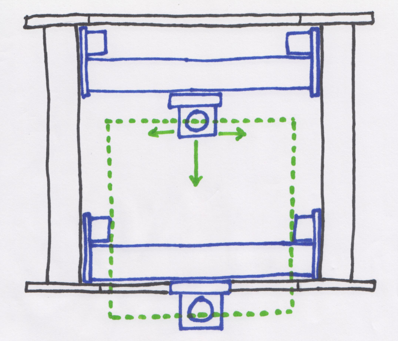
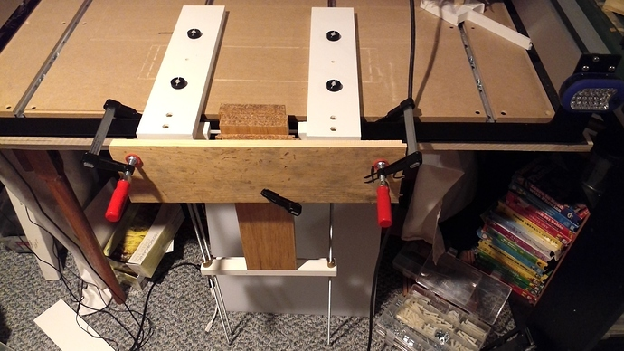
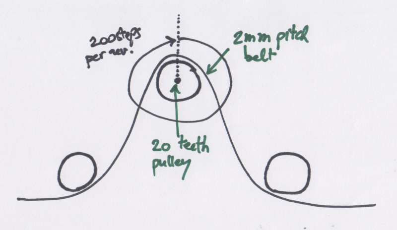
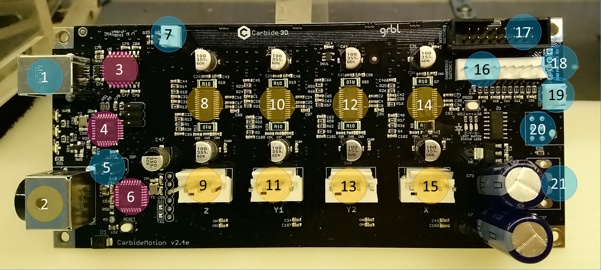
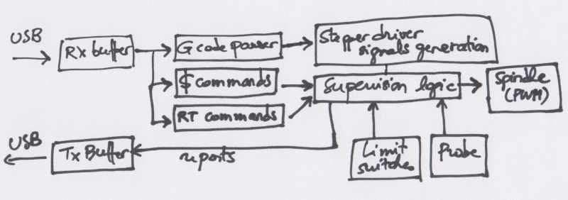

# Anatomy of a Shapeoko

This section provides details on _how_ the Shapeoko is working. 


None of this info is required to be able to successfully use the machine, but you may find some of this information useful for troubleshooting, repairing, or later upgrading the machine.


## Mechanical structure

That part is self explanatory, since the Shapeoko is a kit everyone will get acquainted with the \(very simple\) mechanical structure during assembly anyway. The correct geometry of pieces cut on the Shapeoko will depend mainly on:

* making sure the mechanical structure is assembled such that all three axes of movement are _actually_ orthogonal to each other \(see [Squaring, surfacing, tramming](squaring.md#squaring-the-machine)\).
* making sure that there is no slop or excessive friction anywhere in the moving parts \(which mostly boils down to tightening the V-wheel eccentric nuts correctly\).

## Work area

The Shapeoko3 has a cutting area of 16 × 16'', the XL has 16 × 33'' and the XXL has 33 × 33''. One thing to consider is that the cutting area is not centered, it extends beyond the front plates of the machine: 



Some implications may not be immediately apparent:

* a \(small\) part of the cutting area is lost unless the stock material is overhanging the front of the machine.
* however this is also a great opportunity to use this front area to mill a workpiece clamped **vertically** to the front of the machine _e.g._, to cut finger joints:




Plans to build this vertical fixture are available at [https://cutrocket.com/p/5cb25f3380844/](https://cutrocket.com/p/5cb25f3380844/)


* when designing an enclosure you may want to take this into account: the router \(and potentially the dust shoe\) will protude by a significant amount when the full area is used.


Some folks have _swapped_ the Y plates on their machine, this allows them to shift the usable cutting area towards the back _i.e._, getting larger cutting area inside the machine at the expense of losing the overhang capability.


## Stepper motors

As the name implies, stepper motors are designed to rotate by small angle increments, rather than rotating continuously as conventional motors do when they are powered. Stepper motors are ubiquitous in hobby CNCs, for a good reason: they provide the capability to move by a precise amount \(i.e. a given number of steps\), without the need for a position feedback mechanism.

The stepper motors on the Shapeoko3 are **NEMA23** \(just a fancy way to say that their front/back face size is 2.3'' square\), are of the "**bipolar**" type \(which means that they are controlled by two pairs of wires, the "A" phase and the "B" phase, and that one step is made by sending current in A and turning off B, or the other way around\), and are internally designed so that each step rotates the shaft by exactly 1.8°, which translates to 360°/1.8° = **200 steps to perform a full revolution**. 

It's the job of the **stepper driver** to generate current alternatively in the A and B phases, when instructed to move by one or more steps.


The stepper drivers use a trick to optimize the torque: instead of generating a constant voltage \(and therefore current\) in a phase, they generate a higher voltage and chop it at a high frequency so that it produces the desired value on average. It's just an implementation detail, but it explains the \(normal\) humming sound that the motors emit when the machine is idle.


But it gets better: instead of just turning the current on and off completely alternatively on phases A and B to move one step at a time, if the stepper driver sends a carefully chosen variable amount of current in A and B simultaneously, then it is possible to reach \(and hold\) intermediate positions between two steps: these are called "**microsteps**", and the drivers used in the Shapeoko are capable of controlling **8 microsteps for each step**.

So overall, the motors can be controlled with a precision of 200 × 8 = 1600 microsteps per revolution.


Interestingly, stepper motors use more power when doing nothing \(_i.e._, holding a position\) than when moving. This is why they tend to get warm when the machine is on but idle. This is not a problem in itself, the motors are designed to support high temperatures but you might as well turn the machine off if it is going to stay idle for a long time, if only to save power.


## Pulleys & belts

A pulley is installed on the motor shaft, and drives a "**GT2**" belt that has a 2mm pitch, _i.e._  distance in mm between two teeth\).




The pulleys used on the Shapeoko3 happen to have 20 teeth, with \(obviously\) the same 2mm spacing as the belt: so when the shaft does one full revolution, the belt moves by 20 teeth, i.e. 40mm.

This full revolution requires 1600 microsteps, which means that it requires 1600/40 = 40 steps to move by 1mm. And this is where the "**40 steps/mm**" setting in the Shapeoko controller comes from \(more on this in the [Dimensional accuracy](x-y-z-calibration.md#x-y-z-calibration) section\)

Which means that the minimal movement that the Shapeoko can theoretically do in any axis is 1/40th of a mm, that's 0.025mm or 0.001''. Quite precise, right?

And that when the machine needs to move by X mm along one axis, the stepper motor must be told 40 × X times to do one \(micro\)step.


Everyone is too lazy to write "microstep" every time, so they just write "step". 99% of the time when discussing steps, you should understand "microstep", because this is what the stepper driver generates. The other 1% is when discussing stepper motor characteristics themselves, which are characterized by their number of "full" steps, because that's an intrinsic property of the motor design \(while the number of microsteps is only driven by the selected stepper driver\).


So in theory, telling the motor to do N steps will move the associated axis by N/40 mm. But that's only true if the effort put on the shaft is lower than the torque the motor is able to provide. When the forces on the shaft exceed the max torque of the motor, commanding one step of rotation will result in...the motor staying in the same position, so effectively "losing" one step, which then causes a discrepancy between where the machine actually is, and where it thinks it is \(as it has no feedback loop to verify if it actually moved\), and this is bad for accuracy.

Another potential reason for "losing" steps, is that the pulley may slip on the motor shaft if the **set screws** are not tight, so they should be secured/checked \(using a 1.5mm Allen key\):


Finally, the belts must be **tensioned** correctly, to avoid any slop that could lead to the belt jumping the pulley teeth when a large force is applied on that axis. This is a Goldilocks situation where the belt needs to be tight enough to avoid this problem, but not too tight to avoid bending the motor shaft. 


The usual words to characterize an adequate belt tension are "guitar-string tight". For the Y belts, a good indication of proper tension is that when the gantry is at one end of the rails, it should be possible to lift the belt a bit, but it should not be possible to slide a full pinky finger under the middle of the belt.


Natural manufacturing variations across belts and pulleys, a variable level of tensioning, and probably multiple other factors, are such that the actual number of steps required to move by 1mm may not be _exactly_ 40, but a tiny bit more or a tiny bit less: this is covered in the X/Y/Z calibration part of the [Dimensional accuracy](x-y-z-calibration.md#x-y-z-calibration) section.

It is the job of the **controller** to send commands to the stepper drivers \(which in turn will generate the right current waveforms on the motor phases\), to achieve the desired movements of the machine.

## Controller board

The brain of the Shapeoko is the controller board. There have been several revisions over the years, the one presented below is from circa 2017 \(v2.4e\), the latest one may be slightly different, but fundamentals will likely be the same.



* **\#1** is the connector of the **USB link** from the host PC that sends the G-code commands
* **\#2** is the **main power** connector \(24V from the external power supply\)
* **\#3** is the **USB isolator**, it helps preventing potential EMI issues.
* **\#4** is the **Serial-to-USB** microcontroller, supporting the main Arduino controller for USB comms
* **\#5** is the "Arduino ISP" **header** and carries these signals:

| pin column1 | pin column2 | pin column 3 |
| :--- | :--- | :--- |
| 5V | SPINDLE PWM \(= D11 = MOSI\) | GND |
| LIMIT Z \(= D12 = MISO\) | SPINDLE DIR \(= D13 = SCK\) | RESET |

* **\#6** is the Arduino microcontroller \(ATMega328P\) that runs the motion control software
  * Note: there is a small push button right under the Arduino, to RESET the board manually if needed…never the case in normal usage.
* **\#7** is a header with GND and +5V available.
* **\#8** is the stepper driver for Z axis
* **\#9** is the stepper connector for Z axis
  * from left to right pins: A1/B1/B2/A2 motor signals
* **\#10** is the stepper driver for Y axis motor \#1
* **\#11** is the stepper connector for Y axis motor \#1
  * from left to right pins: A1/B1/B2/A2 motor signals
* **\#12** is the stepper driver for Y axis motor \#2
* **\#13** is the stepper connector for Y axis motor \#2
  * from left to right pins: A1/B1/B2/A2 motor signals
* **\#14** is the stepper driver for X axis
* **\#15** is the stepper connector for X axis
  * from left to right pins: A1/B1/B2/A2 motor signals
* **\#16** is the "Shapeoko switches" header
  * From left to right, 2 pins per switch:
    * X-limit switch
    * Y-limit switch
    * Z-limit switch
    * E-stop 
    * Probe 
    * Feed Hold
* **\#17** is the "Nomad switches". The Nomad CNC uses the same controller board, this header is unused on the Shapeoko.
* **\#18** has plated holes for soldering headers to get the following signals \(labelled on the silkscreen\) 
  * GND
  * PWM
  * 5V
  * D13
* **\#19** is a "RESERVED" connector, that happens to be used for the Carbide 3D probe now. 
* **\#20** has plated holes for these signals:

| Left pin column | Right pin column |
| :--- | :--- |
| 24V | RESERVED |
| PWM | RESET |
| RESERVED | GND |

* **\#21** has plated holes for the following \(unused\) signals, from top to bottom
  * AUX 24V INPUT
  * AUX 24V INPUT
  * AUX ON/OFF
  * AUX ON/OFF

## GRBL Motion control software

On the Shapeoko, the piece of embedded software that runs in the Arduino microcontroller is **GRBL** \("Gerbil"\), an open-source CNC motion control software \(available here: [https://github.com/gnea/grbl](https://github.com/gnea/grbl)\)

Carbide 3D contributes to the development of GRBL, which is why it comes with a Shapeoko-specific set of settings already built-in the code \(so if you're into software and ever need to figure out why GRBL behaves the way it does, you can go and check the source code, which is neat!\)

For example, here's a copy of the Shapeoko3 settings in GRBL1.1:

```text
  // Description: Shapeoko CNC mill with three NEMA 23 stepper motors, driven by CarbideMotion
  #define MICROSTEPS_XY 8
  #define STEP_REVS_XY 200
  #define MM_PER_REV_XY (2.0*20) // 2mm belt pitch, 20 pulley teeth
  #define MICROSTEPS_Z 8
  #define STEP_REVS_Z 200
  #define MM_PER_REV_Z (2.0*20) // 2mm belt pitch, 20 pulley teeth
  #define DEFAULT_X_STEPS_PER_MM (MICROSTEPS_XY*STEP_REVS_XY/MM_PER_REV_XY)
  #define DEFAULT_Y_STEPS_PER_MM (MICROSTEPS_XY*STEP_REVS_XY/MM_PER_REV_XY)
  #define DEFAULT_Z_STEPS_PER_MM (MICROSTEPS_Z*STEP_REVS_Z/MM_PER_REV_Z)
  #define DEFAULT_X_MAX_RATE 5000.0 // mm/min
  #define DEFAULT_Y_MAX_RATE 5000.0 // mm/min
  #define DEFAULT_Z_MAX_RATE 5000.0 // mm/min
  #define DEFAULT_X_ACCELERATION (400.0*60*60) // 400*60*60 mm/min^2 = 400 mm/sec^2
  #define DEFAULT_Y_ACCELERATION (400.0*60*60) // 400*60*60 mm/min^2 = 400 mm/sec^2
  #define DEFAULT_Z_ACCELERATION (400.0*60*60) // 400*60*60 mm/min^2 = 400 mm/sec^2
  #define DEFAULT_X_MAX_TRAVEL 425.0 // mm NOTE: Must be a positive value.
  #define DEFAULT_Y_MAX_TRAVEL 465.0 // mm NOTE: Must be a positive value.
  #define DEFAULT_Z_MAX_TRAVEL 80.0 // mm NOTE: Must be a positive value.
  #define DEFAULT_SPINDLE_RPM_MAX 10000.0 // rpm
  #define DEFAULT_SPINDLE_RPM_MIN 0.0 // rpm
  #define DEFAULT_STEP_PULSE_MICROSECONDS 10
  #define DEFAULT_STEPPING_INVERT_MASK 0
  #define DEFAULT_DIRECTION_INVERT_MASK ((1<<X_AXIS)|(1<<Z_AXIS))
  #define DEFAULT_STEPPER_IDLE_LOCK_TIME 255 // msec (0-254, 255 keeps steppers enabled)
  #define DEFAULT_STATUS_REPORT_MASK 1 // MPos enabled
  #define DEFAULT_JUNCTION_DEVIATION 0.02 // mm
  #define DEFAULT_ARC_TOLERANCE 0.01 // mm
  #define DEFAULT_REPORT_INCHES 0 // false
  #define DEFAULT_INVERT_ST_ENABLE 0 // false
  #define DEFAULT_INVERT_LIMIT_PINS 0 // false
  #define DEFAULT_SOFT_LIMIT_ENABLE 0 // false
  #define DEFAULT_HARD_LIMIT_ENABLE 0  // false
  #define DEFAULT_INVERT_PROBE_PIN 0 // false
  #define DEFAULT_LASER_MODE 0 // false
  #define DEFAULT_HOMING_ENABLE 0  // false
  #define DEFAULT_HOMING_DIR_MASK 0 // move positive dir
  #define DEFAULT_HOMING_FEED_RATE 100.0 // mm/min
  #define DEFAULT_HOMING_SEEK_RATE 1000.0 // mm/min
  #define DEFAULT_HOMING_DEBOUNCE_DELAY 25 // msec (0-65k)
  #define DEFAULT_HOMING_PULLOFF 5.0 // mm
```


Note the defaut maximum feedrate of 5000mm/min, i.e. a bit less than 200''/min. Carbide Motion 505 and later will override this setting during the initial machine configuration, to a maximum of 10000mm/min \(394ipm\), to allow for fast rapid movements \(outside the material\)


The first six settings should be clear from the whole steps/microsteps section above, the rest are default values for settings that can be reconfigured anyway.

What GRBL does is listen to incoming commands on the USB interface, and act upon receiving them. Here's a very rough description of what's going on inside GRBL:



* first there is a **reception buffer**, and that's a critical point because while the Arduino microcontroller can execute code with very deterministic timings, that's not the case of the host PC at the other end of the USB cable, which executes e.g. Carbide Motion on Windows. And as everyone has experienced, from time to time Windows or MAC OS can decide to go and do something else for a little while, and this could break the flow of G-code commands into the controller. With this buffer, the control software can send a few additional G-code commands in advance of the current one, to ensure that the controller will never starve waiting for the next command from USB.
* the **G-code commands** are parsed and processed by a dedicated piece of code that generates the appropriate signals to drive the stepper driver to produce the desired motion
* the **'$' commands** are interpreted to update various internal variables
* the **realtime commands** consist of a single character, that has an immediate effect as soon as it is received, having priority over anything else GRBL is currently doing. For example ,  sending '!' will trigger a Feed Hold.
* GRBL also uses hardware input signals from the **limit switches** and potentially from a **probe**, and commands an output "**PWM**" spindle signal to potentially drive the RPM of a spindle  


The PWM/Spindle signal is unused on a stock Shapeoko, but installing a spindle is a popular mod, and then this signal comes in handy.


Below are the three most useful GRBL commands when using the Shapeoko:

* **$$** prints out the current value of the settings
* **$&lt;x&gt;=&lt;val&gt;** writes value _val_ in setting _x_
* **$H** homes the machines

These commands can be typed from the G-code **console**, all G-code senders have one \(the one in Carbide Motion is called "MDI" for "Manual Data Input"\).

## Trim Router

All of the above of course serves a single purpose: moving a router and its cutter in three dimensions. The very concept of the Shapeoko is to be able to use an inexpensive consumer-grade compact **router**. The most popular ones \(if only because they are supported out of the box by the Shapeoko mechanical kit\) are:

* the DeWalt DWP611 in the US, or its European counterpart the D26200
* the Makita RT0701 in the US, or its European counterpart the RT0700
* Carbide 3D's "Carbide compact router" \(CCR\), for the US only, which is a close sibling of the Makita.

but in theory any other hand router could be fitted on the Shapeoko, with the right mount adapter.

The most significant difference between the DeWalt and the Makita/CCR is the RPM range: the Makita can be set from 10.000 RPM to 30.000RPM, the CCR from 11.000 RPM to 31.000 RPM, while the DeWalt is limited to 16.000 to 27.000RPM.

| Dial position \(Makita\) | RPM |
| :--- | :--- |
| 1 | ~10,000 |
| 2 | ~12,000 |
| 3 | ~17,000 |
| 4 | ~22,000 |
| 5 | ~27,000 |
| 6 | ~30,000 |

| Dial position \(DeWalt\) | RPM |
| :--- | :--- |
| 1 | ~16,500 |
| 2 | ~18,000 |
| 3 | ~19,800 |
| 4 | ~21,500 |
| 5 | ~24,200 |
| 6 | ~27,000 |

| Dial position \(CCR\) | RPM |
| :--- | :--- |
| 1 | ~11000 |
| 2 | ~13600 |
| 3 | ~18250 |
| 4 | ~25000 |
| 5 | ~29000 |
| 6 | ~31000 |

If you know you will need to be using lower RPMs, the Makita or CCR will be a better choice. Other than that, all three routers \(and more\) have been used successfully for all kinds of jobs on the Shapeoko.

Pro CNCs usually have a **spindle**, not a router, and that is a possible \(and popular\) upgrade path for the Shapeoko, check out the [HW upgrades](upgrading-the-machine.md#spindle-upgrade) section for more.


