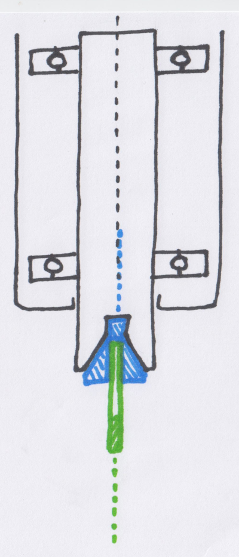
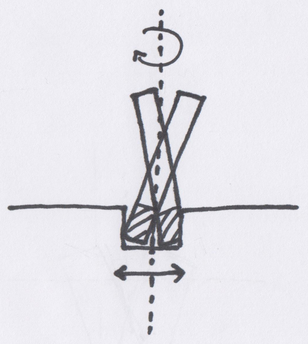
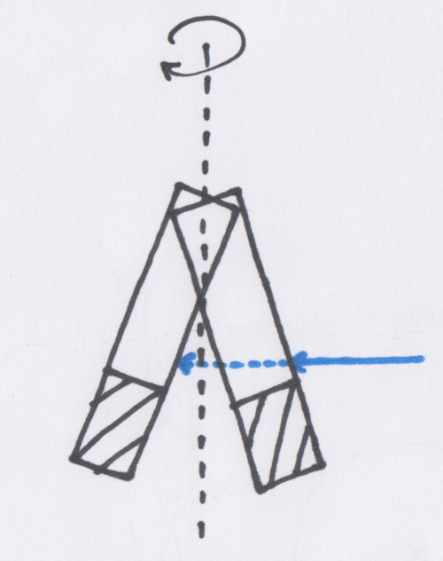
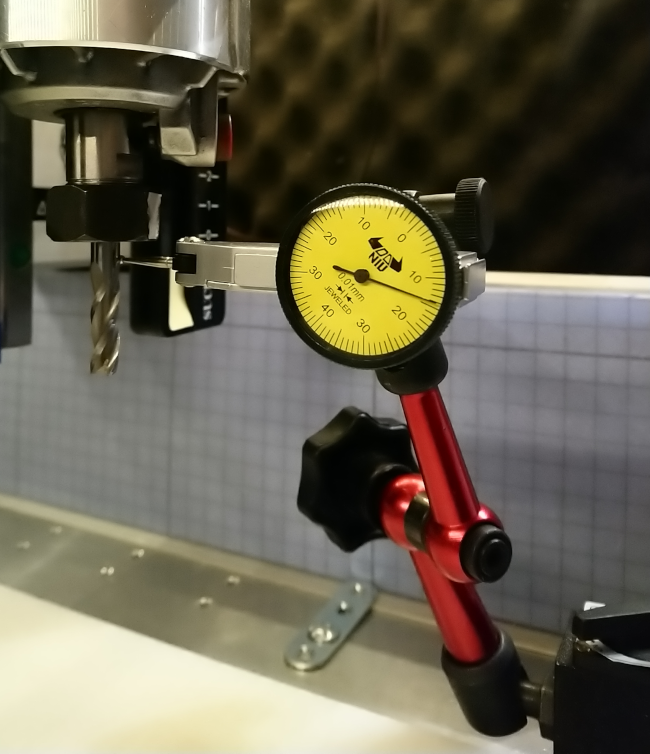

# Collets

There is not much too say about collets, other than "they come in various sizes and quality". Here's a sample set of collets for the Makita router:

From left to right:

* 1/4" Makita collet \(comes with the router in the US version\)
* 6mm Makita collet \(comes with the router in the European version\) with a 6mm to 3.175mm adapter inserted
* 1/8" \(3.175mm\) cheap unbranded collet
* 1/4" \(6.35mm\) precision collet from Elaire Corp
* 1/8" \(3.175mm\) precision collet from Elaire Corp

The main constraint with router collets is that the range of available sizes is quite limited, especially toward the smaller diameters. Spindle users have access to "ER" collets that are available in many more sizes, but that is a story for the [Spindle upgrade](../upgrading-the-machine/spindle-upgrade.md) section. Using a collet adapter/reducer is generally not recommanded as it tends to increase runout, but for most jobs it will still work fine.

Overall the Makita/DeWalt collets are fine, and this is definitely not something new users have to worry about. 

Below is a short overview of what runout is and how to measure it anyway. 

## Runout / TIR

In theory, the rotation axis of the router shaft, the axis of the collet, and the axis of the endmill are aligned: 

But in practice, manufacturing tolerances are such that there are \(very\) small imperfections at all levels:

* the router shaft itself may not rotate perfectly on its axis
* the collet geometry may not be perfect, introducing a misalignment of the axis between the outer surface \(attached to the router shaft\) and the inner surface \(holding the endmill\)
* the endmill itself may not have a perfectly cylindrical shape

The end effect is that the movement of the endmill's tip in the material is the combination of the rotation along its own axis and other unintended deviations. Here's a very \(very\) exagerated view of what happens when cutting a single slot:

The expected width of the slot is the endmill diameter, the actual width of the slot is the sum of the endmill diameter and the amount of deviation. This deviation can characterized by the ****maximal displacement measured at a given position on the surface of the endmill: 

A way to measure it is to use a **dial indicator**, capturing the minimum and maximum values read over a 360° revolution. Ideally, the runout should be measured at the tip of the endmill, but that is often not possible because of the flutes: at best you could get a measurement at the tip of each flute, instead of throughout the circumference. So the dial indicator should be positioned on the shaft, as low as possible.

**Runout** is the difference between the maximal and minimal values, at this given measurement point. 

On this particular setup using the stock 1/4" Makita collet and a 1/4" endmill, the measured runout was 0.0027" / 0.07mm at that position. Not great, not too bad, definitely not a concern in day to day use anyway.

Other possible measurements involve checking the router runout only \(removing the collet and measuring on the inside surface\), then measuring the router+collet runout, and finally the router+collet+endmill runout as above.

**TIR** \(Total Indicated Runout\) is the range of runout values if we were to measure across the full length of the endmill, so it boils down to the max runout.

## Reducing runout

* There is nothing one can do about the runout of a specific router \(short of returning the router, to get a new one, that _could_ be better, but that is random\)
* Using precision collets is a simple way to help reducing runout, and is one of the cheapest "upgrades" to the stock Shapeoko setup.
* Using quality endmills helps, but the endmill is probably not the main source of runout anyway
* and last but not least, while the above discussion was centered on the router/collet/endmill assembly, another factor has a much greater influence on the runout "as seen on the cut", and that is squaring/tramming of the machine: see [Tramming and surfacing](../building-the-shapeoko/tramming-and-surfacing.md) section for more.

