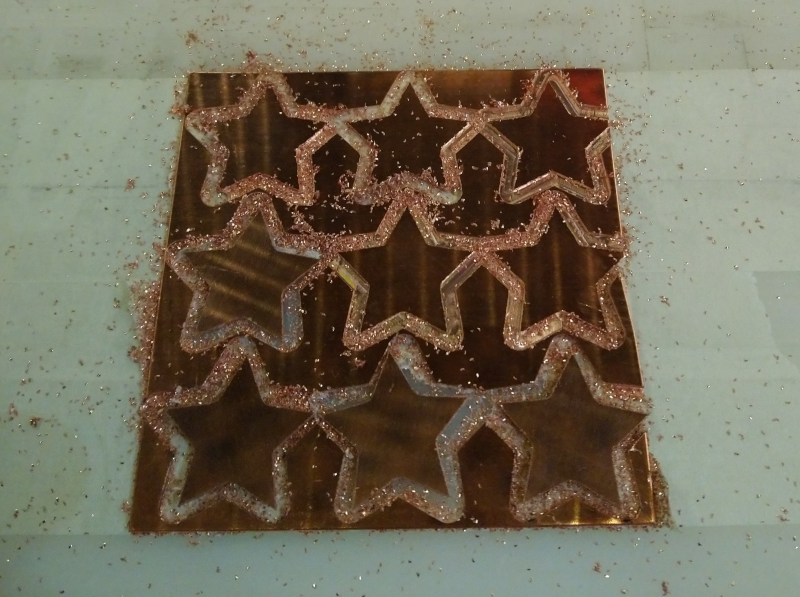
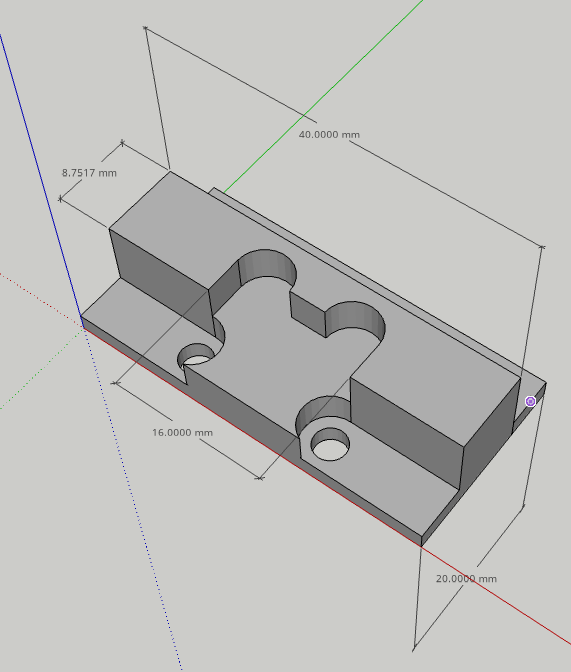
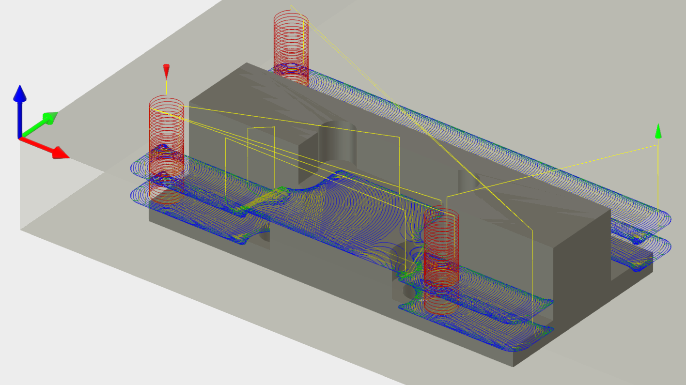
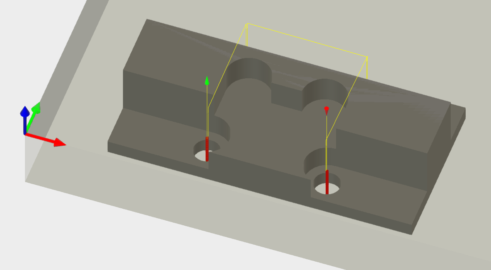
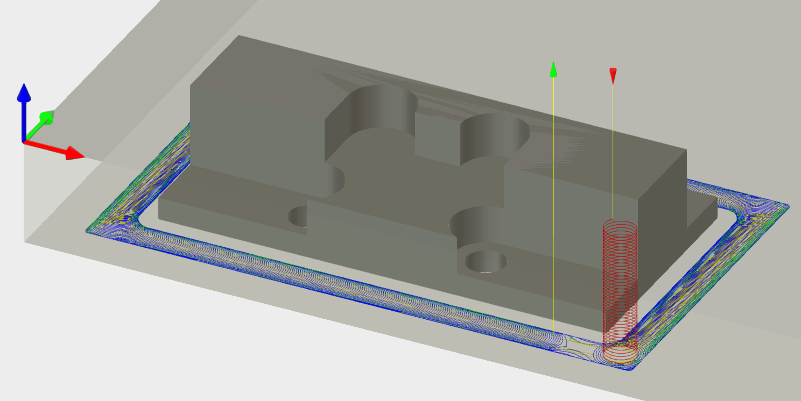
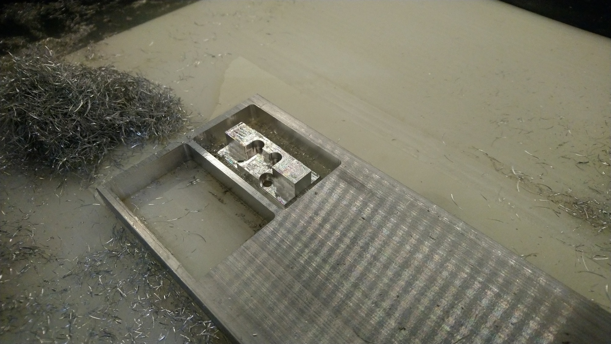

# Usecases: cutting metal

## Profile cuts in copper

The following was just a little experiment around doing profile cuts in copper with a 2-flute 1/8" square endmill \(\#102Z from Carbide3D store\), to figure out which feeds and speeds would work. I used a 100mmx100mm \(~4"x4"\) piece of 0.9mm \(0.035"\) thick copper, used tape & glue to hold it onto the wasteboard, and cut simple profiles at increasing chiploads, to find the sweet spot.

The toolpath is a single **contour/profile** cut, which is not the best thing to do if you need a perfect finish \(you should rather do a roughing cut followed by a light finishing cut to have perfect edges\), but for the purpose of this test, it represented a worst case scenario \(slotting throughout the cut\).

* The first step was to determine an adequate target **chipload** for an 1/8" endmill in copper. The guideline in the [Feeds & speeds](feeds-and-speeds-basics.md#shapeoko-chiploads-guideline) section for aluminium is from 0.0005" / 0.0127mm to 0.001" / 0.0254mm. Aluminium and copper are different, and their hardness varies with the specific type/temper used, but overall they both are in the 75-150BHN hardness range, so I assumed I could use the same target chipload \(since my copper sheet was of unknown origin, I could not make any better informed decision anyway\)
* **Stepover** does not apply this since wasa slotting cut. Therefore **chip thinning** did not apply either.
* I chose **12.000 RPM**, to keep things quiet and since cutting force was not going to be a problem for such a shallow cut.
* To achieve the 0.0005" chipload at 12.000RPM with this 2-flute endmill, the **feedrate** needed to be 0.0005 x 2 x 12000 = 12ipm = 300mm/min
* **plungerate** should be low since this is metal AND I would not be using any ramping into the material, I picked 4ipm \(100mm/min\)
* For **depth of cut** the guideline is 5 to 10% of endmill diameter for large WOC in metals, 5% of 1/8" is 0.00625" and 10% is 0.0125, I selected a middle value of 0.008" / 0.2mm
* **deflection** would not likely to be a problem for this shallow cut, the calculator told me the deflection for those settings was actually 0.002mm \(0.00008"\) for a 20mm \(0.8"\) stickout.

I actually tested 9 feedrates, starting from below the recommanded min chipload, to above the max recommanded chipload: 200, 300, 400, 500, 600, 700, 800, 900, and 1000 mm/min, which correspond to chipload values from 0.008mm \(0.0003"\) to 0.042mm \(0.0016"\)


I did not use any coolant or blast or air for this cut to be in a worst case scenario, for a real cut it would be better to do so.


All the cuts completed without issue, but:

* the 200, 300, and 400mm/min cuts were a bit noisy with hints of chatter during some passes
* it got better at 500mm/min
* 600mm/min was the best cut \(clean noise and clean cut\)
* 700 to 1000mm/min cut got increasingly noisy and rough.

For this specific test, 600mm/min i.e. a chipload of 0.001" / 0.0254mm seemed to be the sweet spot, but it also showed that there is a good range of usable feedrates around this optimal value.

## Profile cut in aluminium

* Same 2-flute ZrN-coated 1/8" square endmill, \#102Z
* Material for this test was 2017 T6 aluminium.
* Again target **chipload** for an 1/8" endmill in aluminium is 0.0005" / 0.0127mm minimum, I started from that. 
* Same **12.000 RPM** speed
* To achieve the 0.0005" chipload at 12.000RPM with this 2-flute endmill, the **feedrate** needs to be 0.0005" x 2 flutes  x 12000 RPM = **12ipm = 300mm/min**
* **plungerate** of 100mm/min \(4ipm\) again.
* For **depth of cut** I tried the high end of the recommanded range, 10% of the endmill diameter, so 0.012" / 0.3mm
* predicted **deflection** is still negligeable, 0.001mm \(0.00004"\) for a 20mm \(0.8"\) stickout
* Still using a simple slotting toolpath, but this time I used linear ramping and lead-in/lead-out options in VCarve.

Once the cut started, I could feel that the 300mm/min feedrate was a bit too low, so I gradually increased using **feedrate override** it until it sounded right, and ended up at +50%, i.e. 450mm/min \(18ipm\), i.e. a chipload of 0.00075", which happens to be right in the middle of the recommanded range for this endmill size.

## Adaptive clearing in aluminium

I needed to cut the following piece from 2017 T6 aluminium:

It is relatively small \(about 0.8"x1.5"x0.4"\), and holes are about 0.15", so I went for using a 1/8" endmill \(same as before: 2-flute ZrN-coated 1/8" square endmill, \#102Z\)

The majority of the cut is done with one **3D adaptive clearing toolpath** for roughing: 

* 10.000 RPM
* target chipload of 0.001"
* Stepover \("optimal load" in Fusion360\) of 0.012" \(~10% x endmill diameter\)
* target chipload adjusted for chip thinning for this stepover is 0.0017"
* feedrate was therefore 34ipm \(= 0.0017" x 2 flutes x 10.000RPM\)
* I used 13ipm plunge rate since helical ramping \(shown in red below\) allows  
* I kept 0.02" axial stock to leave, and 0.02" radial stock to leave
* 0.16" DOC \(~130% x endmill diameter\), which resulted in two passes \(in blue\):

I used a regular pocketing toolpath to cut the four holes, using the same feeds and speeds:

I added a horizontal finishing pass to shave off the 0.02" \(axial and radial\) excess material left during the adaptive clearing, and get to the final piece dimensions:

Finally, I used an adaptive toolpath to cutout the piece. I could have used a regular profile cut \(slotting\), but considering the small endmill \(1/8"\) and relatively thick stock \(0.4"\), this seemed less risky albeit longer approach: 

I used an air jet throughout the cut to help chip evacuation, no coolant. This got me nice long chips, and a decent finish quality:

Retrospectively, I should have used much higher RPMs \(while maintaining the same chiploads\) to optimize this cut.

