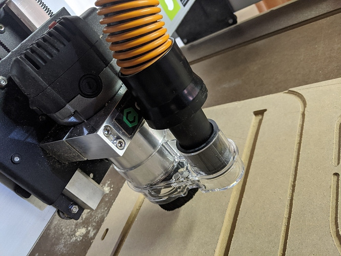
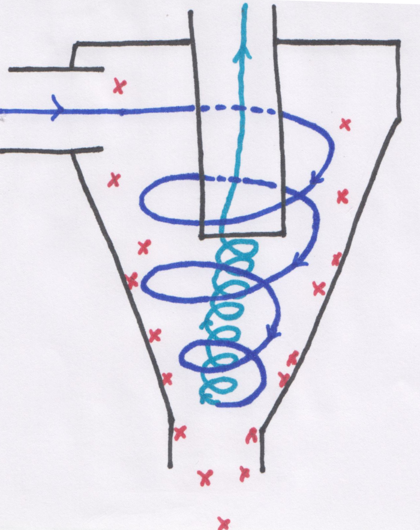
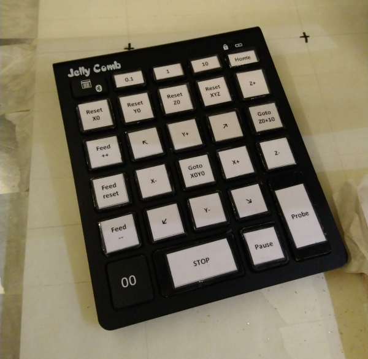
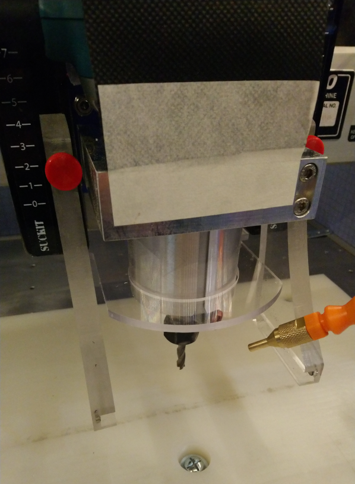

# Shapeoko setup

This section is a brief overview of the usual elements of a Shapeoko setup in the workshop, and focuses on the "why" and "what's important" in each element, rather than describing all possible options \(which would be impossible, user setups vary wildly!\)

## Location

Many users do not have the luxury of having multiple options for where to install their Shapeoko anyway, but when possible:

* a heated/dry area is preferable. The structure and electronics are basically immune to low/high temps and humidity, but the MDF bed is prone to absorb moisture.
* spare space around the machine \(especially above the machine\) comes in handy
  * for accessibility during maintenance
  * to accomodate an enclosure, itself larger than the machine by a good margin
  * as a provision for upgrades \(e.g. higher Z-axis upgrade\)
  * to have room to fit a dust collection system underneath/next to the machine
  * to support tiling \(feeding long pieces from the front or back of the machine, through to the other side\).
* height: having the machine installed at arm/desk level is best. Kneeling to change the endmills on a machine installed on the floor or in a low cabinet will get old very quickly.
* keep in mind that CNC is noisy \(router and sound of the cut itself and dust collection system\), though an enclosure will help a lot.
* the Shapeoko should rest on a rigid and level surface. A custom-made bench with a torsion box is a popular choice, but mine is just installed on a sturdy Ikea kitchen table bolted to the wall.

## Feet or no feet?

The regular setup with the four leveling feet works fine, but is susceptible to a couple of issues:

* the MDF bed can sag in the middle, especially on larger models \(XL and XXL\). Usually not by much, but enough to be a nuisance. Just adding a custom support point in the middle underneath the bed/rail addresses this weakness, easy enough.
* the other point that made me consider removing the feet is that I am using the tape & glue workholding method a lot, it involves pushing the stock firmly onto the wasteboard for a few seconds, and it did not feel right to be pushing in the middle of the bed, exactly where the natural sag already happens. As many others have done, I removed the four feet. My solution was to install the Shapeoko on top of a thick piece of MDF \(with holes to accomodate the protruding welded nuts under the steel plates\), with a narrower and thinner piece of MDF inserted between the plates on top of that, plus a thin sheet of roofing felt to provide a little damping. As long as the bench underneath is reasonably level, getting rid of the feet is not a problem, and this will provide a lot of additional rigidity: I can now push on the bed as hard as I need to. 


\(the picture shows an aluminium bed, which also helps the rigidity, but that is a story for the [HW upgrades](upgrading-the-machine.md#bed-upgrade) section\)

## Dust collection

CNC is just messy. While it is quite possible to operate the Shapeoko without a dust collection system and just clean-up manually once the job is finished, here are a few reasons why it is much better to have one:

* cutting MDF: unlike in wood, the cutter will not produce nice thick/heavy chips, but a very fine dust that will float and soon cover everything around the machine, and is dangerous if inhaled repeatedly.
* visibility: vaccuuming chips during the cut allows seeing what the tool is doing, and how the cut looks like so far, which is important to detect if something is not right. And manual vaccuuming during the cut gets old very quickly.
* clearing the path for the tool: if chips accumulate e.g. in a deep slot, they will end up being in the way between the tool and the material, they will accumulate and reduce chip evacuation inside the flutes, all of which are not good for the quality of the cut.
* some folks have caused cuts to fail by dust induced static when vacuuming by hand.

### Dust shoe

Using a dust shoe attached to the X/Z carriage is the common solution. They come in two main types:

* the dust shoe can be attached to the router \(or elsewhere on the moving part of the Z-plate\). In this case, since it will move up and down with Z movements during the cut, one needs to take that into account, by leaving enough clearance under the dust shoe and ideally having long and flexible bristles, so that when the router will be cutting at maximum depth, the dust shoe won't collide with the surface of the stock. Here's a picture of Carbide3D's "Sweepy" dust shoe:




The main benefit of a router-mounted dust shoe is that it can be quite compact, and it will not reduce the X travel. The main drawback is that it does not work well when cutting deep jobs, as  the required clearance under the bristles will make the suction efficiency drop significantly


* or the dust shoe can be attached to the fixed part of the carriage, and then adjusted and locked with the bristles against the stock surface \(you will still have to watch out for possible collision with clamps, or use low-profile clamps that will slide right under the bristles\). They are called "Z-independent" dust shoes, here's a picture of such a dust shoe installed on my machine:



The main benefit of a Z-independent dust shoe is that suction is optimal \(since the bristles can be adjusted to be flush against the stock surface\), and there is no need to worry about cutting depths. The main drawback is that the side arms holding it usually reduce the X travel slightly, and the dust shoe is generally a bit bulky, with risks of collision with clamps.



If you buy or make a dust shoe, make sure it has a slot in the back so that it can be inserted/removed without having to raise the tool, unlike mine shown in the picture above. The natural thing to do is to zero without the dust shoe to see what you are doing \(even more so if you are using a touch probe\), and then slide the dust shoe in place just before running the job. 



When the toolpaths are such that the dust shoe will move past the edges of the stock surface, it is useful to add extra material \(of the same thickness\) around the stock, to ensure that suction power remains optimal throughout the job.


### Dust separator & shop vacuum

While it is possible to connect a shop vacuum directly to the dust shoe, it turns out to be inconvenient, and potentially unsafe: 

* inconvenient because the amount of chips produced when cutting with a CNC can be significant, and you would end up replacing the shop vacuum paper bag very often.
* potentially unsafe because cutting some materials \(e.g. MDF\) produce fine dust instead of chips. Even with perfect feeds and speeds, the shop vacuum may not have an adequate filter to cope with this, and even if it does it would require cleaning very often.

A common solution is to buy or build a "cyclone" dust separator: 



* the shop vacuum is plugged on top, while the hose from the dust shoe is connected on the left.
* the suction from the shop vacuum and the shape of the cyclone dust separator are such that an outer vortex \(blue\) and inner vortex \(teal\) are created, so the chips/dust contained in the incoming air flow are pushed against the walls of the cyclone by centrifugal force, and then slide down under the effect of gravity to the bottom where they can be collected using any kind of tank.

I chose to buy a cheap ~4 gallons/15L ash collector tank at my local hardware store, and bolted the cyclone onto that \(with a little glue around the base for sealing\):


Surprisingly little dust/debris gets past this and into the shop vac, so much so that I hardly ever change the shop vacuum filter itself now


BUT if you are cutting a lot of MDF or other nasty material that produce very fine dust, you should still have proper \(HEPA\) filtering in place, the cyclone alone will not be good enough.


## Enclosures

Putting the Shapeoko inside an enclosure has many benefits:

* noise reduction
  * the enclosure walls alone will reduce noise, or at least filter out the most irritating high frequencies of the router.
  * the inside walls can be padded with a sound-damping material.
* dust/chips containment
  * while most of the job will be done by the dust collection system, _some_ chips/dust will still find their way around the machine, and the enclosure helps in keeping that from spreading to the rest of the workshop.
* additional safety
  * the front window of an enclosure is an excellent protection against flying debris, or the occasional broken endmill.

Most people design their own custom enclosure. Here are a few things to consider:

* **height**: 
  * it should be high enough to accommodate the Shapeoko itself _and_ still have a comfortable margin on top on that. The dust collection hose should be able to move freely when the gantry moves to any position on the work area.
* **accessibility** 
  * a front window that can be removed or opened is standard. For maintenance reasons the ability to remove/raise the top of the enclosure out of the way is handy. 
* **visibility**
  * the front side should be a window, you will want to be able to check what is going on at all times.
* **integration**
  * with the dust collection/shop vacuum, which is commonly placed underneath the enclosure.
* **clearance** at the front of the machine: 
  * the router can reach beyond the limits of the bed/wasteboard on the front side, and this can turn out to be very useful \(stock overhanging on the front\), so the enclosure should not prevent this.
* **sound-proofing**
  * covering the side walls with a sound-absorbing material helps dampening the noise.
* **lighting**  
  * you will probably want to install \(LED\) lighting inside the enclosure, at 360° if possible to avoid shadows on the work area.
* **future-proofing**: 
  * provision areas for installing various controls \(see control panel below\), a VFD controller when you upgrade to a spindle, etc...

## Control panel / E-stop

While you are designing your enclosure, why not plan to add a custom power control panel at the same time? It makes for a simple and useful project, especially if you include a kill switch/emergency stop button. When things go wrong, you do not want to have to reach for the various power switches \(router and machine, at least\), so having a big red button located right within arm's reach could save you \(or the machine\) someday. 

Mine is a crude version made from MDF parts, it does not look fancy but does the job perfectly. Beyond implementing the emergency stop button, having all power switches in a single place and with a visual cue as to what is currently turned on is very convenient:


## Control pad

If you are using a G-code sender that supports keyboard shortcuts, it can be convenient to use a remote keypad \(wireless or wired\) for those shortcuts, so that the jogging/probing commands can be used without looking at the computer screen. Mine is wireless and costs about 20$, I printed custom labels for the actions I use most, and then mapped the underlying keys to the associated actions in my G-code sender.



You can also go crazy and buy a fancy keypad with programmable OLED displays on each key, and dynamically switch between different keymap configurations.

## Air jet & lubrication

While a dust collection system works great for cutting wood & plastics, cutting **metal** is different: the chips may be too heavy to be efficiently sucked out of the cut, and if any lubrication is required it is incompatible with the use of a dust shoe.

The usual solution is to use an air jet to push the chips away from the cut. A mist coolant spray system is a useful addition to the shapeoko setup when cutting metal. In the picture below, the orange tube goes to a \(heavy duty\) air compressor, and the transparent tube goes into a bottle of lubrication liquid. The lubricant gets mixed with the compressed air, and the spray is aimed at the cutting point:


However this means that metal chips will be flying all over the work area, so it can be useful to add specific protections.

Some kind of **filter** on top of the router: the picture below shows a quick and dirty hack that protects the router air inlets from flying chips, while still letting the air enter freely. Some just put a sock on the top part of the router. Whatever works for you, but do protect it somehow, metal chips going into the router's air intake will not end well.

A **chip guard** can be installed to prevent chips from flying upwards and getting stuck in the Z-axis or router, while still allowing the air jet to be aimed at the cut:



## Side walls

Protection walls can be installed on the sides/back of the machine, to at least keep the chips contained within the work area, when not using a dust shoe:


Mine are just made from 0.1'' thick hard foam strips glued to aluminium corner guards, bolted onto the bed. 


With an MDF bed, another idea is to cut slots on the sides, making it very easy to insert/remove the walls.


They do a good job of containing the chips \(but if you look closely enough at the picture below, you will see that some chips ended up on the left rail anyway\) :


## GRBL settings

The Shapeoko's default configuration procedure in Carbide Motion programs a set of specific GRBL parameters in the controller. Depending on the version of CM used, these settings were meant to be conservative, they are ideal while learning how to use the machine, but they can then be tuned to more aggressive values to improve jogging and homing speed.

I tuned mine based on a great [suggestion ](https://community.carbide3d.com/t/testing-more-aggressive-grbl-settings/19280/8)from **@wmoy** on the forum, and captured them here for reference:

```text
$25=2000.000 (Homing search seek rate, mm/min)
$27=1.000 (Homing switch pull-off distance, millimeters)
$110=10000.000 (X-axis maximum rate, mm/min)
$111=10000.000 (Y-axis maximum rate, mm/min)
$112=1400.000 (Z-axis maximum rate for HDZ, mm/min, 1000 for stock Z axis)
$120=500.000 (X-axis acceleration, mm/sec^2)
$121=500.000 (Y-axis acceleration, mm/sec^2)
$122=200.000 (Z-axis acceleration, mm/sec^2)
```

These values can be tuned from the MDI menu in Carbide Motion, or from the G-code command shell in any other G-code sender.


Those GRBL settings are now the standard values in Carbide Motion, starting from version 505



Note that those increased MAX speeds are fine for rapid moves outside the material, but it will still be your responsibility to program adequate cutting feedrates in the toolpaths, which are usually much lower than those limits. That 10.000 mm/min rate on X and Y corresponds to 393ipm, while cutting feedrates are typically always \(well\) below 200ipm.


