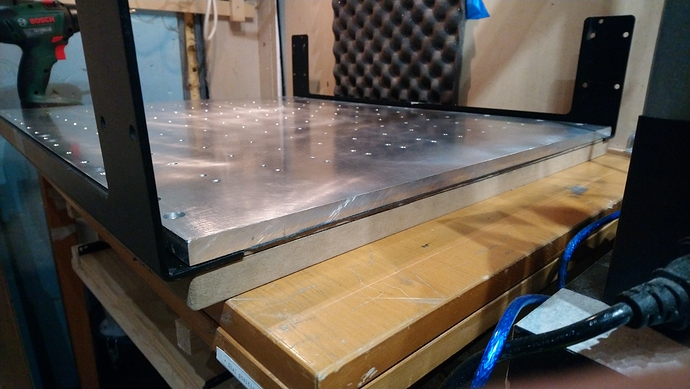
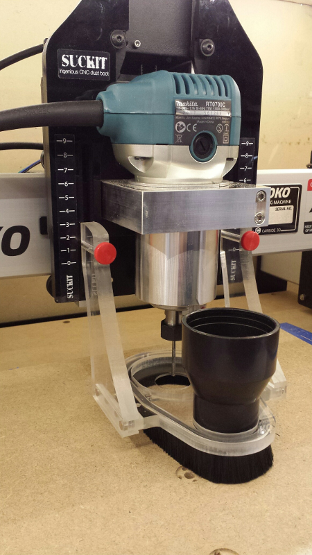
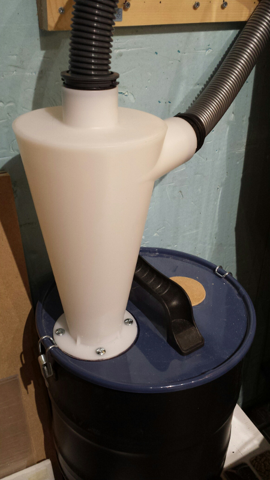
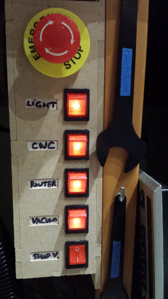
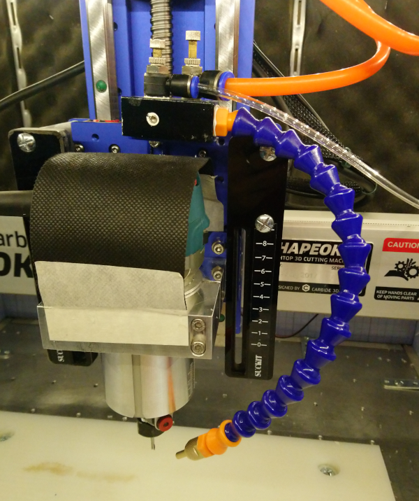
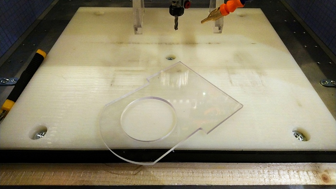
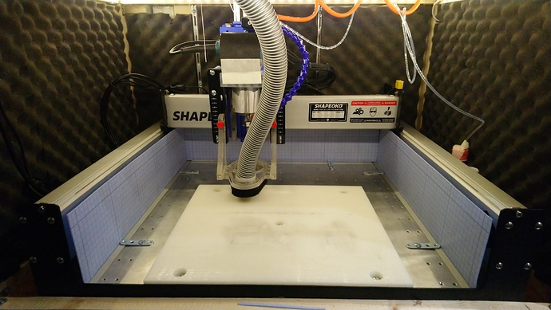
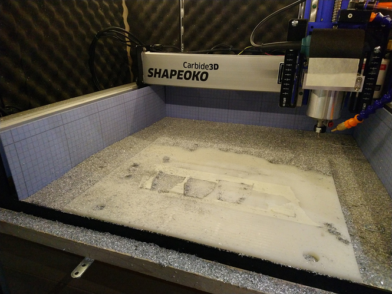

# Shapeoko setup

This section is a brief overview of the usual elements of a Shapeoko setup in the workshop, and focuses on the "why" and "what's important" in each element, rather than describing all possible options \(which would be impossible, each user setup is very custom\)

## Location

Many users do not have the luxury of having multiple options for where to install their Shapeoko anyway, but when possible a few considerations apply:

* A heated/dry area is preferable. The structure and electronics are immune to low/high temps and humidity, but the MDF bed is prone to absorb moisture.
* Spare space around the machine \(especially above the machine\) comes in handy
  * for accessibility during maintenance
  * to accomodate an enclosure, itself larger than the machine by a good margin
  * as a provision for upgrades \(e.g. higher Z-axis upgrade\)
  * to have room to fit a dust collection system underneath/next to the machine
  * to support tiling \(feeding long pieces from the front or back of the machine, through to the other side.
* Height: having the machine installed at arm/desk level is best. Kneeling to change endmill on a machine installed on the floor or in a low cabinet will get old very quickly.
* Keep in mind that CNC is noisy \(router + sound of the cut itself + dust collection\), though an enclosure will help a lot.
* The Shapeoko should rest on a rigid and level surface. A custom-made bench with a torsion box is a popular choice, but mine is installed on a sturdy Ikea kitchen table bolted to the wall, 

## Feet or no feet?

The regular setup with the four leveling feet works fine, but is susceptible to a couple of issues:

* the MDF bed can sag in the middle, especially on large models \(XL and XXL\). Usually not by much, but enough to be a nuisance. Just adding a custom support point in the middle under the machine fixes this weakness, easy enough.
* the other point that made me consider removing the feet is that I am using the tape & glue workholding method a lot, it involves pushing the stock firmly onto the wasteboard for a few seconds, and it did not feel right to be pushing in the middle of the bed, exactly where the natural sag already happens. As many others have done, I removed the four feet. My solution was to install the Shapeoko on top of a thick piece of MDF \(with holes to accomodate the protruded welded nuts under the steel plates\), with a narrower and thinner piece of MDF inserted between the plates on top of that, plus a thing sheet of roofing felt to provide a little damping. As long as the bench underneath is reasonably level, this will provide a lot of rigidity, and I can now push on the bed as hard as I need to without fear of deformation. 

## Dust collection

CNC is just messy. While it is quite possible to operate the machine without a dust collection system and just clean-up manually once the job is finished, here are a few reasons why it is better to have one in place:

* cutting MDF: unlike in wood, the cutter will not produce nice thick/heavy chips, but a very fine dust that will float and soon cover everything around the machine, and is dangerous if inhaled.
* visibility: vaccuuming chips from the cut allows to see what the tool is doing, how the cut looks like so far, which is important to detect if something is not going right. Manual vaccuuming during the cut gets old very quickly...
* clearing the path for the tool: if chips accumulate e.g. in a deep slot, they will end up being in the way between the tool and the material, they will be re-cut and reduce chip evacuation inside the flutes, all of which are not good for the quality of the cut.

### Dust shoe

&lt;TODO&gt;


when the toolpaths are such that the dust shoe will move past the edges of the stock surface, it is useful to add extra material \(of the same thickness as the stock\) around these edges, to ensure the suction power is optimal throughout the job


### Cyclone & shopvac

xxxx

## Enclosures

Putting the Shapeoko inside an enclosure has many benefits:

* noise reduction
  * the enclosure walls alone will reduce noise, or at least filter out the most irritating high frequencies of the router.
  * the inside walls can be padded with a sound-damping material
* dust/chips containment
  * while most of the job will be done by the dust collection system, _some_ chips/dust will still find its  way around the machine, and the enclosure helps keeping that from spreading to the rest of the workshop.
* additional safety
  * the front window of the enclosure is an excellent protection against flying debris

Most people design their own custom enclosure, here are a few things to consider:

* **height**: 
  * it should be high enough to accomodate the Shapeoko itself AND still have comfortable margin on top on that. The dust collection hose should be able to move freely when the gantry moves to any position on the work area.
* **accessibility** 
  * a front window that can be removed or opened is standard. For maintenance actions the ability to remove/raise the top of the enclosure out of the way is handy. 
* **visibility**
  * the front side should be a window, you will want to be able to check what is going on not only where the tool is, but on the sides too \(belts/rails\)
* **integration**
  * with the dust collection/shopvac, that is commonly placed underneath the enclosure.
* **clearance at the front** of the machine: 
  * the router can reach beyond the limits of the bed/wasteboard on the front side, and this can turn out to be very useful \(stock overhanging on the front\), so the enclosure should not prevent this
* **lighting**  
  * you may want to install \(LED\) lighting inside the enclosure.
* **future-proofing**: 
  * provision areas for installing various controls \(see control panel below\), a VFD controller when you upgrade to a spindle, etc...

## Control panel / E-stop

While you are designing your enclosure, why not plan to add a custom power control panel at the same time ? It makes for a simple and useful project, especially if you include a killswitch/emergency stop button. When things go wrong, you do not want to have to reach for the various power switches \(router and machine, at least\), so having a big red button located right within arm's reach could save you \(or the machine\) someday. 

Mine is a crude version made from MDF parts, it does not look fancy but does the job perfectly. Beyond implementing the emergency stop button, having all power switches in a single placeand  with a visual indication of what's currently turned on is very convenient:

## Air jet & lubrication

While a dust collection system works great for cutting wood & plastics, cutting **metal** is different: the chips may be too heavy to be efficiently sucked out of the cut, and if any lubrication is required it is incompatible with the use of a dust shoe.

The usual solution is to use an air jet to push the chips away from the cut. A mist coolant spray system is a useful addition to the shapeoko setup when cutting metal. In the picture below, the orange tube goes to a \(heavy duty\) air compressor, and the transparent tube goes into a bottle of lubrication liquid. The lubricant gets mixed with the compressed air, and the spray is aimed at the cutting point:

This means that metal chips will be flying all over the work area, so it can be useful to add specific protections.

Some kind of **coarse filter** on top of the router: the picture above shows a quick and dirty hack that protects the router air inlets from flying chips, while still letting the air enter freely. Some people just put a sock on the top part of the router. Whatever works for you, but do protect it somehow, metal chips going into the router air intake will not end well.

A **chip guard** can be installed where the dust shoe would normally be, to prevent chips from going upwards and getting stuck in the Z-axis or router:

Protection **walls** can be installed on the sides/back of the machine, to at least keep the chips contained within the work area:

They do a good job of containing the chips \(but if you look closely enough at the picture below, you will see that some chips ended up on the left rail anyway\) :

