# Running a job

The basic workflow for running a job is covered pretty well in Carbide 3D's docs/tutorials, the intent of this section is to provide background information and various tips about the different steps. 


The ordering of these steps can vary based on personal preference and software being used. For example, I like to have the machine turned off while I change the cutter, but many find it more convenient to have it turned on to be able to jog the router automatically to the front.


## Installing the cutter

A few things to watch out for when installing a tool in the collet :

* make sure the collet matches the endmill diameter. This may sound silly, but once you start having a collection of various imperial and metric tools and collets, inadvertently using a 6mm endmill in a 1/4'' \(6.35mm\) collet is a \(remote\) possibility, and not paying attention to this will result in serious trouble during the cut. 
* the collet and collet taper must be **clean** of any debris/dust. Those might introduce runout. 
* **stickout**: it should be 
  * as low as possible to minimize tool deflection
  * but still be compatible with the max cutting depth for this job
  * short enough that the shank is engaged over the full height of the collet
  * but not pushed so far back that the flutes are inside the collet
* **runout**: if it matters for the job at hand \(high-precision and/or micro-machining\), now is the time to check it and tune it.
* the saying goes that the collet should be "**monkey tight, but not gorilla tight**". It should not be a baby monkey either, or the endmill might slip in the collet.

## Moving manually

Whenever the machine is turned off, it is possible to move it manually, with just one constraint: do it slowly. When the machine is turned off and moved manually, the stepper motors behave as alternators, they generate current, enough current in fact to back-power the electronics \(you might see the LED on the controller board come to life...\). Moving slowly ensures that the generated current stays low enough to not damage the stepper electronics. 

## Homing


That "clonk" sound when the machine is turned on is just the stepper motors locking in place, nothing to be concerned about.


The reason for homing was introduced in the [CNC workflow](workflow.md) section: the only way the Shapeoko can tell for sure where it is, is when it contacts the three limit switches. Without homing, each time the machine is power cycled it would be unable to go back to any specific coordinates with precision.

You could argue that homing is useless since you are going to manually jog to the Zero point and set it to be the reference anyway. For a job that can be done in a single run / with a single tool, that could work. But the power of homing is that it will allow returning with great precision to the Zero point defined last \(which happens to be stored in the non-volatile memory of the controller by the GRBL software\). 

If you turn off the machine to change tools, this will be needed. But even if you don't, you may still want to home between runs: if for some reason the steppers or belts skipped a few steps during the previous run, returning to Zero without homing first _may_ bring the machine to a subtly different point, a few steps away.


The notable exception is 2-sided jobs: depending on the precision of your limit switches, you may find that it is better to NOT re-home between the two sides to have minimal offset error.


## Setting & checking RPM

Unless you have installed a spindle or a PID controller \(see [HW upgrades](upgrading-the-machine.md#automatic-router-rpm-control)\), you need to adjust RPM manually using the knob on the trim router. The [Anatomy of a Shapeoko](anatomy-of-a-shapeoko.md#trim-router) section has a reminder about the mapping between knob values and RPMs, but the actual RPM can be slightly different than advertised, and on my router the knob did not even have a reference point on the casing, so I added a visual cue with a marker to at least have a repeatable setting:

But it's not easy to interpolate between knob settings to use intermediate RPM values, so I found it much easier to buy a laser tachometer \(about 20$\), turn the router on, and adjust the knob to get the desired value:

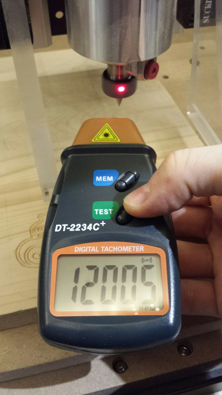

All it takes is a small patch of white/reflective tape on the collet nut:

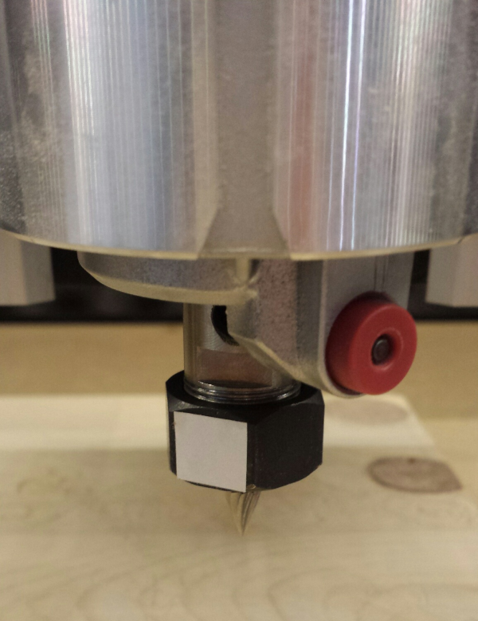

## Zeroing strategies

The next step before cutting is to set the zeros. You will probably have noticed that two options are typically offered in CAM software : defining zero somewhere on the **top** of the stock, or on the **bottom.**

In VCarve this is called setting the "Z Zero position" to "Material Surface" or "Machine Bed":

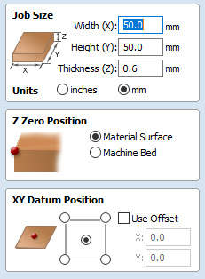

In Carbide Create, this is selected using the "Top/Bottom" drop-down list 

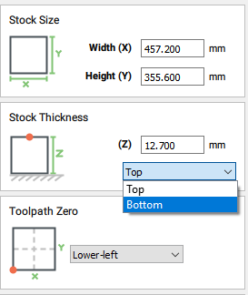

Consider this example where one would want to cut a rectangular pocket on the top of a square piece of stock: 

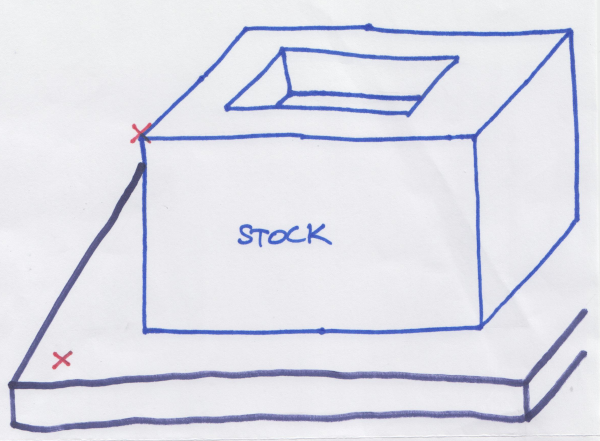

In many cases, one will want to zero on the **top** of the stock, just because:

* it feels more natural to set that plane as a reference \(Z0\), and then picture the machine milling the pocket down to a predefined DEPTH under that reference.
* as long as the pocket is not going all the way through the stock, there is no need to know or care about the stock thickness.
* it is often convenient to use the top left corner as a reference point for not only Z0, but also X0 and Y0, and using a corner probe makes that very easy \(more on this below\).

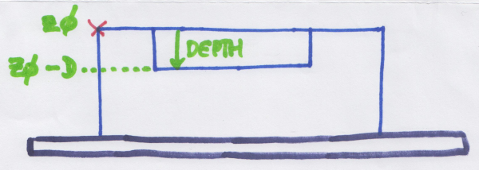

Previewing the g-code for that pocket toolpath would look something like below, with the tool starting from the upper left corner of the stock, retracting, moving to the pocketing area, and cutting to lower and lower depths:

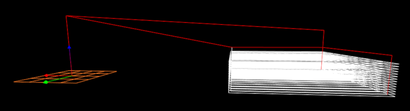

But sometimes, it is convenient to declare Z0 on the **bottom** of the stock / surface of the wasteboard:

* when the stock is not quite the desired thickness, and ones wants to surface it, down to a precise final height.
* when milling a piece that requires multiple tools, and there may not be an flat surface _left_ after the first toolpath has been run \(think of a roughing pass that would mill the top surface away and leave only a curved surface\)

Now there is a catch with zeroing on stock bottom: the CAM software NEEDS to know the stock thickness \(H in the picture above\), such that it can offset Z0 by that, and end up in the same situation as is setting Z0 on top.

The G-code for the SAME pocket toolpath as above, regenerated after declaring Z0 being on stock bottom in the CAM, would look like this:

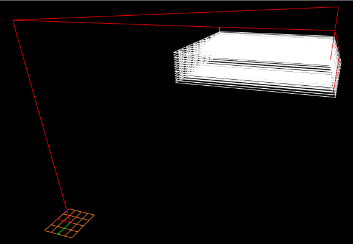

The tool would start from stock bottom, then rise all the way to the top surface \(plus the retract height\) and start cutting as it would if Z0 had been declared to be on top of the stock.

In summary,

* you can choose to set zero on stock top or stock bottom in CAM, but then on the machine you MUST zero the tool where you said you would!
* when setting zero on stock bottom, make sure to set the stock thickness value correctly in the CAM

## Zeroing \(manually\)

After jogging to the vertical of the intended X/Y zero point, lower Z gradually then use fine steps to touch off on _e.g._ a piece of paper placed between the tool and the stock, stopping as soon as the paper cannot be moved freely under the tool anymore, and then tell the G-code sender to reset X0/Y0/Z0. Yes, it does mean that you will zero a tiny bit above the real stock surface, but the average thickness of a piece of paper is around 0.004'' / 0.1mm, and chances are that you are already compressing the paper since it cannot move anymore, so you will actually be very, very close to the stock surface.

Miscellaneous tips:

* double-check your Z jog step before doing the final steps to touch off. It is very easy to hit the "down" arrow one time too many by mistake, and if the step is still say 0.1'', this might bury your tool into the stock, or more likely break it if it is a small endmill.
* touching off with a very pointy V-bit can be tricky, it's easy to go too far down without noticing, so you should use even finer jog steps and/or extra caution.
* for jobs involving multiple tools, consider the fact that you will have to re-zero after tool change: it is more convenient to zero on a part of the surface that will...still be there after the first tool has done its job.

The main limitation of manual zeroing is that you need to eyeball the X/Y location, which for some jobs is not precise enough. And of course, the manual careful jogging to touch off is somewhat time consuming.

## Zeroing \(with a Probe\)

Enter the touch probe, to automate the zeroing process. The Shapeoko controller has a dedicated "Probe" input, that works like the other limit switches. It detects whether there is continuity between the two pins:

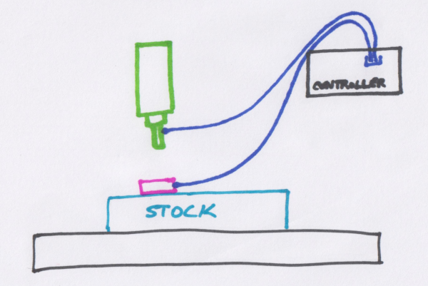

For zeroing Z only, a probe can boil down to a piece of \(conductive\) metal sheet \(of known thickness\), for zeroing X, Y and Z, it needs to be 3-dimensional but the principle is the same. X/Y/Z probes typically have a recessed face on the bottom side, so that they can be placed on a corner of the stock top surface:

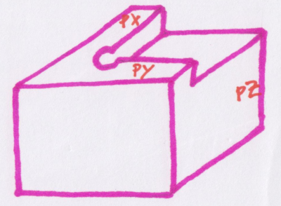


Probes come in two types: passive and active. Passive is just what was described above, i.e. a glorified metal cube. Active probes have internal electronics to support features such as an embedded test LED that lights up when contact is made, which is useful for checking that the probe chain is working fine before initiating the probing cycle


The probing goes like this:

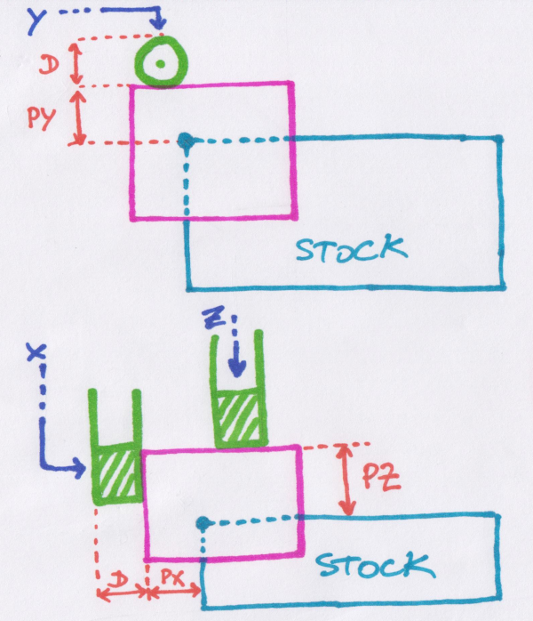

* the probing cycle starts with the tool raised above the probe. It could be anywhere above, but there is usually a target area above which to \(coarsely\) position the tool, to facilitate the rest of the sequence.
* the tool is lowered along Z, until it makes contact. When it does, the software can just read the current Z and subtract the thickness of the probe \(PZ in the sketch above\) to get Z0. This Z touch off sequence can be repeated to average out values and improve precision
* if the probing cycle is configured to also probe X and Y, it retracts the tool and proceeds to move away from probe, lowers the tool and then comes back towards it until it detects contact, then repeats that operation for the other side. It can then determine X0 and Y0 by reading the X or Y values at contact, add PX or PY, and add half the \(preconfigured\) diameter D of the tool itself. 

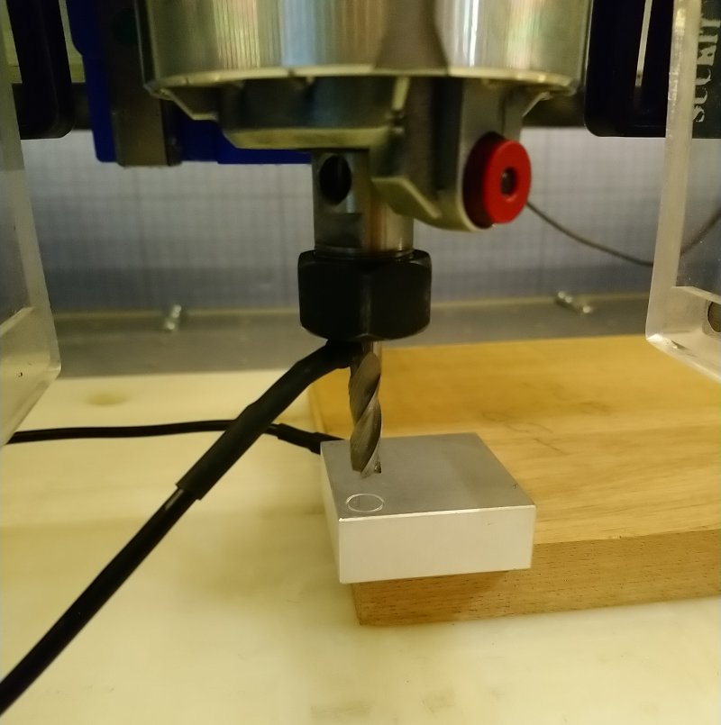

If the stock shape does not have a straight corner, the probe can also sit on top of the stock surface and be used for Z probing only \(the software will know that when Z probing only is selected, it should compensate for the total height of the probe, not just the PZ step\).

One problem remains: the X0/Y0 computations depend on \(half the\) diameter of the tool, so the geometry of the tool must have been configured beforehand, and this manual operation is error prone. Also, the _actual_ precise diameter of the tool is often not quite the advertised value, so this will introduce a _slight_ error in X0/Y0, which will result in a shift between runs with different tools. One more probing trick can be useful: if the probe has a hole, one can lower the tool into the hole and then probe its sides: probe left and memorize current X value, then probe right and memory current X value: the average \(middle\) of these two values is at the X center of the hole. Repeating this operation by probing on the front/back side of the hole will locate the Y center of the hole. Since the location of the center of the hole is at a known distance from the inner corner of the probe, this gives X0 and Y0. Z-probing can then be done normally elsewhere on the top surface. The beauty of this method is that it is independent of the tool diameter! 

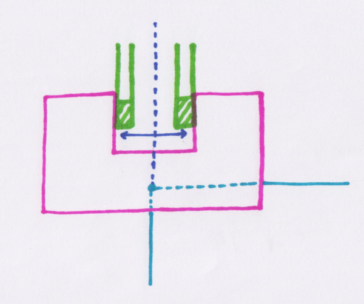


_@neilferreri_ on the forum came up with a wonderful probing macro for CNCjs, that does just this, go check it out: [https://github.com/cncjs/CNCjs-Macros](https://github.com/cncjs/CNCjs-Macros)


## Running a single-tool job

In case the G-code file was generated from a design that only used a single tool for all toolpaths, this is straightforward. Nothing special to be said here so I'll just share my own habits:

* if your G-code sender allows, raise the tool after zeroing. It is normally not necessary, but depending on your CAM post-processor's settings, the G-code may or may not contain an opening statement to do it, so this will give you a \(little bit\) of time to react if something unexpected happens. It is also required anyway in case your dust shoe model cannot be installed if the tool is lowered \(and since zeroing with the dust shoe in place is not fun\)
* If using a fixed-height dust shoe, double-check that it is lowered at stock surface level and won't crash into anything during the job.
* turn on the dust collection \(and air jet/lubricant mister if applicable\)
* put on your safety goggles and/or close the enclosure window.
* turn on the router.
* hit start...with your hand/mouse over the pause/stop button.


At least the first time I run a new project, I like to watch & listen throughout the cut, looking for hints of incorrect cutting parameters \(chatter, bad looking chips\), debris build-up, or anything I might have done wrong in the CAD/CAM, or could optimize. 


## Running a multi-tool job

Now, when multiple endmills are involved in a project, one must deal with **tool changes**. This involves two things:

* a moment where the machine is paused and the router is accessible, to go and change the tool.
* readjusting the Z0 after installing the new tool. Indeed, the new tool is probably not the same length as the previous tool, and is probably not seated at the same depth inside the collet anyway. Since Z0 was set using the tip of the previous tool, it needs to be reset.

There are basically two ways to manage this:

1\) The manual way :

* split your project into multiple G-code files, **one per tool**. A given file may still contain multiple toolpaths using the same tool.
* zero using the first tool, run the G-code file corresponding to that tool.
* turn off the router and install the second tool.
* redo the zeroing procedure, for Z0 only.
  * this is mandatory, and it's easy to forget...don't ask me how I know.
  * The "return to Z0 + xxx mm" button in Carbide Motion is very convenient to go back to X0/Y0, but beware: one day the second tool may stick out by more than xxx mm compared to the previous one...and that command may result in crashing the new tool into the stoc
* load and run the second G-code
* proceed similarly each time there is a new tool change needed.

2\) The semi-automated way

* this approach requires one to have a [**tool length offset probe**](upgrading-the-machine.md#tool-length-offset-probe) installed on the machine.
* generate a **single G-code file** containing all toolpaths, for all tools.
* Zero using the first tool, then run the G-code file: the machine will go and probe the length of that first tool, and will start cutting.
* The G-code sender will know when a tool change is required \(by detecting the "M6" commands inserted in the G-code file by the CAD tool\), and it will pause the job. 
* install the second tool.
* proceed to the automatic Z0 adjustment:
  * In Carbide Motion when using a BitSetter, resuming after the tool change prompt will trigger a new tool length offset probing, moving at the predefined BitSetter location to do so automatically.
  * In other G-code senders, it may be needed to launch a macro to trigger a new tool length offset probing, or even go and adjust Z0 manually if one does not have a tool length probe installed.
* The cut then proceeds, until the next tool change \(if any\), where this tool length offset adjustment is repeated.

Regardless, a few points to be considered during tool change:

* some people like to jog the router to the front using a predefined position in the G-code sender, to have easier access. Carbide Motion does this automatically when the BitSetter option is enabled.
* **safety**: if you are using a router or spindle that is externally controlled, I would recommend actually cutting its power source. Do you really trust your PID/VFD that much? If you are manually turning the router on and off, this is less of a risk but I choose to be extra cautious \(paranoid?\), and also kill the router power source \(in my case, flipping a switch on a control panel\) 
* remove the tool and collet and make sure the collet taper is free from any debris/dust that could create runout for the next tool.


If the collet is stuck in the taper, you may try moving the endmill gently left and right in the collet to get it out.


