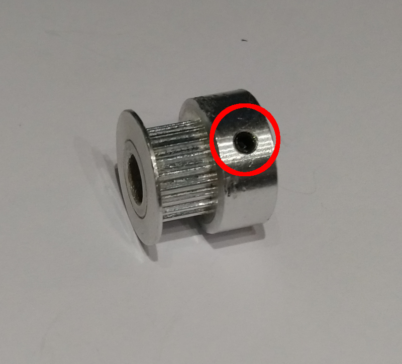
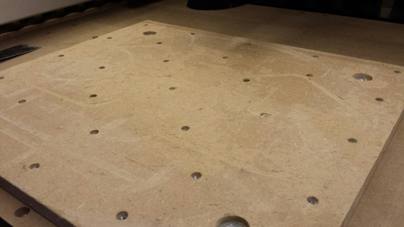
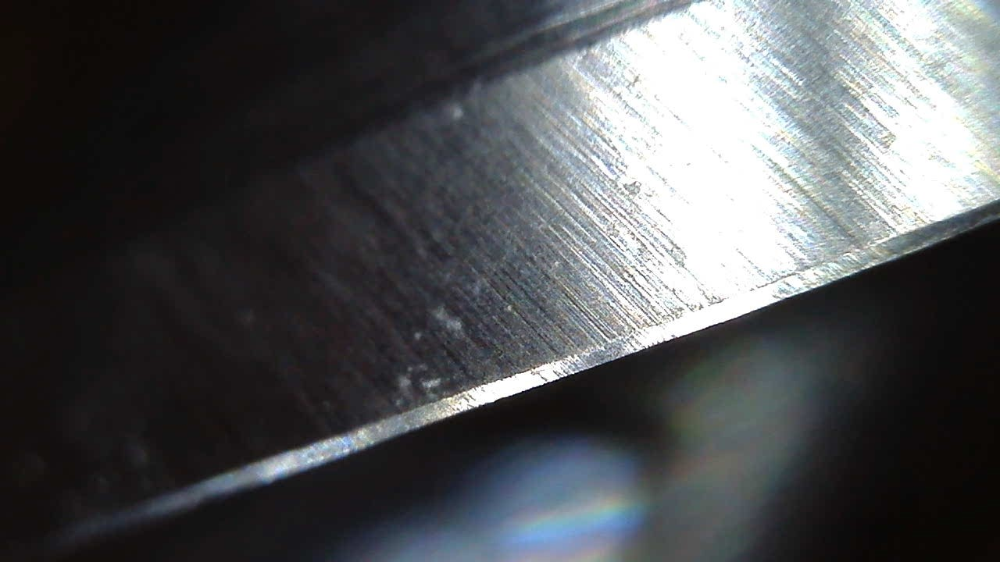
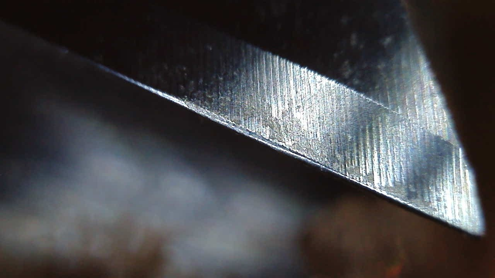
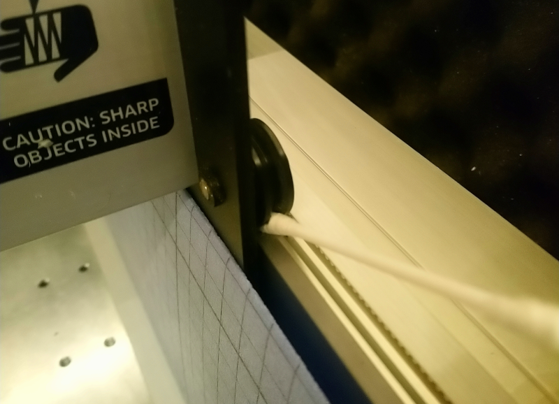
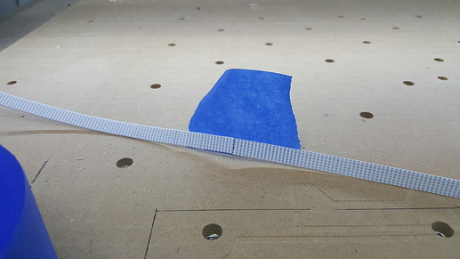
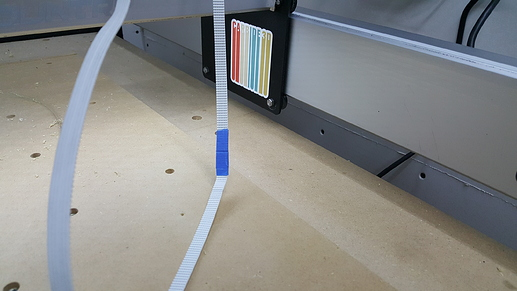
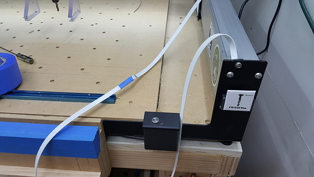
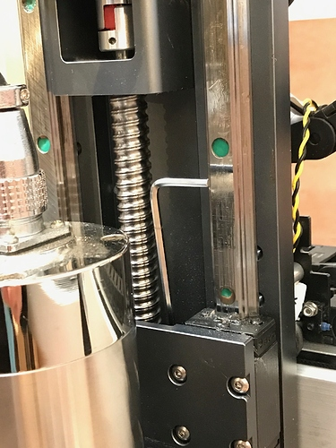
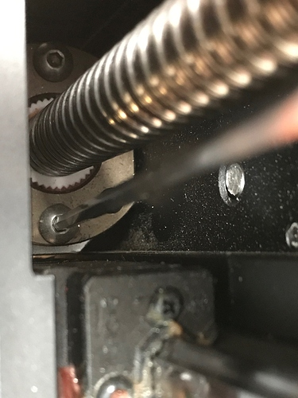

# Troubleshooting & maintenance

This section touches on a few of the most common mishaps that can happen when working with the Shapeoko, as well as basic maintenance tips.

## Basic checks

First, it's always advisable to go back and check the machine operating checklist, it's available at: [https://docs.carbide3d.com/general-faq/machine-operating-checklist](https://docs.carbide3d.com/general-faq/machine-operating-checklist)

## Hitting the limits

On one end of each axis, the homing switches will interrupt the toolpath if triggered _and_ if **hard limits** are enabled in GRBL, which by default they are not.

On the other end of each axis, since there is no way for the machine to know if it went too far, there are two cases:

* either the **soft limits** in GRBL have been activated and configured to the correct value for your machine, and the job will stop.
* or the soft limits are turned off, and you can get a mechanical crash.

Carbide Motion uses its own hard-coded soft limits during jogging, so if you are using this sender you are better off leaving soft limits turned off in GRBL \(first that would be redundant, and second the values set in GRBL may not be consistent with the ones in CM\).

If you are using another sender, then by all means do turn on soft limits in GRBL, it's easy:

* $20 parameter controls whether soft limits are enabled \(1\) or not \(0\). Start with soft limits disabled, to be able to jog freely.
* $130, $131, and $132 parameters respectively control X, Y and Z maximum travel : \(carefully\) jog to the limit of each axis, leaving a small margin you are confortable with, write the current axis value in millimeters, drop the minus sign, and set it in the corresponding parameter \(_e.g._ type in $130=&lt;positive value in mm&gt; in the GRBL console\). 
* once you are done, activate soft limits, and check that when trying to jog past them, the sender produces an error and stops the movement.


You should actually TEST how far you can go on YOUR machine, not rely on theoretical X/Y/Z travel values for the Shapeoko. There are a variety of factors that can make these values specific to a given machine. For example, on mine the X travel is limited by the arms of the dust shoe.


## Cut depth issues

When the cut depth is off, assuming the toolpath itself is correct, chances are something is slipping in the Z direction \(that is arguably the weakest axis on a stock Shapeoko\). A few potential reasons are listed below, more or less by decreasing likelihood:

* under load, the pulley may be slipping on the motor shaft if the **set screws** are not tight, so that should be checked/secured first \(using a 1.5mm hex key\):


The original set screws work just fine for most users, but some use beefier/larger set screws, or replace them with cap screws


* the belts must be **tensioned** correctly, to avoid any slop that could lead to the belt jumping the pulley teeth when a large load is put on that axis. This is a goldilocks situation where the belt needs to be tight enough to avoid this problem, but not too tight to avoid bending the motor shaft.


The usual words to characterize an adequate belt tension are "guitar-string tight". For the Y belts, a good indication of proper tension is that when the gantry is at one end of the rail, it should be possible to lift the belt a bit, but it should not be possible to slide a pinky finger under the middle of the belt.


* the endmill could be slipping in the collet, if it is not tight enough \("monkey tight, not gorilla tight"\), or worse if the wrong collet size was used \(e.g 6mm endmill in a 6.35mm collet\)
* also, and this applies to all axis, in theory commanding the motor to do N steps will move the associated axis by \(close to\) N/40 mm. But that's only true if the effort put on the shaft is lower than the torque the motor is able to provide. When the forces exceed the max torque of the motor, commanding one step of rotation will result in...the motor staying in the same position, effectively "losing" one step, which then causes a discrepancy between where the machine actually is, and where it thinks it is \(as it has no feedback loop to verify if it actually move\), and subsequent cuts will be off by the number of skipped steps.
* finally, if you are using a touch probe to zero Z axis only, make sure it does not sit on its recessed part, which is used for XYZ probing : installing it on a corner and probing Z would result in a Z0 that is off by the height of the probe step.


If nothing is slipping and the depth error is small, it _might_ just be that the Z steps per mm value \($102 parameter in GRBL\) is not right, refer to the [Dimensional accuracy](x-y-z-calibration.md#x-y-z-calibration) section for more.


## Crashing the machine

This will happen sooner or later, and it will very likely be a user error somewhere in the workflow. First, in most cases it's not that big a deal: the steppers have limited power and will stall, or the belts will skip. You should still rush to the emergency stop button but chances are that the machine will not be permanently damaged. Reports from people who actually broke the machine beyond trivial repairs are \(very\) rare.

Here's a checklist of things to double-check after a crash, while the machine is turned off:

* move each axis manually, and check for slop or any unusual noise/friction.
* check V-wheels are still tight. They are probably the parts that are most likely to have been  damaged. It's a good idea to have a spare set available.
* check the belts: if the pulleys skipped hard enough, belt teeth _may_ have been damaged \(but they are more likely to just break : having a spare roll of GT2 belt is cheap and can come in handy\). Pay specific attention to the Z-belt tensioning: a Z-related crash may have loosened the tensioning screw.
* optionally check whether the machine is still square and trammed.

Once everything is checked \(and repaired if need be\), turn on the machine and check whether homing and jogging still work fine.

## Disconnects

If a job stops suddenly for no apparent reason, and commands from the G-code sender have no effect anymore, it is very likely an EMI-related loss of communication with the controller. Most users never experience this failure, but there are a number of user-specific variables that _may_ lead to this problem. The main contributors are static discharges \(that are more likely to be a problem when the air is very dry, or when making a lot of dust while cutting\) and electrical noise \(which has many sources, be it mains power or poor grounding\).

A variety of solutions apply, the most commonly cited are:

* try different wall sockets if possible, for the machine, the router, and the shop vac.
* grounding the router body/mount \(_e.g._ wrapping a copper wire around the router mount and connecting it to a known-good grounding point, on the machine itself or nearby\).
* earthing the machine frame.
* grounding the dust collection hose, and/or use an anti-static hose.
* if the air is very dry, spray a little water on the stock, or use a humidifier in the room.
* using a high-quality shielded USB cable, and/or a USB isolator or powered USB hub, or just using a different USB port on the PC running the G-code sender.
* make sure your computer does not put the USB ports to sleep mode after a while. On a laptop, this can happen if running on battery: make sure it runs on power instead, or adjust power management options.
* using a voltage regulator/surge protector between mains and the machine.
* checking if router brushes are not worn out, and replacing them if needed.


To isolate the source of disconnects, it can be useful to do "air cuts" with the router turned off, then try with the shop vac turned off : if the disconnects disappear, look at grounding the router or the dust hose/shop vac.


## Double-checking the toolpaths

If the cut is not going as expected and there do not seem to be any mechanical issues, chances are the mistake lies in the toolpaths themselves. Going back over the toolpath parameters is a first step, then visualizing the toolpath details in the CAM tool is often helpful. This is one area where Fusion360 shines, the toolpath simulation feature is excellent, one can play it in slow motion, and it detects tool collision automatically \(assuming the selected tool and tool holder's geometry are modeled correctly\)

Typical mistakes include:

* typing the feeds and speeds values incorrectly \(or just using incorrect feeds and speeds\)
* inconsistency between where the zero point is declared in the CAM setup, and where you zeroed physically on the stock.
* wrong depth of cut setting \(which may not be immediately visible on the toolpath preview\).
* setting retract/safety height to an excessively large value resulting in the carriage lifting, bottoming out on the stops, then thinking it is much higher than it actually is, plunging deeply into the stock.
* wrong ordering of toolpaths.
* inconsistency between the toolpath and the selected tool capabilities, _e.g._ cutting deeper than the endmill flute length allows.

## Double-checking the G-code

While it is very unlikely that the generated G-code is incorrect if the toolpath is OK, you can still double-check it using a G-code viewer : 

* CAMotics is a good option for a standalone G-code viewer, there are many others, some of them online. 
  * I often use [https://nraynaud.github.io/webgcode/](https://nraynaud.github.io/webgcode/) and just copy/paste some G-code in there as a quick check.
* many G-code senders \(_e.g._ CNCjs, Universal G-code Sender, etc...\) include a G-code preview pane, and systematically checking that everything looks as it should there \(_e.g._ dimensions/depth, location of the toolpath versus zero point, ...\) before running a job will probably prevent a few silly mistakes, like not running the right file.

## Resurfacing the wasteboard

Some people use the wasteboard as a truly disposable part, i.e. have their toolpaths overcut into it on purpose, while others like to make it last by carefully setting the toolpaths to not cut deeper than the stock. Regardless, sooner or later the surface of the wasteboard will be scarred enough to require a fresh surfacing.

Here's my first MDF wasteboard after a few months of use:

Tape & glue workholding is great, but removing it tends to tear out the MDF surface over time. I later switched to an HDPE wasteboard that is immune to this, but still needs to be resurfaced \(much less frequently though\): 

## Tool wear

It takes a while to admit that endmills really are consumables \(no matter how expensive they can be\) and must be replaced when they are worn out, and the difficulty is that this is not often visible to the naked eye. Here's a close-up picture of the cutting edge of a brand new endmill:

Notice the narrow part that runs along the edge \(a.k.a. "primary radial relief"\), and the much larger surface \("secondary radial relief"\). By comparison, here is how my ancient \#201 endmill looks after being abused for months:

The primary radial relief is so blunt it is almost gone. At this point, the cutter is rubbing/forcing its way into material as much as it is cutting it. 

The big question is how to tell when a cutter has had enough, and everyone will have their own tips but here are a few pointers:   

* visual inspection with a USB microscope like the one used for the pictures above is a cheap option \(20$\), an even cheaper option is just to use a loupe.
* the sound of the cut and finish quality can be telltale signs \(assuming you remember how it sounded/looked with a fresh endmill for a similar cut\).
* the look of the chips can be an indication too: a sharp endmill used with proper chipload will make clean chips of uniform sizes, while a dull one will tend to make irregular, torn-out ones.
* if the endmill color changes to a darker shade, it has probably been rubbing for some time, either due to incorrect feeds and speeds or wear. Either way, it's done.

And then again, the level of wear that is acceptable really depends on the material being cut and the required finish quality. I still use the battered \#201 pictured above for quick & dirty tests in wood, and get away with it. 


If your endmills wear out very quickly, it is likely that you are not using proper feeds and speeds, and/or you have too much runout.


## Cleaning the belts, wheels, V-rails

* a quick vacuuming along the belts length will remove the chips that may have landed there during the cut. It takes 10 seconds, and will prevent the V-wheels rolling over debris or chips getting into the pulleys/idlers.
* it is good practice to wipe off the V rails if crud accumulates.
* cleaning the V-wheels \(ALL of them\) once in a while helps keeping a clean contact with the rail too. I use a cotton swab placed between the wheel and the rail, and slide the machine manually:


You could also use custom **wheels covers:** check out David Johnson's DIY engineering site to buy some, he also made them available on Thingiverse so if you have a 3D printer you could print them yourself.


## Changing the belts

Sooner or later you will have to replace a belt, and it's less than fun to run the new belt through the idlers and pulley, so here's a handy tip from **@Microwave\_Monkey**: undo one end clamp, loop the new belt through and reinstall the clamp, then take the end of the old belt and secure it to the end of the new belt with some painters tape like so:

Now it is easy to gently pull the new belt through the pulleys and such with the old belt. No fiddling around trying to coax the new belt around all of them.

## Tightening belts & wheels 

From time to time, it is worth checking whether the belts are still guitar-string tight, and the eccentric nuts still keep the V-wheels right against the rails.

* belts can stretch/loosen a bit, and this will not be readily apparent. Do the pinky finger test, or better yet actually measure the belt tension  \(using the method mentioned in [Squaring, surfacing, tramming](squaring.md#squaring-the-machine)\)
* with the machine turned off,
  * slide the gantry and X/Z carriage manually and check that all wheels are turning: if one of them is not moving, either the eccentric nut is not tight enough or the wheel is worn out and should be replaced. 
  * Grab the X/Z carriage and \(gently\) try to twist it front/back and left/right: there should not be any slop.


A little bit of blue Loctite on the eccentric nuts helps keeping them tight for a very long time


## HDZ maintenance

While the HDZ is mostly maintenance free, once in a while it does not hurt to double-check its less visible/accessible parts. Specifically, you may want to check that the two screws holding the lower part of the ballscrew are still tight, using the long allen key which comes with the Shapeoko:

