# Squaring, surfacing, tramming

## Squaring the machine

Squaring the machine is covered in the Shapeoko assembly instructions, this section just adds a few notes on why this matters, and a few tips.

In the best case scenario, bringing the gantry to the front side, tightening the front screws, sliding the gantry to the back, and tightening the back screws is enough to make the gantry square to the Y rails. Here's a view from the top with the gantry pushed all the way back or all the way to the front steel plates, ideally the side plates should make contact simultaneously, leaving no gap on either side:

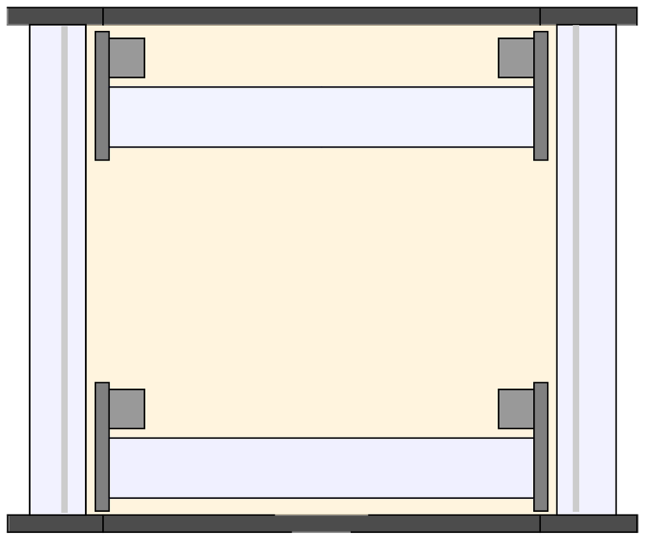

But you may and likely will get a small gap on one side, and a similar gap on the opposite side when pushing the gantry to the other end of the Y rails \(teal arrows on the exaggerated sketch below\):

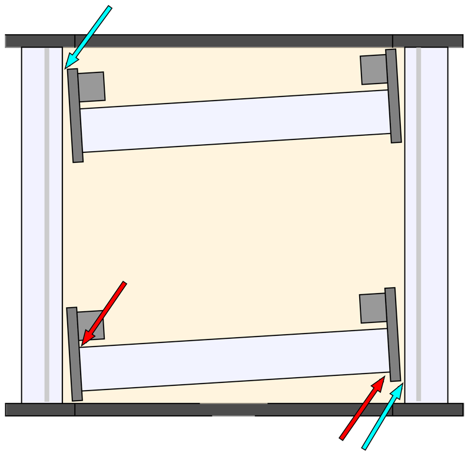

This can be due to a number of reasons \(X extrusion sides not being perfectly square, tolerances in the side plate / V-wheel /washers assembly, etc...\), and common solutions to fix this are:

* to insert **shims** between the X extrusion and the side plates on both ends \(but on opposite sides of the rail, _e.g._ where the red arrows are on the sketch\). Of course, should the skew be in the other direction, the shim location should be reversed. One shimming technique is to just fold a piece of aluminium foil a few times over, and insert it there. Or use a feeler gauge.
* to use **washers** carefully selected to have slightly different thicknesses, and use them on the front and back V-wheels on each side plate, to achieve the same effect \(in the sketch above, one would install slightly thicker washers on the back wheels on the left side, and on the front wheels on the right side\)


You _could_ also try and file the end of the extrusion flat to correct for squareness, but honestly this is not easy to do correctly for the casual hobbyist


Here's a \(poorly executed\) example of aluminium foil shimming on my machine, that was enough to fix the gap:

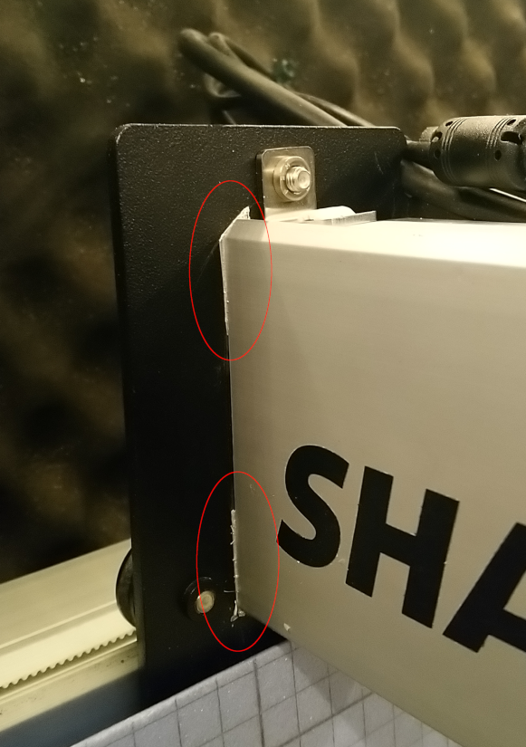

Once X and Y axis are square, the next step is to make the wasteboard as flat and parallel to the mechanical X/Y plane of the machine as possible, and this is what surfacing the wasteboard does.

## Surfacing the wasteboard

Either the X/Z rail is not perfectly parallel to the bed \(as shown exaggerated in the sketch below\), or the wasteboard is not perfectly flat to begin with, either way the end result is that after zeroing somewhere on stock surface and moving the endmill elsewhere along the X/Y axis, the tip of the endmill can end up being above or below stock surface: 

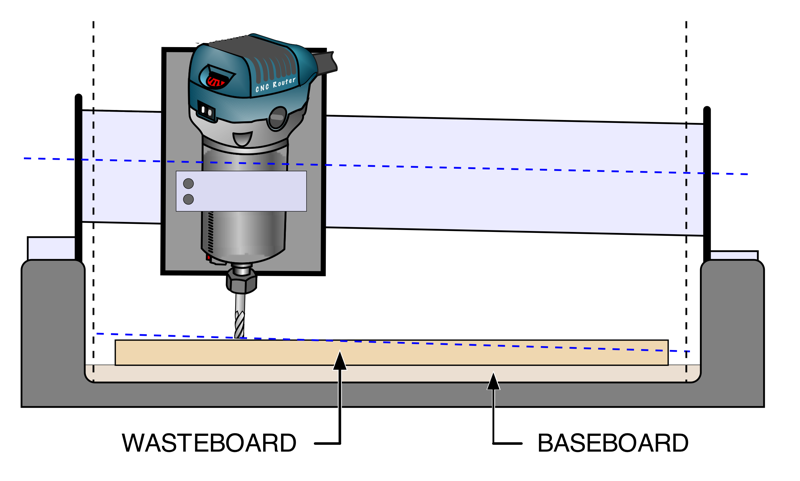

Running a surfacing toolpath on the top of the wasteboard will make it parallel to the gantry, therefore providing a known-flat reference to mount the stock onto, which turns out to be important for projects where depth accuracy matters:

* V-carving is a typical example: a small error in the depth being cut shows up as a difference in the width of features on the surface, which can be quite visible. In severe cases or when doing very shallow V-carving, the tip of the V-bit might not even make contact with the stock anymore on one side of the piece.
* PCB engraving is the extreme case, since by definition it cuts a very, very shallow trace onto the \(supposedly\) flat surface of a copper clad board: any minute difference in depth will ruin the quality of the PCB traces.


For PCB engraving, another technique to compensate for depth variations is to use bed leveling, i.e. use a probe to map the height of the PCB surface in various points, and compensate for it at the G-code instruction level


* but even regular jobs are impacted: in the example illustrated above, a pocket cut on the left side of the stock would end up being shallower than expected, and the same pocket cut on the right side would be deeper than expected. And both would have a sloped bottom.

Since the surfacing toolpath has to cover a lot of real estate, a fly cutter with a large diameter is useful \(but any large endmill will do, it just takes longer\).


Tip: draw squiggles with a pencil all over the wasteboard before starting: after the surfacing operation you will be able to tell if you missed a low spot \(i.e., did not surface deep enough to make it perfectly flat\)


Here's an MDF wasteboard surfacing operation in progress:

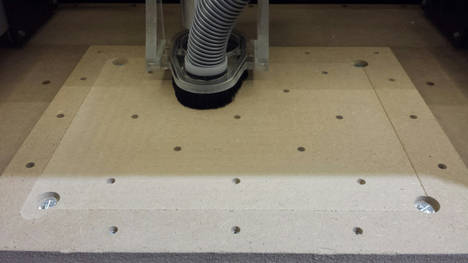


For MDF wasteboards, it is recommended to seal the surface after surfacing with a few coats of whatever you have on hand \(shellac, polyurethane, varnish, lacquer...\), this will reduce the likelyhood of the MDF absorbing a lot of humidity, as well as make the surface harder/less likely to tear off, especially when using the tape & glue workholding method.


While surfacing ensures that the surface of the wasteboard is true to the X/Y axis of the rails, it does not do anything about any potential **tilt** of the router itself around the X or Y axis: hence the need for tramming the router.

## Tramming the router/spindle

In a perfect world, the router axis would be perfectly square to the surface of the wasteboard \(and of the stock material\). For a pocket operation, a cross-section of three successive passes of an endmill could look like the sketch below, the bottom of the pocket would be flat, and its width exactly as intended:

But in reality, the mechanical assembly and tolerances on the router mount are such that the angle between the endmill axis and the stock surface can be slightly different from 90°. Here's a very exaggerated example:

Now the pocket ends up being wider than it was programmed to be, AND the bottom of the cut is not perfectly flat, there are small ridges at the overlap between passes.  Here's a real life example:

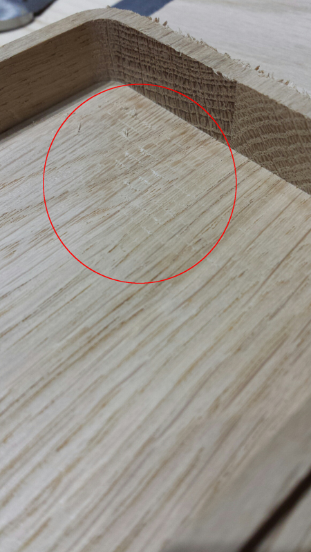

If the router is slightly tilted around both the Y axis and the X axis, there can be ridges visible in both X and Y directions. To get rid of those, the router should be **trammed**, i.e. its Z axis made perfectly orthogonal to the wasteboard. 


You should surface the wasteboard **before** tramming. If you don't, you may end up including any tilt or thickness variation of the wasteboard in the adjustment


One option is to use a dedicated tramming device mounted in the router and integrating two dial indicators. Any difference between the readout on the indicators is a sign of a tram angle. The arm can be rotated manually to check the angle in any direction:

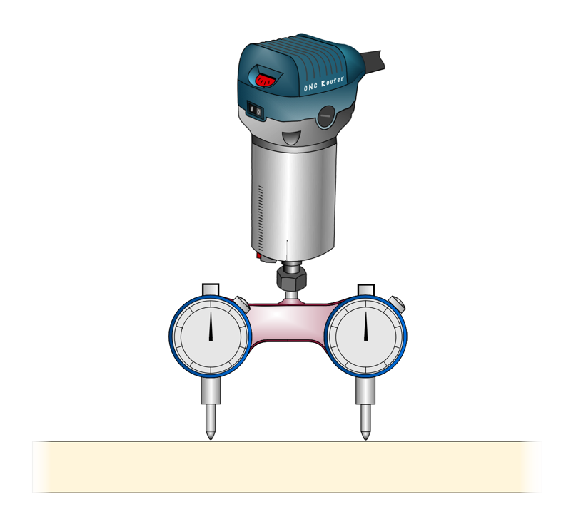

Very convenient, but pricey \(unless you make your own, but getting enough precision in the parts/assembly is not easy\).

The next best thing if you just have a dial indicator, is to mount a stub/dowel in the router, and attach the indicator at the end of a small arm. Then rotate the arm manually to detect variation, and determine which way the router is tilted from there:

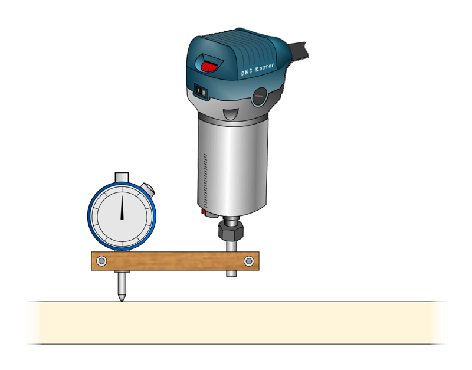


An even cheaper version of this, is replacing the dial indicator with a fixed dowel, and rotate the arm: if the dowel catches the wasteboard on one side but not the other, adjust router tilt to compensate, rinse and repeat.


And finally, if you don't have a dial indicator and don't even want to bother with the dowel & arm gadget described above, you can still do a "good enough" tramming using a machinist square placed against the router mount. Check the left/right tilt:

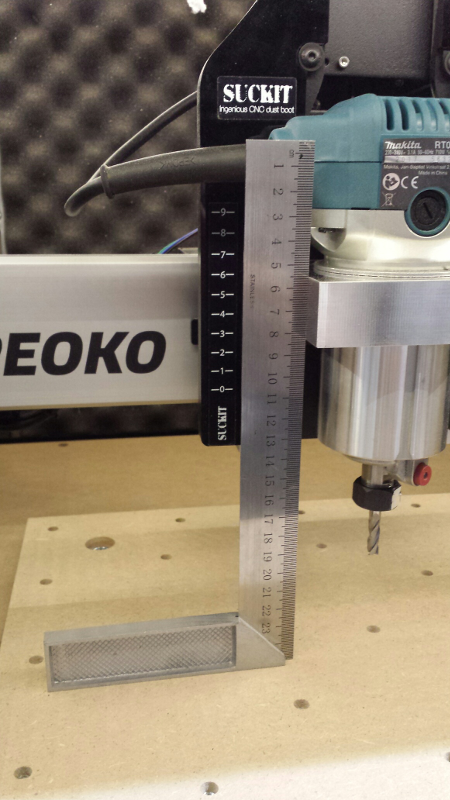

and then the front/back tilt:

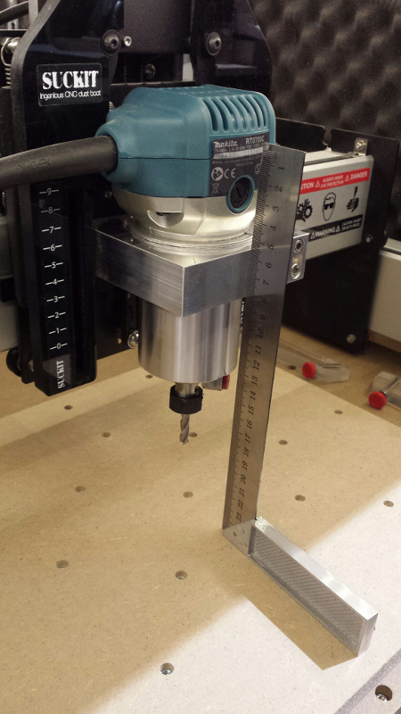

On this machine, the left/right tilt happened to be almost zero:

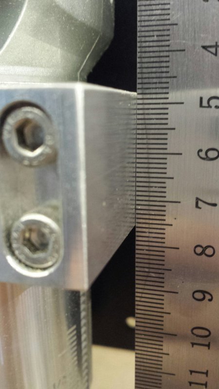

If adjustment is necessary, loosen the screws holding the mount, tilt it ever so slightly in the opposite direction, tighten everything and re-check. This can an iterative \(and sometimes frustrating\) process, but well worth the time spent. To make this easier, you could buy or make an adapter plate that sits between the router mount and the Z-plate and has eccentric nuts to tilt it easily left and right.

Now on the front side of my machine, there was a non-negligeable tilt angle:

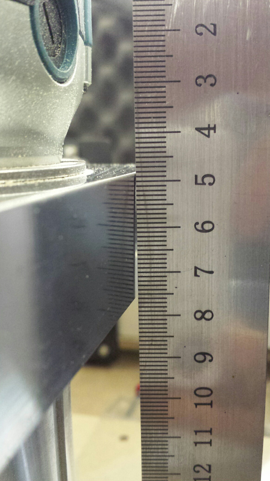

There are \(at least\) two popular ways to fix the front/back tilt:

* loosen the 8 screws on the side plates of the X extrusion, then **rotate the whole gantry** around its axis, towards the back or front, and re-tighten the screws. Again, an iterative process, because tightening the screws may make the gantry rotate very slightly. You may want to remove the powder coat inside the screw holes, to get a little wiggle room.
* **shim the router mount**. A thin strip of aluminium folder over a few times, inserted between the bottom \(or top\) of the mount and the Z-plate, can correct the fractions of a degree of front/back tilt. 

Here is the same machine after front/back tramming:

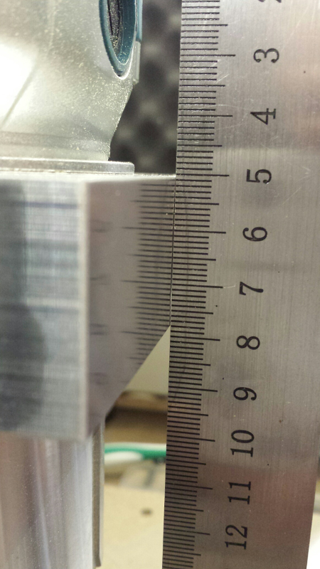

Not perfect, but much better. Here is a re-run of the same pocket operation as earlier, after tramming. The ridges are not completely gone, but are much less visible:

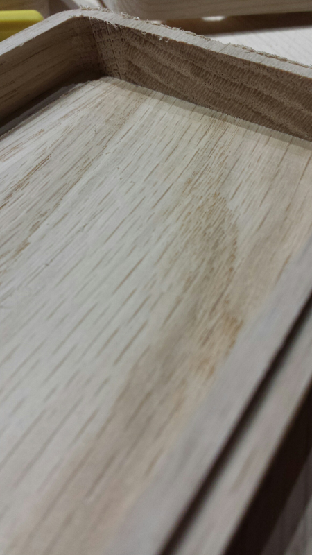


Since tramming modifies the Z axis angle slightly, it is advised to re-surface the wasteboard afterwards, to get it as flat as possible.


