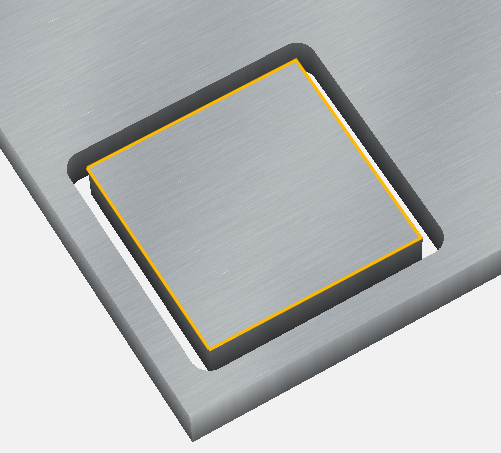
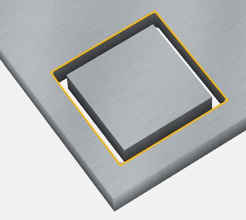
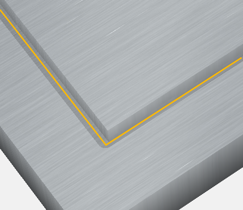

# Toolpaths basics

A **toolpath** is the intended path that the tip of the endmill will follow, to remove material and produce the desired geometry of the workpiece.

For a specific object geometry/feature defined in the CAD tool, the CAM tool will generate toolpaths as sets of lines and curves defined in X/Y/Z space, and the post-processor will then generate the corresponding G-code instructions for the machine.

Taking the simplest example of a square shape in a CAD tool:

various types of toolpaths can be created based on this reference shape \(highlighted in yellow in the following pictures\):

## Pockets

A very common one is a **pocket** operation, where the endmill will move inside the shape, to empty material starting from the surface and down to a **given depth**: 

Since this pocket depth may exceed what be can cut in a single pass by the endmill, it is usually necessary to take several passes:

&lt;TODO screenshot of toolpaths with several passes&gt;

## Contour toolpaths

Another typical operation is an **outside contour**, where the endmill cuts material along the outside of the shape, so you are left with a cut out piece of the size of the original shape 

Conversely, with an **inside contour** you are left with a hole of the size of the original shape \(and an inside piece: 

* finally, the **no-offset contour** makes the endmill move centered along the shape lines: 

## V-Carve toolpaths

* **V-carve** is a specific toolpath, which is vaguely similar to a pocket but with sloped borders, it is intended to drive a V-bit of a given angle on the inside of the shapes \(text letters, most often\)

&lt;TODO: VCarve details & example&gt;

## Roughing & finishing toolpaths

TODO

## Previewing toolpaths

