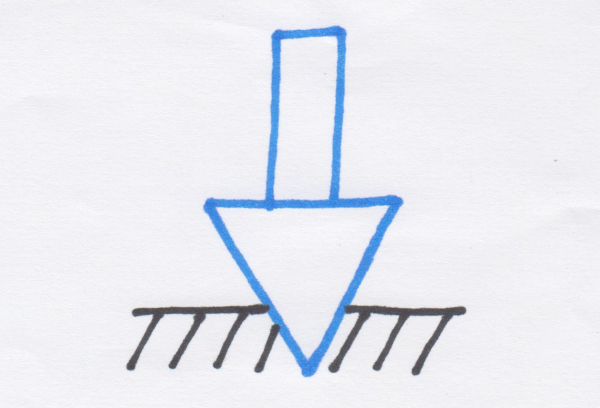
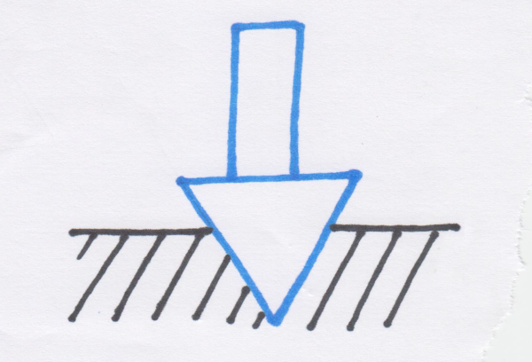

# Toolpaths

A **toolpath** is the intended trajectory that the tip of the endmill will follow, to remove material and produce the desired geometry of the workpiece.

For a specific object geometry/feature defined in the CAD tool, the CAM tool will generate toolpaths as sets of lines and curves defined in X/Y/Z space, and the post-processor will then generate the corresponding G-code instructions for the machine.

"2D" toolpaths correspond to cutting a 2D feature in the design, and moving only two axis of the machine at a time \(typically, stepping down along Z only, then moving along X and Y only\). Since X, Y, and Z are moved \(albeit not simultaneously\), this is sometimes called "2.5D".

"3D" toolpaths correspond to cutting a 3D feature, and potentially moving the three axis of the machine simultaneously. 


Not all toolpaths presented below are available in Carbide Create: 3D toolpaths, adaptive toolpaths, REST machining, and the roughing vs. finishing toolpaths feature require to use other CAM programs. If you are just starting you can ignore those, Carbide Create is perfect to learn simple 2D toolpaths before moving on to more complex projects. The intent here is to show what is available in advanced CAM programs, and then everyone can decide whether to invest money \(e.g. VCarve\) or time \(e.g. Fusion360\) to access those features. 


Taking the simplest example of a 50x50mm square shape in a CAD tool, placed in the center of a 100x100mm stock material area, with the zero point defined in the lower-left corner, and using a 6mm endmill \(~1/4"\) :

various types of toolpaths can be created based on this reference shape \(highlighted in yellow in the following pictures\):

## Pocket toolpaths

In a pocket toolpath the endmill is moved within the boundaries of the shape, to remove all material from the top surface down to a given depth: 

Extremely simple, but it already illustrates a few interesting general parameters that will apply to any toolpath:

* the **zero \(X0/Y0/Z0\) point**: in this example, positioned in the lower-left corner of the stock, on the top surface of the stock.
* since the toolpath defines the trajectory of the _tip_ of the endmill, an endmill positioned at the zero point touches the stock surface, so the very first action is to raise the endmill up to the **retract height** \(Z offset above Z0\), to avoid scraping the surface when moving to the cutting area.
* the red lines illustrate rapid moves \("**rapids**"\). The first move is from the zero point \(+ retract height\), to the point where the endmill will start **plunging** into the material \(vertical green line\)
  * This example illustrates a straight plunge, since this is what Carbide Create generates, but plunging vertically is a bit hard on the endmills, so there are other approaches to ensure a smoother entry into the material. Below are examples of **linear ramping** and **helix ramping** \(using Fusion360 CAM preview\) :

Since pocket depth may exceed what be can cut in a single pass by the endmill, it is often necessary to take several passes, removing a given **depth of cut** a.k.a. **DOC** a.k.a. **depth per pass,** until the pocket depth is reached:

A small depth of cut is easier on the tool/machine but increases total cutting time a lot, while a \(too\) large depth of cut may put too much force on the tool and introduce chatter, delfection, etc... 

Recommanded depths of cut depending in the endmill diameter and material are available in the [Feeds & speeds](feeds-and-speeds-basics.md) section, but experimentation is key.

On the following snapshot, a few circles of the same diameter as the endmill were added for the purpose of illustrating two things:

* The **stepover** a.k.a. ****\(radial\) **width of cut** parameter of the toolpath controls how close to each other successive loops of the toolpaths are, in this case the stepover was chosen to be 50% of the endmill diameter for simplicity. Check out the [Feeds & speeds](feeds-and-speeds-basics.md) section for recommended stepover values, and how this affects chip thinning and ultimately the optimal feeds and speeds.
* In **corners** two things happen:
  * the cutter engagement temporarily increases: nothing to be concerned about in many cases, but this limits the chipload/feedrate values. This is where advanced toolpaths help, e.g. adaptive clearing, more on this later.
  * obviously, the round endmill cannot reach all the way into the square corner of the geometry, so some material is left and all corners end up rounded, to the diameter of the endmill. One way to mitigate this is to use a smaller endmill, but cutting a large pocket using a very small endmill would take forever, so a better alternative is first cut the pocket normally with a large endmill, then run a second toolpath will a smaller endmill, that will only work locally in the corners. In advanced CAM tools, this is easy using the "rest machining" option, the tool is smart enough to figure out how much material is left, and produce a second toolpath with a smaller tool that will only cut there. But Carbide Create does not \(yet\) support rest machining, so you could fake it by manually creating additional geometry. In the example below, a 4.5x4.5mm square was added in one corner, with an associated pocket toolpath using a 1/16" endmill. The corner will still not be perfectly square, but its radius will be 4 times smaller, so it will look much closer to square.

Check out the Fusion360 part of the [Upgrading to advanced software]() section for more details on adaptive clearing and rest machining. 

Even though this "concentric squares/pseudo-spiral" toolpath is by far the most common, other patterns exist. Below is an example of the same pocket using a "zigzag" or "raster" patten toolpath, from Vectric VCarve : 

## Contour/Profile toolpaths

Contour \(a.k.a. Profile\) toolpaths just follow the...contour of a shape, with the option to have the endmill positioned either on the outside or on the inside of the shape, and even right on it:

* **Outside contour**, usually associated to cutting the shape out of the stock material: 

* **Inside contour**, usually associated to creating a &lt;shape&gt;d-hole in in a piece:

* **No-offset contour**, can be used for example for engraving the shape on the surface of the piece with a pointy bit.

So, contour toolpaths are extremely simple, but there is a small catch: they produce **slotting** cuts:

In this situation, half of the endmill circumference is engaged in the material at all times, refer to the slotting paragraph in [Feeds & speeds](feeds-and-speeds-basics.md#slotting) section for details. The bottomline is that since this is a worst case scenario for the cutter, the feeds & speeds and DOC need to be dialed back quite a bit to avoid chatter or  excessive tool deflection. 

Sometimes this is no big deal and you can just proceed with the reduced DOC and be fine. In other situations \(e.g. cutting plastics or metal\), deep slotting can be difficult and a solution can be to avoid it altogether when possible, for example by cutting the profile as a pocket instead of a slot. This usually requires to create additional geometry around the piece, and create a pocket toolpath to cut material in-between the original shape and the added geometry:

* The orange square is the original shape
* The back square is the extra geometry, created to be larger than the original square by a value of the endmill diameter plus a small margin.
* Selecting the two squares, Carbide Create produces the pocket toolpath shown in blue
* The tool first goes around the inside of the outer square: no benefit there, this results in slotting.
* But then the tool proceeds to follow the second/inner blue path, around the outside of the original square, and this is where pocketing helps: the tool now just has to remove the thin remaining layer of material, and has some clearance against the opposite wall, so this is like a cutting pass with a very small stepover: this is perfect to minimize forces, and act as a finishing pass.

A refinement of this approach is to leverage adaptive toolpath 

Cutting this narrow pocket can also leverage adaptive clearing strategy if the CAM tool supports its. Using a similar strategy as above with extra geometry around the original shape, and creating a 2D adaptive clearing toolpath results in something like this: 

After it plunges to the depth of cut, the endmill is moved in small spiral movement, between the inner geometry and the outer geometry: at any given time, the endmill engagement into the material is limited to a small fraction of its circumference, much like a pocket cut with small stepover:

Since the cutter load is much lower, one can use much more agressive feeds and speeds and DOC. But of course, it takes much longer to do all these spiral movements rather than going  in a straight line.

## V-Carving toolpaths

V-carving is a specific toolpath strategy dedicated to using V-bits of a given angle to cut the inside of shapes, resulting in a cut depth that depends on how far apart the sides of the shape are.

Let's take the example of a simple chevron shape, to be cut with a 60degree V-bit:

* the toolpath \(pink\) is where the tip of the V-bit will be
* if we look at a vertical cross-section where the blue line is, the V-bit will be like this:

* while at the level of green line, a cross-section would look something like this:

Preview of the toolpath execution:

A typical use is to carve the inside of text characters:

Carving the outside of characters, within a predefined boundary, is another popular option, and when combined with the ability of some CAM tools to limit the V-carve depth to a predefined max value, can give interesting results:


a V-bit is very inefficient at removing large amounts of stock, and even worse at carving flat-bottom pockets, so the scenario above would better make use of a first clearing toolpath using a regular endmill in flat areas, and a second toolpath taking care of V-carving around the characters.


## Roughing vs. finishing toolpaths

For every toolpath there are two conflicting needs: minimizing the total runtime, and getting the best finish and dimensional accuracy of the workpiece. Instead of settling for a middle ground that accomodates both constraints, a very common approach is to make two toolpaths:

* the first \(roughing\) toolpath will be optimized to go fast, maximising material removal rate, but will be programmed to leave a little bit of material around the selected geometry. Even of the tool deflects, vibrates, or more generally produces a poor surface finish, this will be taken care of by the next toolpath.
* the second \(finishing\) toolpath will be optimized for getting a good surface finish and accuracy: it can be set to go slower, but even if it isn't, the simple fact that it will have very little material left to cut will reduce the efforts on the tool, and produce an optimal result.

How roughing/finishing is setup depends on the CAD/CAM tool being used:

* Carbide Create does not support any roughing/finishing option explicitly, but one can still manually create additional geometry in the design to do it, as explained above in the alternatives to slotting.
* Vectric V-Carve has explicit options in its toolpath parameters to create an "allowance offset", basically a margin that will be kept when cutting. One can therefore select a geometry and:
  * create a first toolpath with an allowance offset \(of say 0.01"\)
  * create a second toolpath with an allowance offset of 0
  * For profile toolpaths, this is even simpler: there is a "Do Separate Last Pass" option with an allowance offset value, to tell VCarve to use the allowance value for successive passes down the material, but for the last \(deepest\) pass, discard the allowance: this will result in the endmill taking a full-depth pass all around the geometry, shaving off the material to get to the final dimensions.
* Fusion360 has a "Stock to leave" option in the toolpaths, which works similarly:
  * create a first toolpath with stock to leave at a small value. Both the radial \("vertical"\) and axial \("horizontal"\) stock to leave values can be specified. Here is an example using 0.5mm radial and axial stock to leave in an outside profile toolpath: notice how at the end of this toolpath, there is a small amount of extra stock around the center back square:

* create a second toolpath; identical to the first one except setting radial and axial stock to leave to 0: this will shave off the extra material, to reveal the final walls of the workpiece \(in blue\) as well as remove the remaining 0.5mm at the bottom.

## REST machining

TODO: explain + screenshot

xxxx

## Lead-in/Lead-out

TODO explain + photo si on le fait pas + workaround dans CC

## Adaptive clearing toolpaths

TODO !

TODO explain optimal load = radial width of cut

## 3D toolpaths

Carbide Create does not support them, and the topic is too wide and too specific the CAM tool to be covered here properly, but here is a simple example:

Many of the concepts of 2D toolpaths apply, but the notion of roughing + finishing will be paramount for 3D, to get reasonable job time and a smooth finish.

## Drilling

TODO: proper = drillbit, workaround = endmill + peck\_drilling \(faire un GIF de l'animation Fusion ?\)

10.000RPM, PR 600mm/min, pecking depth 0.8mm in HDPE, with single flute 3.175mm 

## Previewing toolpaths from G-code

Pretty much all CAM tools embed a toolpath visualization feature, however what they display is the toolpath defined in the design, and this is not _guaranteed_ to be 100% what the machine will execute, because of the post-processor step: the generated G-code might be subtly different depending on the selected options.

One way to double-check is to visualize the toolpath from the generated G-code file itself. There are a number of offline and online G-code viewers \(CAMotics is a popular open source desktop app, and there are many online G-code viewers too\)

