# Toolpaths

A **toolpath** is the intended trajectory that the tip of the endmill will follow, to remove material and produce the desired geometry of the workpiece.

For a specific object geometry/feature defined in the CAD tool, the CAM tool will generate toolpaths as sets of lines and curves defined in X/Y/Z space, and the post-processor will then generate the corresponding G-code instructions for the selected machine.

"**2D**" toolpaths correspond to cutting a 2D feature in the design, moving only two axes of the machine at a time \(typically, stepping down along Z only, then moving only in the XY plane, before proceeding with a deeper Z\). Since X, Y, and Z are moved \(albeit not simultaneously\), this is sometimes called "**2.5D**".

"**3D**" toolpaths correspond to cutting a 3D feature, and potentially moving the three axes of the machine simultaneously. 


Not all toolpaths presented below are available in the standard version of Carbide Create: 3D toolpaths, adaptive toolpaths, REST machining, and the roughing vs. finishing toolpaths feature require the use of other CAM programs. If you are just starting you can ignore those, Carbide Create is perfect to learn simple 2D toolpaths before moving on to more complex projects. The intent here is to show what is available in various CAM programs, and then everyone can decide whether to invest money \(_e.g._ VCarve, Carbide Create Pro\) or time \(_e.g._ Fusion 360\) to access those features. 


Let's take the simplest example of a 50×50mm square shape in a CAD tool, placed in the center of a 100×100×10mm stock material, with the zero point defined in the lower-left corner, and using a 6mm endmill \(~1/4''\) :

Various types of toolpaths can be created based on this reference shape.

## Pocket toolpaths

In a pocket toolpath the endmill is moved within the boundaries of the shape, to remove all material from the top surface down to a given depth: 

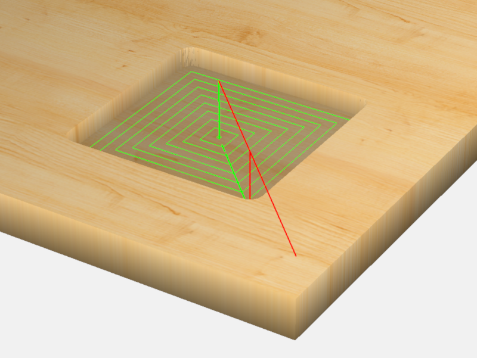

Extremely simple, but it already illustrates a few interesting general parameters that will apply to any toolpath:

* the **zero \(X0/Y0/Z0\) point**: in this example, it is positioned in the lower-left corner of the top of the stock.
* since the toolpath defines the trajectory of the _tip_ of the endmill, an endmill positioned at the zero point touches the stock surface, so the very first action is to raise the endmill up to the **retract height** \(Z offset above Z0\), to avoid scraping the surface when moving to the cutting area.
* the red lines illustrate rapid moves \("**rapids**"\). The first move is from the zero point \(+ retract height\), to the point where the endmill will start **plunging** into the material \(vertical green line\)
* The example above illustrates a straight plunge, since this is what Carbide Create generates, but plunging vertically is a bit hard on the endmill, so there are other approaches to ensure a smoother entry into the material. Below are examples of **linear ramping** and **helix ramping** \(using Fusion360 CAM preview\) :

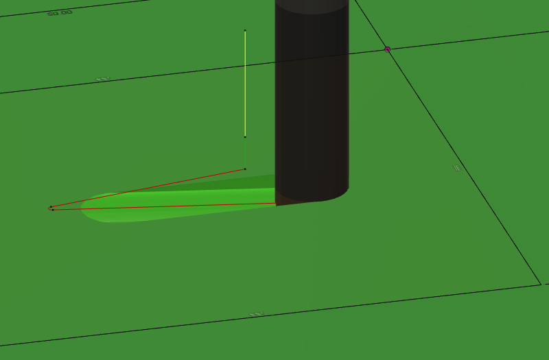

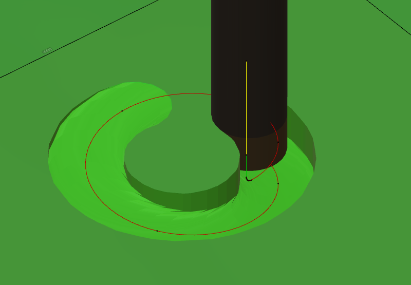

Here's an alternate view of linear ramping into the material:

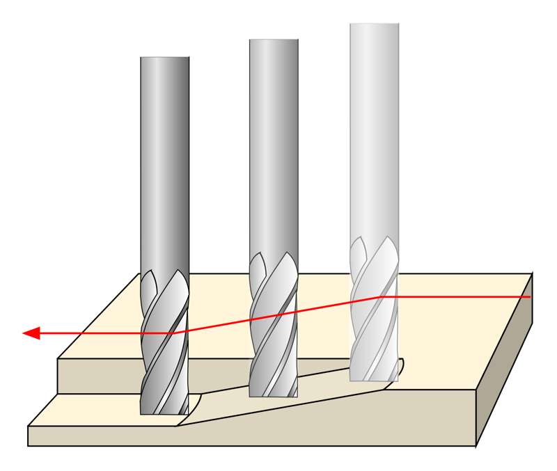

Since the pocket depth may exceed what be can cut in a single pass by the endmill, it is often necessary to take several passes, removing a given depth of cut \(DOC\) a.k.a. **depth per pass,** until the full pocket depth is reached:

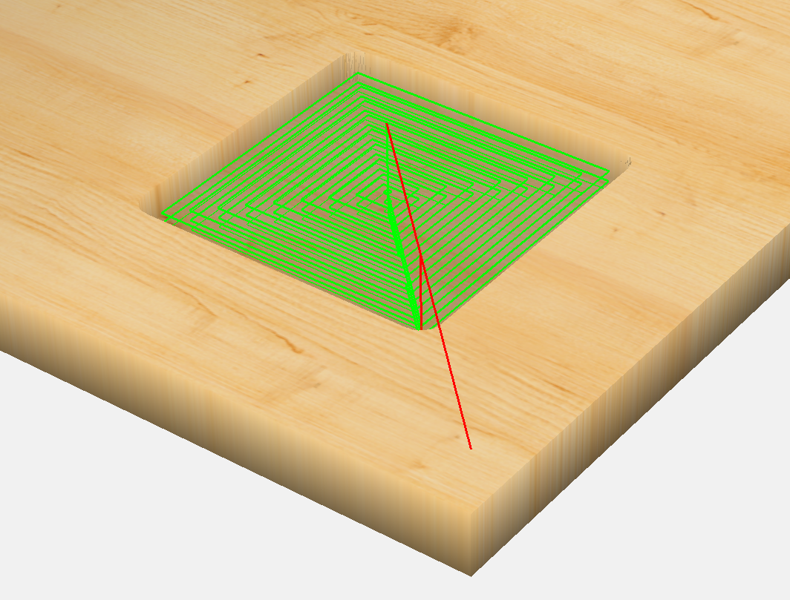

On the following snapshot, a few circles of the same diameter as the endmill were added for the purpose of illustrating two things:

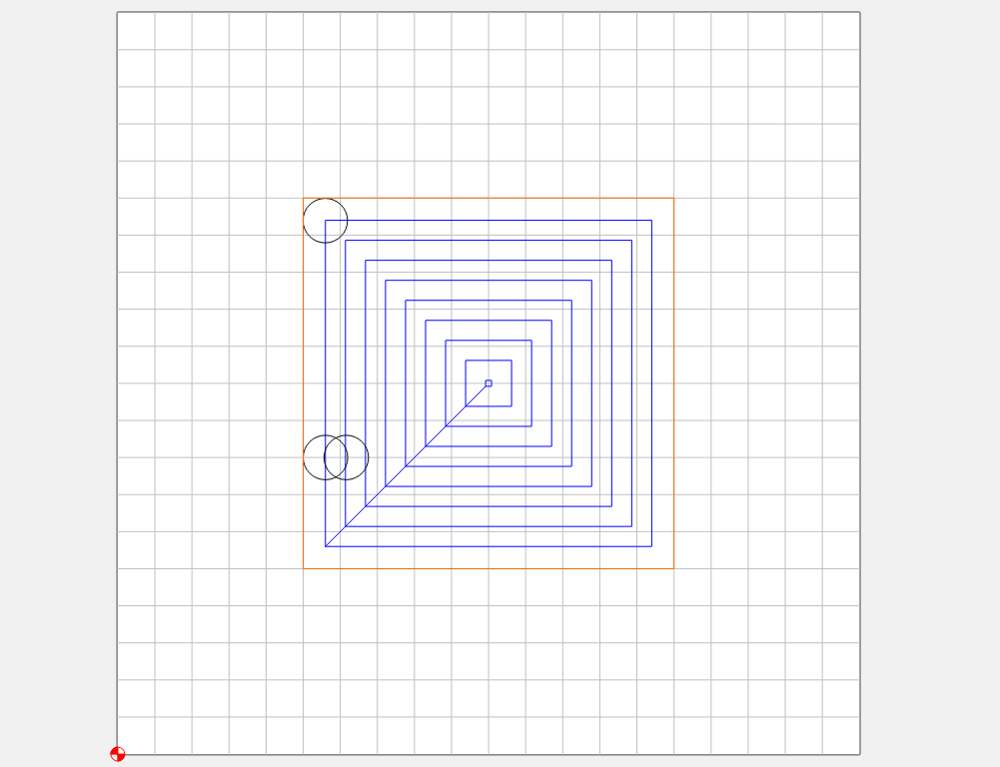

* the **stepover \(**a.k.a. ****width of cut, a.k.a. radial width of cut\) ****parameter of the toolpath controls how close to each other successive loops of the toolpaths are, in this case the stepover was chosen to be 50% of the endmill diameter for simplicity. Check out the [Feeds & speeds](feeds-and-speeds-basics.md) section for recommended stepover values, and how this affects chip thinning and ultimately the optimal feeds and speeds.
* in **corners** two things happen:
  * the cutter engagement temporarily increases \(see tool engagement in the [Feeds & speeds](feeds-and-speeds-basics.md#corners) section\). Nothing to be concerned about in many cases, but this limits the feeds and speeds to being more conservative than they could be. This is where advanced toolpaths help, _e.g._ adaptive clearing, more on this later.
  * obviously, the round endmill cannot reach all the way into the corners, so some material is left and all corners end up rounded to the diameter of the endmill. One way to mitigate this is to use a smaller endmill, but cutting a large pocket using a very small endmill would take forever, so a better alternative is first cut the pocket normally with a large endmill, then run a second toolpath will a smaller endmill, that will only work locally in the corners. In advanced CAM tools, this is easy using the "rest machining" option described later below, where the CAM is smart enough to figure out how much material is left and where and to produce a second toolpath with a smaller tool that will only cut there. At the time of writing Carbide Create does not support rest machining, but you could fake it by manually creating additional geometry. In the example below, a 4.5×4.5mm square was added in one corner, with an associated pocket toolpath using a 1/16'' endmill. The corner will still not be perfectly square, but its radius will be 4 times smaller, so it will look much closer to square.

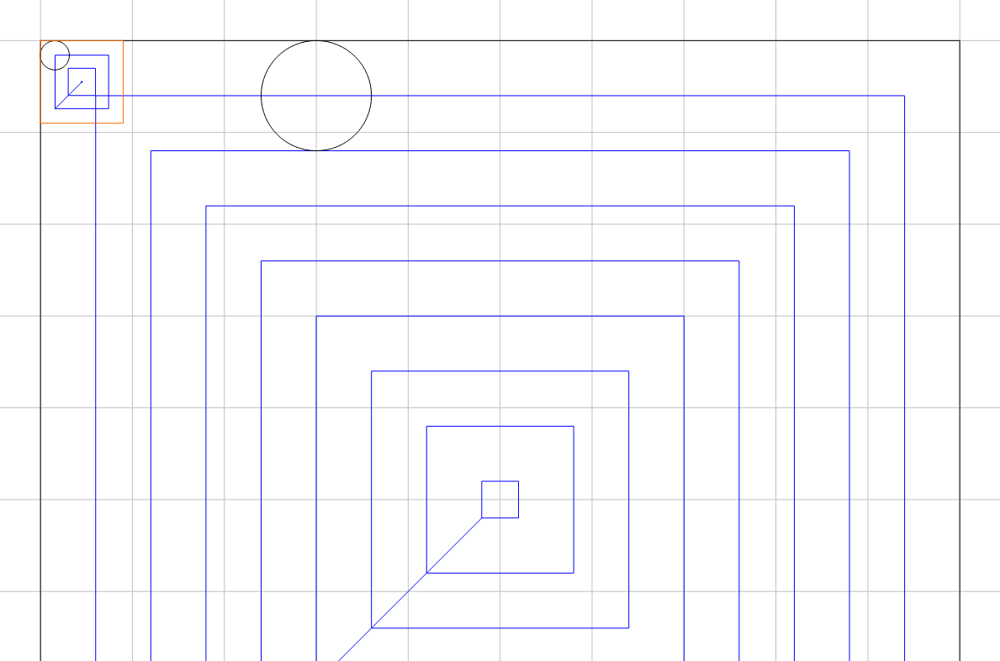

Even though this "concentric squares" toolpath is by far the most common, other patterns exist. Below is an example of the same pocket using a "zigzag" or "raster" pattern toolpath in Vectric VCarve : 

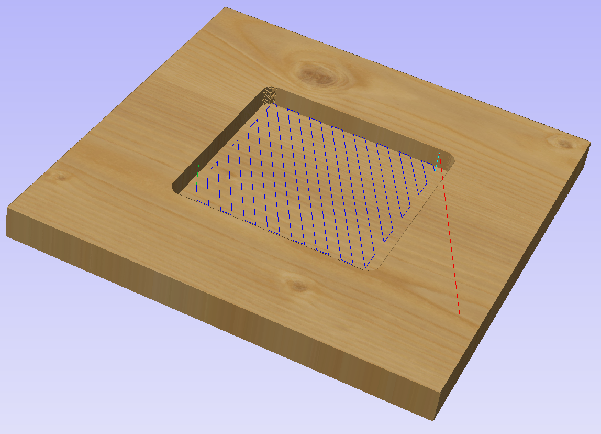

And then there is the matter of the DOC and WOC. As covered in the [Feeds & speeds](feeds-and-speeds-basics.md#choosing-doc-and-woc) section, you can either go for a low DOC and high WOC, or high DOC and low WOC. 

To illustrate the former, considering the 6mm endmill used in this example and assuming we want to cut a  6mm \(0.25''\) deep pocket, we may want to choose a DOC of 2mm \(33% of endmill diameter\) and WOC of 3mm \(50% stepover\), which would result in three passes:

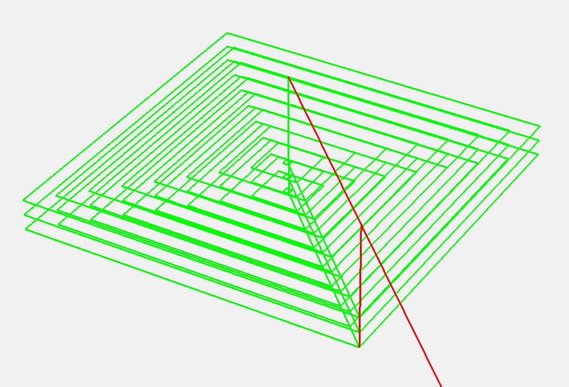

If we wanted instead to go for a high DOC \(say full pocket depth _i.e.,_ 100% of endmill diameter in this case\) and a low WOC \(say 20%\), we would also need to take care of the initial clearing down to full depth, because just plunging to full depth and starting to cut the pocket would initially involve a slotting cut \(100% stepover\) at full depth, which for some materials may be too much to take for the Shapeoko.

If your CAM tool allows, you can just use the option of helical ramping down to the full depth of the pocket, as in this Fusion360 example:

This allows reaching full depth without ever engaging the tool completely, and then the pocket toolpath at full DOC and low WOC \(20% of tool diameter in the example below\) can proceed:

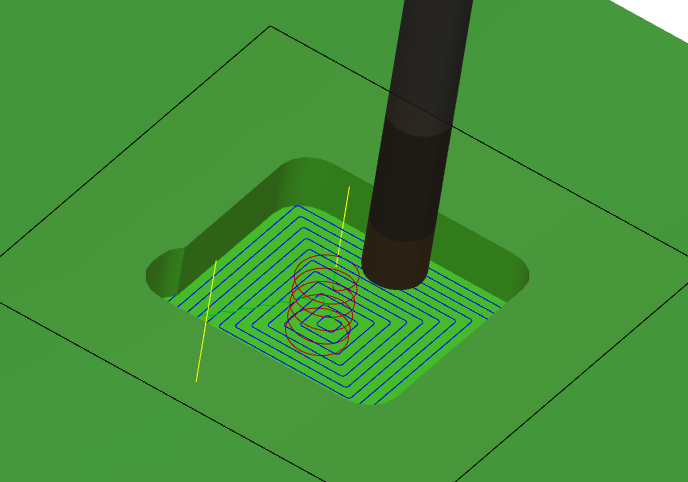

In Carbide Create, you could emulate this by creating two toolpaths: 

* a first one using regular low DOC/50%-stepover pocketing, down to full depth, on a small area:

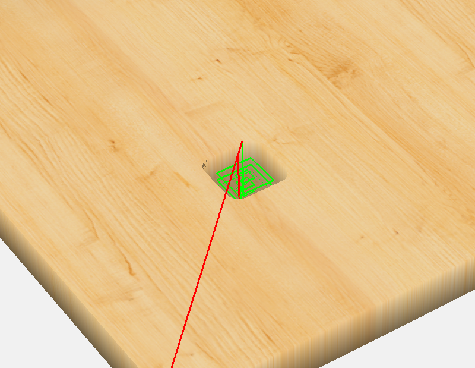

* this would clear the way for a second toolpath doing a single pass at full depth, and 20% stepover:

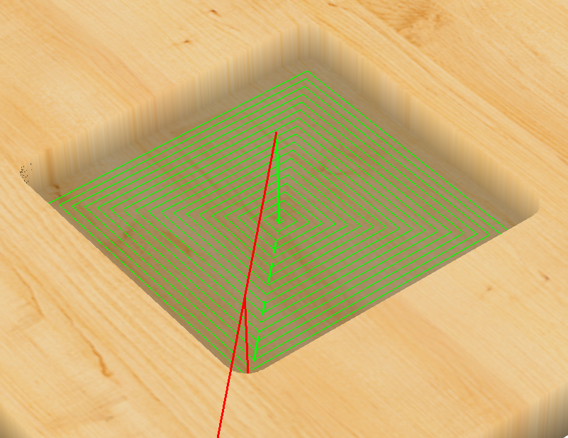

## Contour/Profile toolpaths

Contour \(a.k.a. Profile\) toolpaths just follow the contour of a shape, with the option to have the endmill positioned either on the outside or on the inside of the shape, or right on it:

* **outside contours** are usually associated with cutting the shape out of the stock material: 

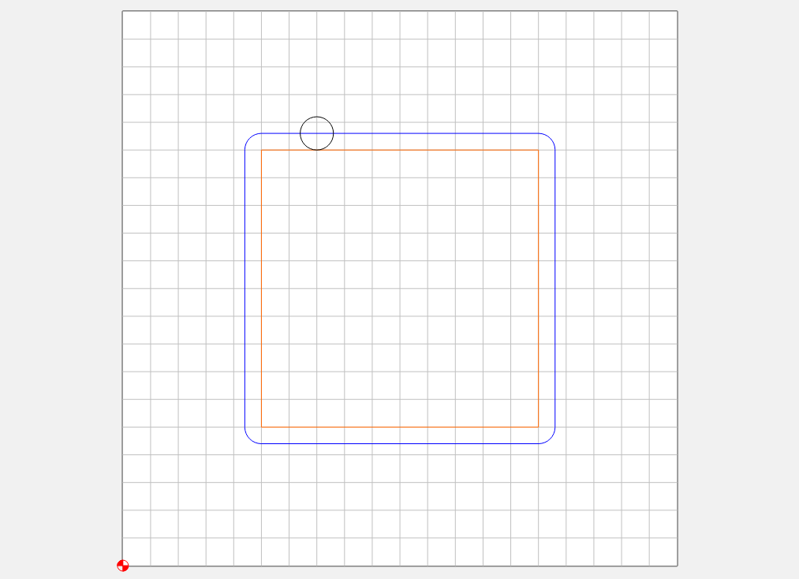

* **inside contours** are usually associated to creating a hole in a piece, the size of the shape:

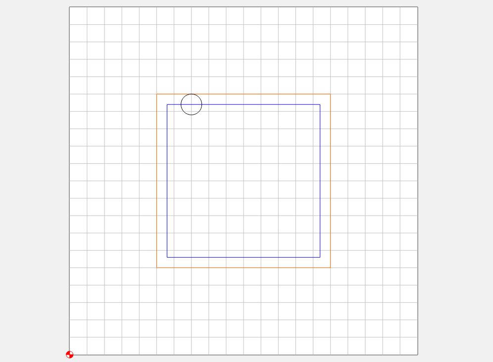

* **no-offset contours** can be used for example for engraving the shape on the surface of the piece with a pointy bit.

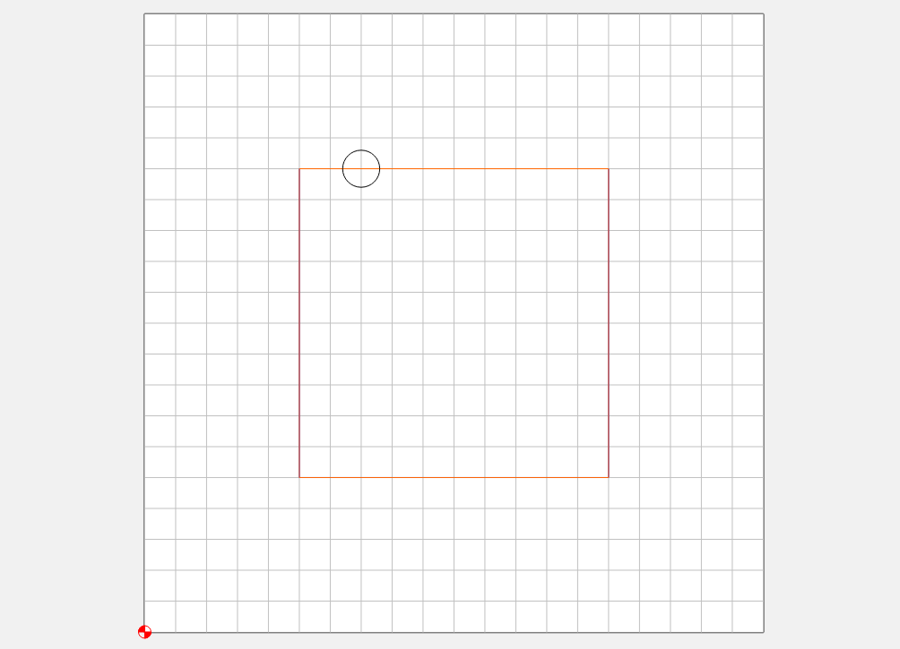

So, contour toolpaths are extremely simple, but there is a small catch: they produce **slotting** cuts:

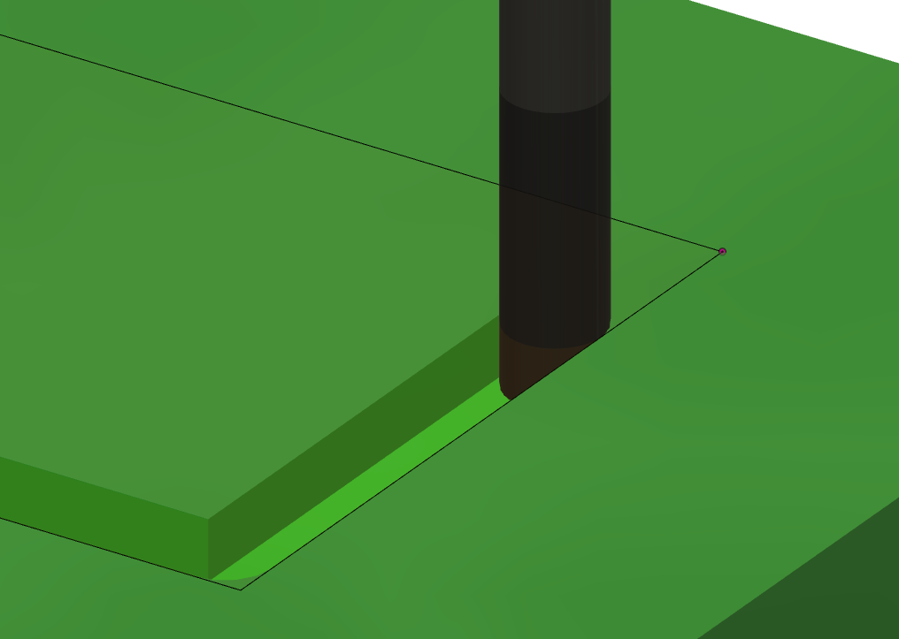

In this situation, half of the endmill circumference is engaged in the material at all times, refer to the slotting paragraph in [Feeds & speeds](feeds-and-speeds-basics.md#slotting) section for details. The bottom line is that since this is a worst case scenario for the cutter, the feeds & speeds and DOC need to be dialed back quite a bit to avoid chatter or  excessive tool deflection. 

Sometimes this is no big deal and you can just proceed with the reduced DOC and be fine. In other situations \(_e.g._ cutting plastics or metal\), deep slotting can be difficult and a solution can be to avoid it altogether when possible, for example by cutting the profile as a pocket instead of a slot. This usually requires creating additional geometry around the piece, and creating a pocket toolpath to cut material in-between the original shape and the added geometry:

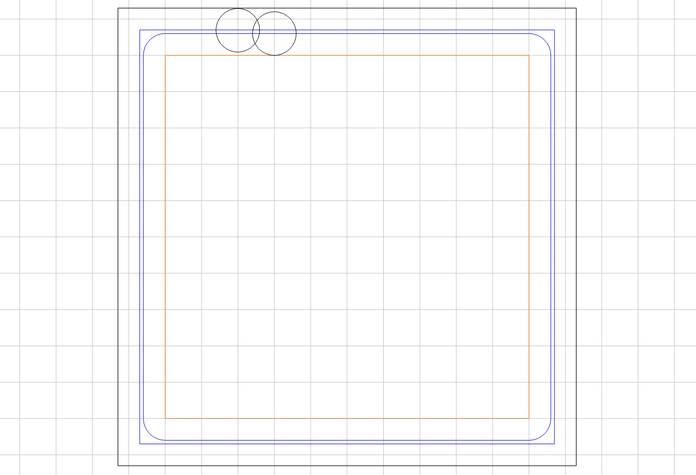

* The orange square is the original shape
* The black square is the extra geometry, created to be larger than the original square by a value of the endmill diameter plus a small margin.
* Selecting the two squares, Carbide Create produces the pocket toolpath shown in blue
* The tool first goes around the inside of the outer square: no benefit there, this results in slotting.
* But then the tool proceeds to follow the second/inner blue path, around the outside of the original square, and this is where pocketing helps: the tool now just has to remove the thin remaining layer of material, and has some clearance against the opposite wall, so this is like a cutting pass with a very small stepover: this is perfect to minimize forces, and act as a finishing pass.

## Adaptive clearing toolpaths

Regular pocket and profile toolpaths share a common problem that is not immediately apparent: they involve large tool engagement angles in the material \(constantly when slotting, and temporarily in the corners when pocketing, see [Feeds & speeds](feeds-and-speeds-basics.md#corners) section\), which in turn limits how deep/fast one can cut.

**Adaptive clearing** \(which is Fusion360's name for their trochoïdal milling family of toolpaths\) is another approach that generates toolpaths that have a constant \(and relatively low\) tool engagement value throughout the cut. When going straight, this is the same as using a very small stepover. When cutting corners, this means taking many small scoops of material, instead of going straight and taking a sharp 90° turn.

While a pocketing operation using a stepover of 60% would look like this \(notice the ~180° tool engagement in the corner\):

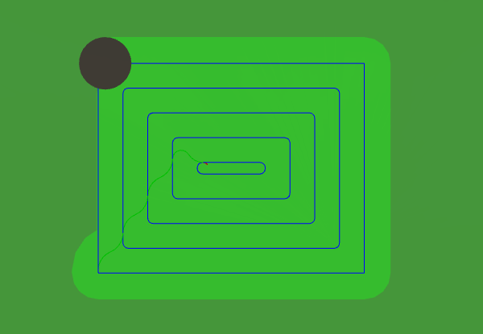

an adaptive clearing toolpath on the same geometry with radial width of cut of 60% would look like this \(notice how the tool is turning before the corner, keeping tool engagement to ~90°\):

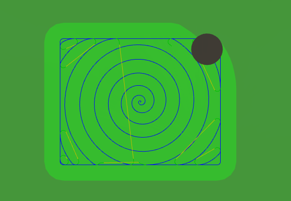


In Fusion360, the radial width of cut \(stepover\) parameter is called **optimal load**


Coming back to the profile cut example discussed earlier, adaptive clearing can be leveraged to avoid slotting. Using extra geometry around the original shape and creating a 2D adaptive clearing toolpath results in something like this: 

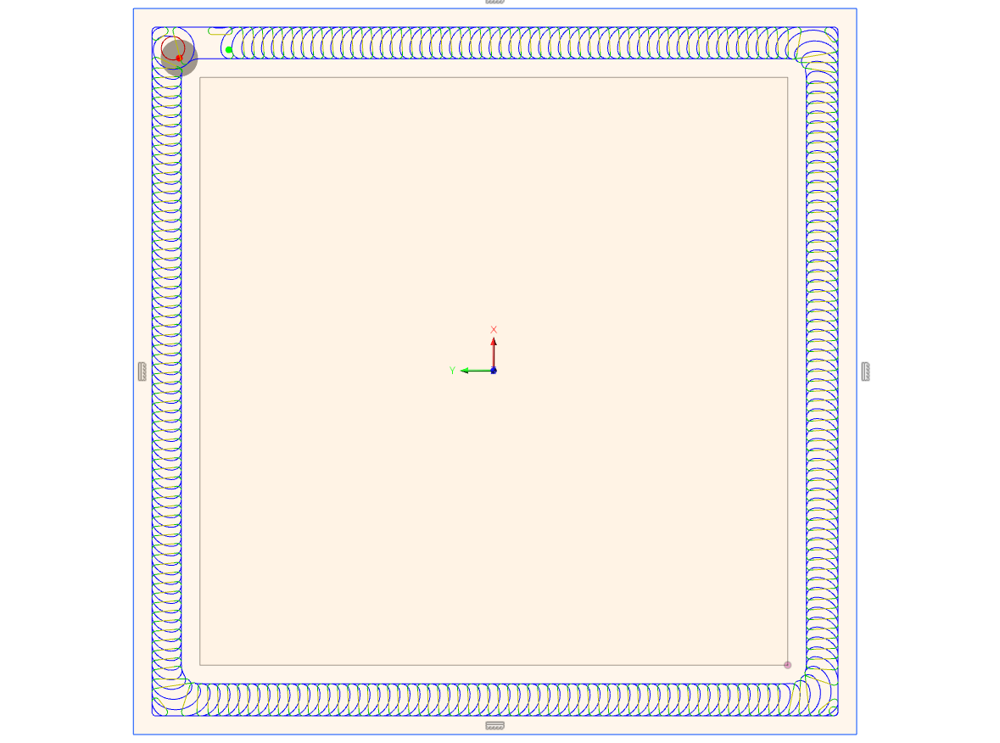

After it plunges to the depth of cut \(possibly using helical ramping\), the endmill is moved in small spiral movements between the inner geometry and the outer geometry: at any given time, the endmill engagement into the material is constant \(and small\):

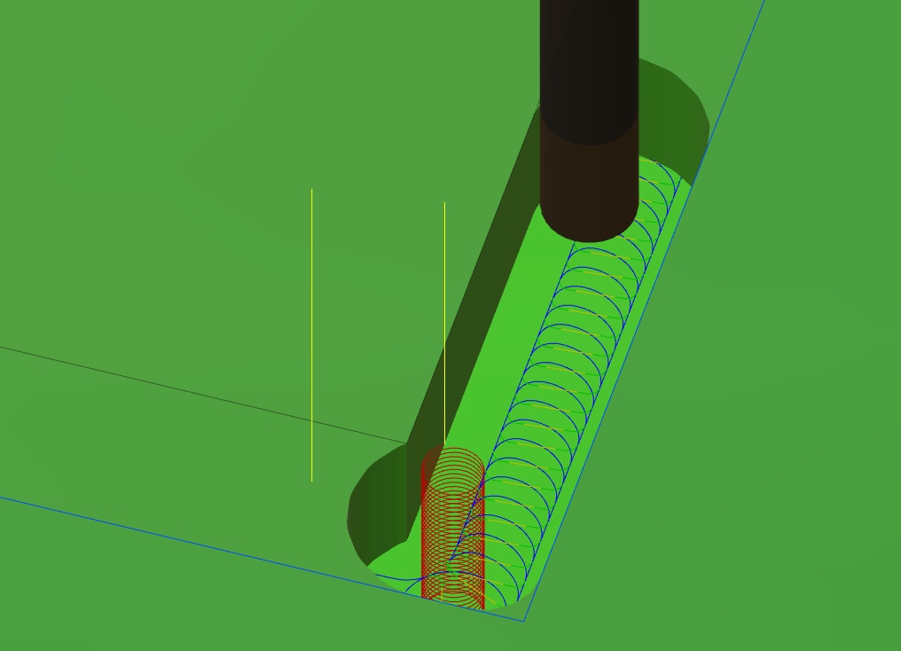

Since the cutter engagement is low, one can use much more agressive feeds and speeds \(but of course, it takes longer to do all these spiral movements rather than going in a straight vertical line, so whether or not this results in a longer or shorter job time depends on the situation\)

For the same reason, the DOC can also be increased very significantly _i.e._,  adopting the "high DOC, low WOC" approach.  


Since adaptive clearing is typically used with a small WOC \(much lower than 50% of the endmill diameter\), chip thinning must be taken into account in the feeds and speeds, as described in the [Feeds & speeds](feeds-and-speeds-basics.md#chip-thinning) section


## V-Carving toolpaths

V-carving is a specific toolpath strategy dedicated to using V-bits to cut the inside of shapes, resulting in a cut depth that depends on how far apart the sides of the shape are.

Let's take the example of a simple chevron shape, to be cut with a 60 degree V-bit:

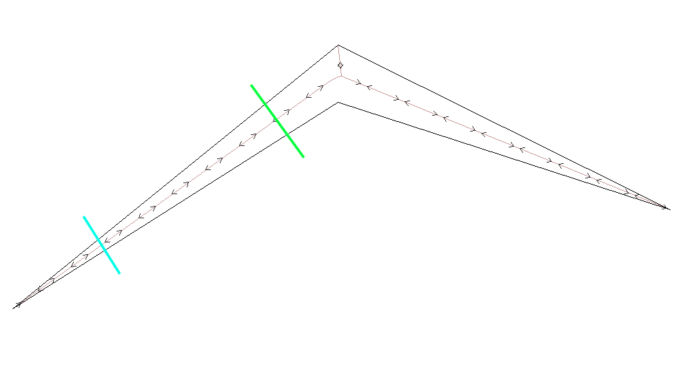

* the toolpath \(pink\) is where the tip of the V-bit will be
* if we look at a vertical cross-section where the blue line is, the V-bit will be like this:

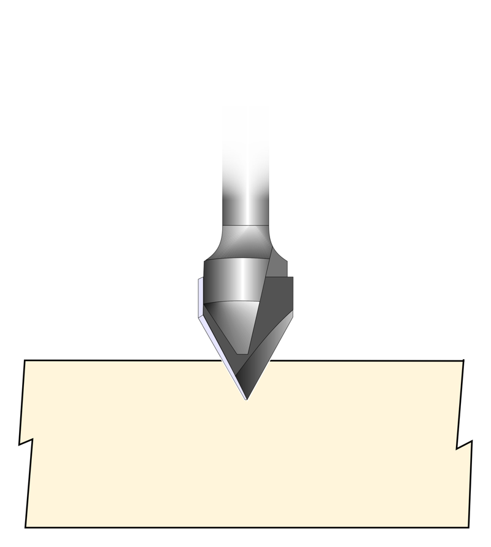

* while at the level of the green line, the cross-section would look something like this:

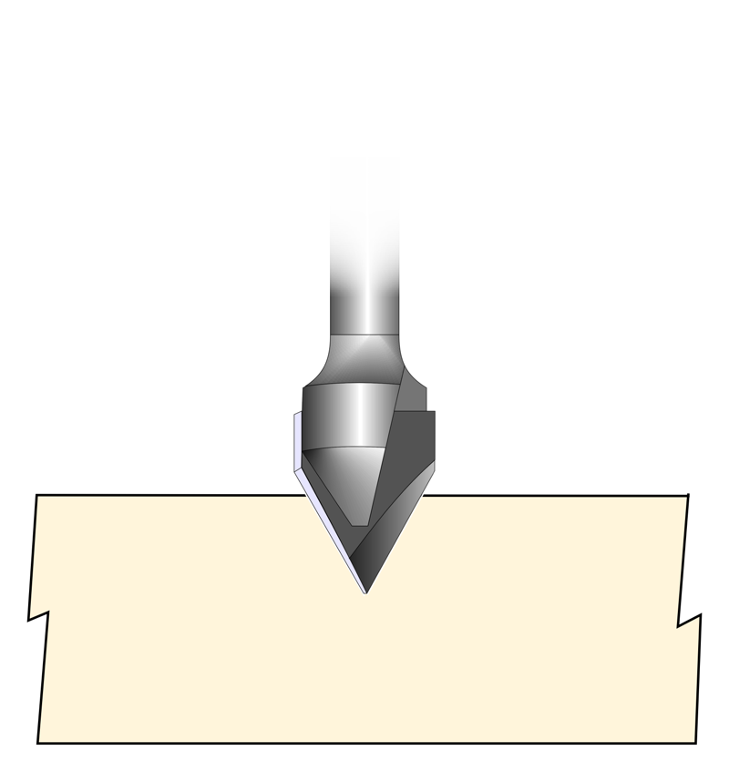

Here's a preview of this toolpath, the width of the cut is controlled by how deep the V-bit is driven:

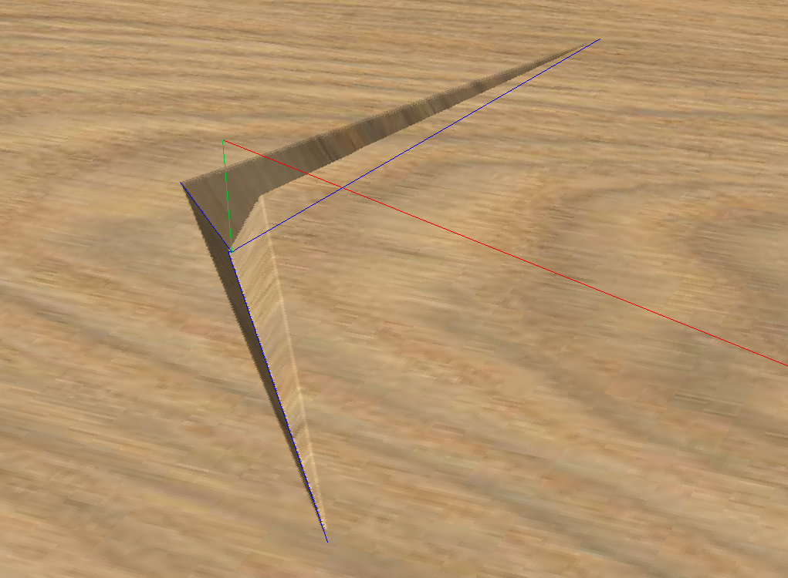

A typical use is to carve the inside of text characters:

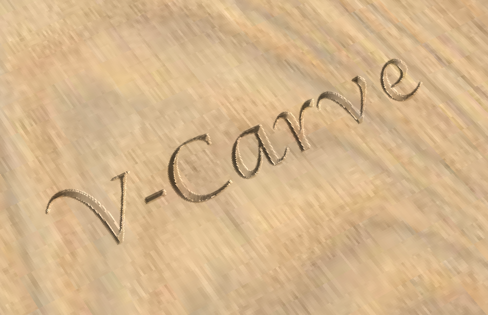

Carving the outside of characters within a predefined boundary is another popular option, and when combined with the ability of some CAM tools to limit the v-carve depth to a predefined max value, it can produce interesting 3D-like results:

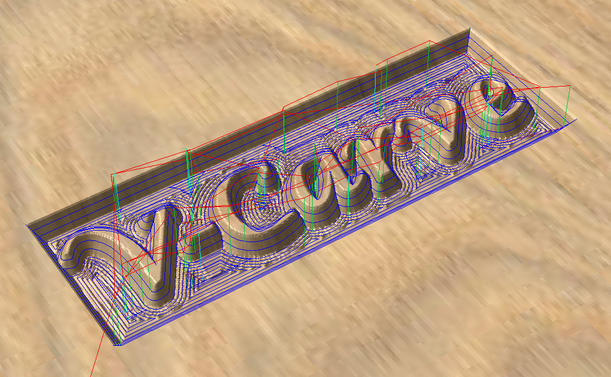


a V-bit is very inefficient at removing large amounts of material, and even worse at carving flat-bottom pockets, so the scenario above would better make use of a first clearing toolpath using a regular endmill in flat areas, and a second toolpath taking care of V-carving around the characters.


Note that V-carving is quite sensitive to setting the Z zero properly, because any slight error in the Z direction will translate to an error in the width of the cuts, which is very visible especially in corners.

An additional pitfall is that some V-bits have a very small **flat** on their tip, so their Z zero must be offset by a small amount to compensate, such that the "virtual tip" of the bit is on the surface:

If the Vbit angle is V degrees, and it has a flat of diameter D, then the H offset to apply on Z zero is :

$$
H = D/2  *tan ((180 -V)/2)
$$

Here are a few examples:

* a 0.02" flat on a 60° vbit will require an offset of 0.0173"
* a 0.02" flat on a 90° vbit will require an offset of 0.01"
* a 0.01" flat on a 60° vbit will require an offset of 0.009"
* a 0.01" flat on a 90° vbit will require an offset of 0.005"

Zero normally \(the flat part of the vbit will touch the surface\), then back off along Z by that offset and reset Z zero.

## Roughing vs. finishing toolpaths

For every toolpath there are two conflicting needs: minimizing the total runtime, and getting the best finish quality and dimensional accuracy of the workpiece. Instead of settling for a middle ground that accommodates both constraints, a very common approach is to create two different toolpaths:

* the first \(roughing\) toolpath will be optimized to go fast, maximising material removal rate, but will be programmed to leave a little bit of material around the selected geometry. Even if the tool deflects, vibrates, or more generally produces a poor surface finish, this will be taken care of by the next toolpath.
* the second \(finishing\) toolpath will be optimized for getting a good surface finish and accuracy: it can be set to go slower, but even if it isn't, the simple fact that it will have very little material left to cut will reduce the efforts on the tool, and produce a cleaner result.

How roughing/finishing is set up depends on the CAD/CAM tool being used:

* Carbide Create does not support \(at the time of writing\) any roughing/finishing option explicitly, but:
  * one can manually create additional geometry in the design to do it, as explained above in the alternatives to slotting.
  * or one can define a "fake" roughing tool and declare it to be slightly larger than the tool actually is, and use that tool in the toolpath: this will generate a toolpath that when cut with the real \(slightly smaller\) tool, will leave a thin layer of material around the shapes. Then, generate toolpaths based on the same geometry, but this time using a tool that is declared to have the true size, and run that: it will act as a finishing toolpath and shave off the excess material from the "roughing" pass.
* Vectric VCarve has explicit options in its toolpath parameters to create an "allowance offset", basically a margin that will be kept when cutting. One can therefore select a geometry and:
  * create a first toolpath with an allowance offset \(of say 0.01''\)
  * create a second toolpath with an allowance offset of 0.
  * for profile toolpaths, this is even simpler: there is a "**Do Separate Last Pass**" option with an allowance offset value, to tell VCarve to use the allowance value for successive passes down the material, but for the last \(deepest\) pass, discard the allowance: this will result in the endmill taking a single full-depth pass all around the geometry at the end, shaving off the material to get to the final dimensions and finish quality.
* Fusion360 has a "**Stock to leave**" option in the toolpaths, which works similarly:
  * create a first toolpath with _stock to leave_ at a small value. Both the radial \("vertical"\) and axial \("horizontal"\) stock to leave values can be specified. Here is an example using 0.5mm radial and axial stock to leave in an outside profile toolpath: notice how at the end of this toolpath, there is a small amount of extra stock remaining around the center back square:

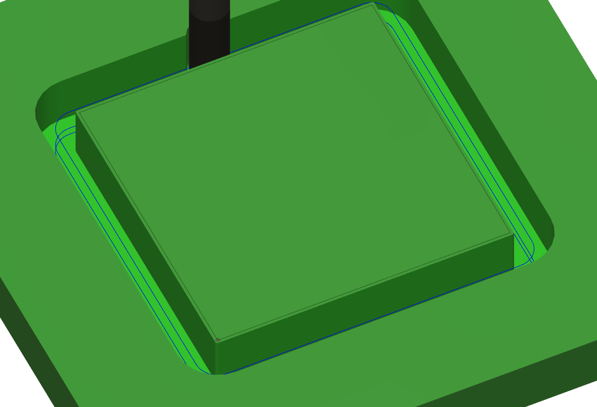

* create a second toolpath, identical to the first one except setting radial and axial stock to leave to 0: this will shave off the extra material, to reveal the final walls of the workpiece \(in blue\) as well as remove the remaining 0.5mm at the bottom:

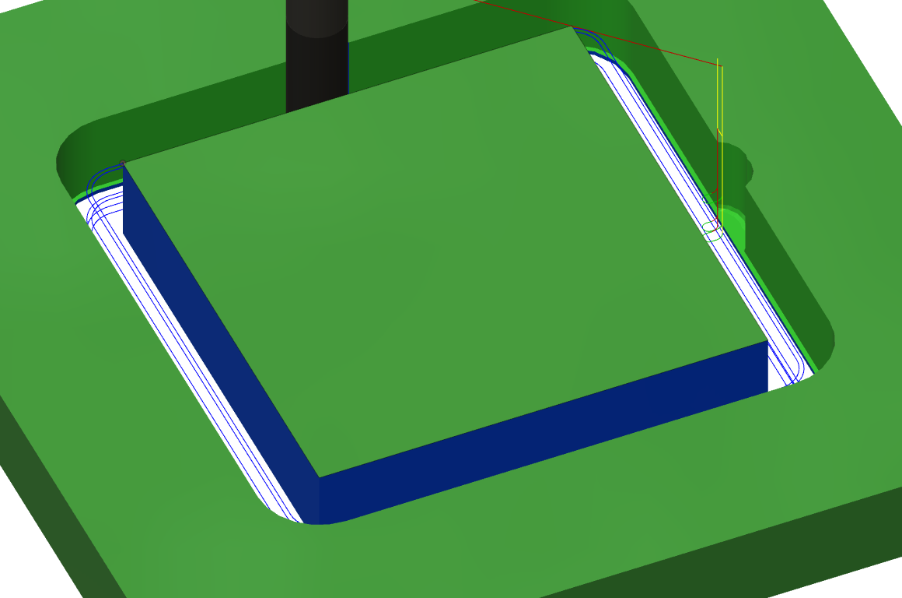

## REST machining

A very common scenario is to first use a large tool to remove a lot of material quickly, and then switch to a smaller tool to cut finer details. CAM tools that support REST machining can optimize toolpaths such that the tool only works in the areas where material was not already removed by the previous toolpaths.

Consider the case where a large pocket must be cut, but the pocket has tight corners radius:

* a large endmill will be more efficient at removing material quickly, but will not be able to reach into the tight corner
* a small endmill will be able to reach the corner, but would be very inefficient at cutting the whole pocket

In the example below a 6mm \(0.24''\) square endmill is first used, with aggressive feeds and speeds to clear out a lot of pockets quickly, and with some stock to leave:

A second toolpath using an 1/8'' endmill and REST machining option, with no stock to leave, takes care of cutting \(only\) the tight corners as well as removing the remaining stock on the pocket walls \(i.e. finishing\)

The power of REST machining lies in the fact that both toolpaths refer to the same geometry \(the pocket outlines\), there is no need to manually create any additional geometry or contraints to restrict the second toolpath to working on the walls and corners only. 

## Lead-in/Lead-out

Consider the case of a profile cut, where the tool plunges straight down at a point somewhere along the profile. During the plunge, the forces on the endmill are mostly vertical, the tool will not deflect. But once the endmill has reached the DOC and starts moving around the profile, lateral forces on the endmill will cause deflection, and the actual cutting path will deviate from the intended path by a tiny amount \(greatly exaggerated on the sketch below\). The resulting profile cut may then end up having a \(small but\) visible notch at the point where the endmill plunged into the material:

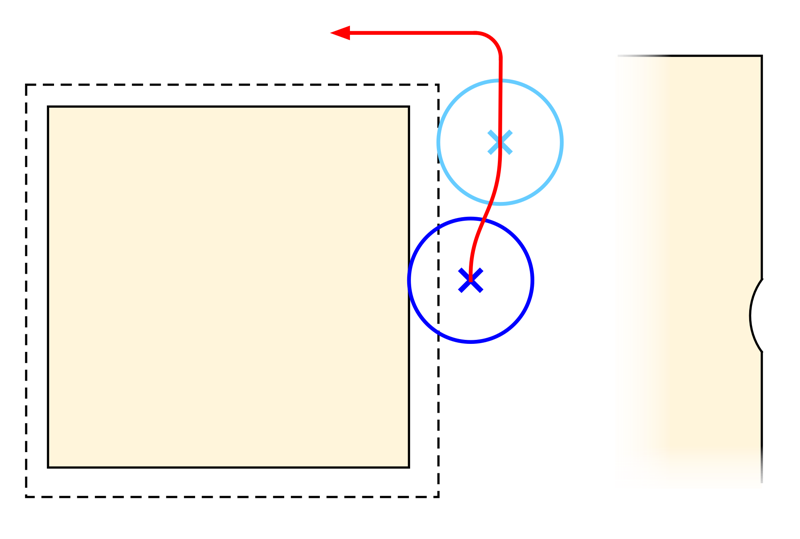

One way to avoid this is to use a roughing pass with stock to leave: the deflection effect will still happen, but it will happen away from the contour, and a finishing pass \(with very little deflection\) will then come and shave off this small variation. 

Another way to deal with such problems is to use **lead-in \(**respectively lead-out\) options if the CAM tool supports it: the toolpath with make the endmill plunge away from the profile, and then lead into \(respectively out of\) the profile edge:

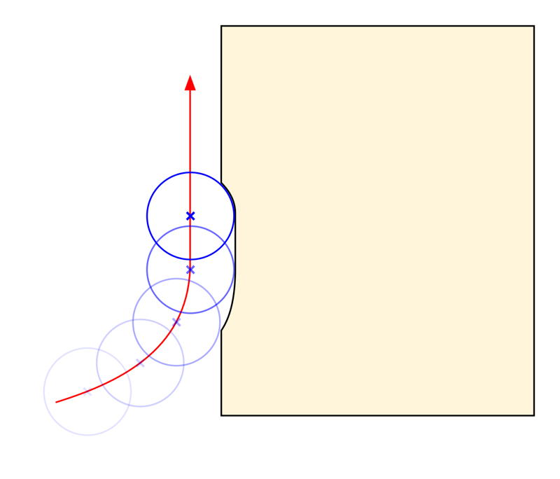

At the time of writing, this feature is not supported in Carbide Create, but one can fallback to manually adding geometry around the piece to achieve similar results.

## 3D toolpaths

The standard version of Carbide Create does not support them, and the topic is too wide and too specific to be covered here properly, but here is a simple example of milling a donut shape in Fusion360:

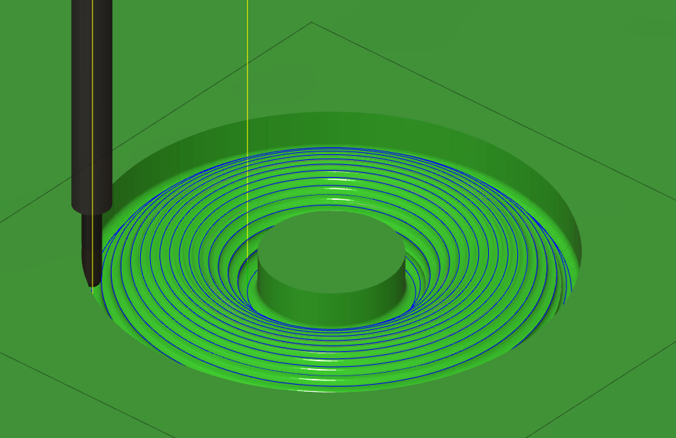

Many of the concepts of 2D toolpaths apply, but the notion of roughing + finishing will be paramount for 3D, to get both a reasonable job time and a smooth finish. Typically, a large diameter square endmill will be used for roughing, and a small diameter ballnose will be used for finishing.

**Carbide Create Pro** includes support for creating 3D toolpaths from 2D features or from grayscale heightmaps. Since many 3D models lend themselves well to being projected to a heightmap, this opens up the possibility to do very intricate 3D carvings. Here is a simple example of milling a 3D surface in CC Pro, starting with the 3D roughing pass:

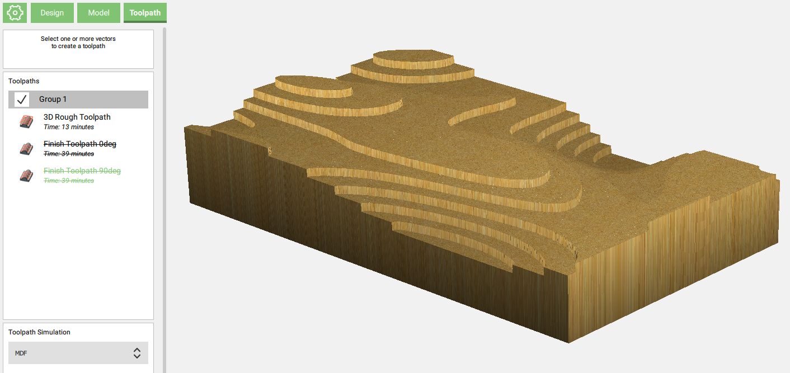

And then adding 3D finishing passes:

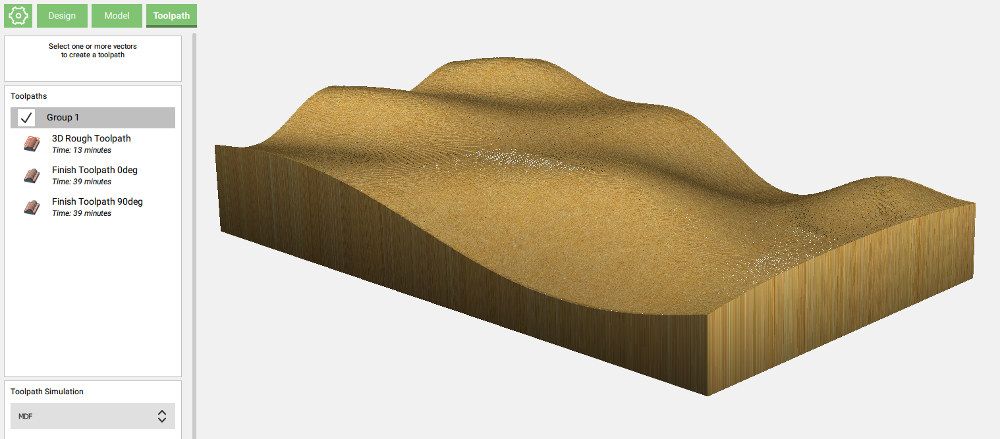

## Drilling toolpaths

For drilling a hole, a first option is to use an endmill smaller than the hole, and use a circular pocket toolpath. It works fine, but turns out to be inconvenient:

* if a job that could otherwise be done completely with _e.g._ a 1/4'' endmill needs 1/4'' holes, a 1/8'' endmill will be required just to mill the hole pockets.
* small endmills usually have a short length of cut and shank, so cutting a deep 1/8'' hole with a 1/16'' endmill could turn out to be impossible.

A useful alternative is to use specific drilling toolpaths, that just plunge the endmill vertically, so it becomes possible to do a 1/4'' hole with a 1/4'' endmill. However, an endmill is very bad at drilling, it is just not designed for this, so the plunge rate should be limited, and the "**peck-drilling**" option used: the tool will cut a small DOC, retract to clear out the chips, and then plunge again, repeatedly until the full depth has been cut.

A more efficient alternative is of course to use an actual drill bit instead of an endmill, but it implies an additional tool change. Also, it's important \(for safety\) to check that the drill bits are rated for the speed the spindle will spin them at.

## Previewing toolpaths from G-code

Pretty much all CAM tools embed a toolpath visualization feature, however what they display is the toolpath defined in the design, and this is not _guaranteed_ to be 100% what the machine will execute, because of the post-processor step: the generated G-code _might_ be subtly different depending on the selected options.

One way to double-check is to visualize the toolpath from the generated G-code file itself. There are a number of offline and online G-code viewers \(CAMotics is a popular open source desktop app, and there are many online G-code viewers too\):

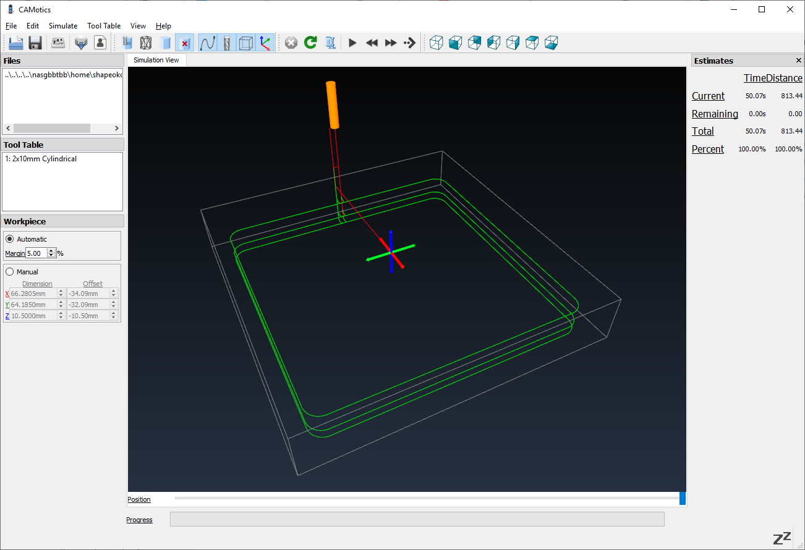

## Toolpath ordering matters

It's easy to understand that the order in which the toolpaths are run \(usually\) matters, but also quite easy to overlook a wrong ordering when a project involves many toolpaths. On the Shapeoko, toolpaths using different tools will be in different G-code files \(since there is no automatic tool changer\), so the likelihood of manually executing the files in the wrong order is small. But multiple toolpaths using the same tool will usually be included into a single file, and the ordering will be as declared in the CAM tool, so a user error is more likely!


Toolpath preview, and better yet realtime toolpath simulation \(when available\), is the best mitigation against this risk


