# HW upgrades

The Shapeoko is a great machine out of the box, and there is really no _need_ to modify it to get good results. No, really, check out Winston Moy's videos if you need convincing. Still, once you are reasonably comfortable with the machine, and how to set optimal CAD/CAM parameters, chances are you may be tempted to optimize the machine itself. 

There are many possible hardware upgrades. Some are cheap, some are definitely expensive: this section provides a brief overview of the popular ones. Whether they add enough value for money is highly debatable, and completely depends on your use cases.

## Tool length offset probe

This is a device to simplify [multi-tool jobs](first-cuts.md#running-a-multi-tool-job). It will automate the process of re-measuring tool length and adjusting Z0 value accordingly, upon each tool change.

Carbide3D's Nomad machine comes with a built-in tool offset length probe. On the Shapeoko, it's not part of the defaut configuration, but Carbide3D sells the "**BitSetter**" device as an optional add-on that attaches to the front plate:

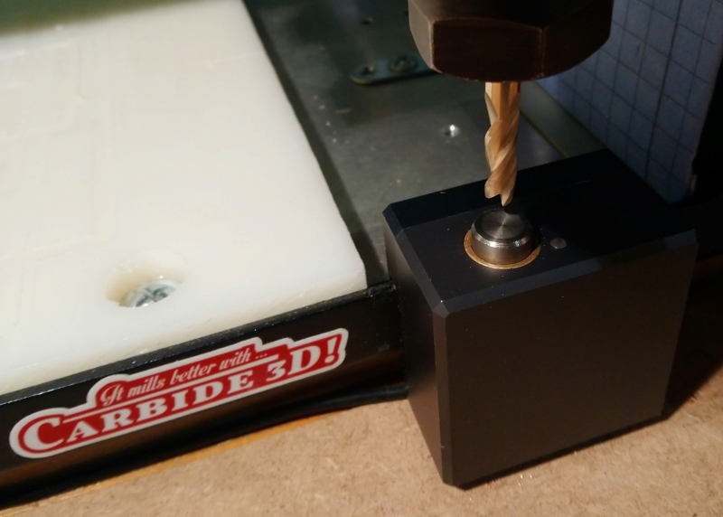

The device must be used in conjunction with an associated workflow in the G-code sender, that will launch a probing of tool length right after each tool change.


This device is connected to the "Probe" input of the controller \(yes, the same input using for X/Y/Z probing\), so it's basically a spring-loaded push button that activates the probe input upon contact.


The probing works something like this:

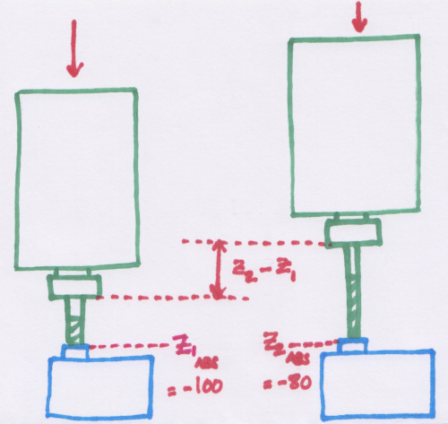

* the user initially sets the zeros normally, which sets Z0.
* the initial probing sequence moves the router over the predefined X/Y position of the tool length probe, then slowly moves the router down until the tip of the endmill pushes the button enough to trigger the probe: at that point, the machine makes a note of the current absolute Z value \(Z1 abs, arbitrarily shown as -100mm in the example above\)
* when the time comes for a tool change, and after the user has installed the new tool, a new probing sequence is launched. In the example above, the second tool sticks out from the collet by 20mm more than the first tool. When the tip of the endmill contacts the probe, the absolute Z value will read a different value than before \(Z2 abs = -80mm in this example\)
* The machine therefore knows that it must adjust the Z0 by an amount of Z2 - Z1 mm.
* The job can then proceed to cut the toolpaths programmed to use the second tool. 


In reality, the tool length probing sequence will likely include several activations of the probe in a row, approaching it at different speeds, and then average the results, for optimal precision.


## Proximity switches

The standard limit switches are fine, but they have mechanical parts that can wear out over time and eventually fail, which would result in a machine crash when homing. But the main reason to upgrade is to get an \(even\) better precision/repeatability when homing. 

**Contactless/proximity switches** trigger when a metal object comes within a certain distance of their surface. Since there is no mechanical contact with the moving part, there is no mechanical wearout, and they also happen to be more precise. Here's an example of a proximity switch for the Z-axis:


They can be used as an \(almost\) drop-in replacement for the original switches, the only difference is that \(depending on their technology\) they may need an additional lead for power supply, connected to one power pin of the controller board \(typically, the 5V pin on the Arduino ISP header, see [Anatomy of a Shapeoko](anatomy-of-a-shapeoko.md#controller-board) for details\).

## X/Z axis upgrade

Probably the most popular upgrade is the replacing the stock X/Z carriage with a sturdier one. This is by nature a costly upgrade since it involves multiple large metal parts, linear rails, and a likely ball screw. A few reasons to consider this upgrade path are:

* to eliminate the chances of the Z-belt slipping on the pulley when improperly tensioned.
* to eliminate the intrinsic \(small\) front/back slop of the original design, between the main Z-plate and the sliding plate.
* to support the weight of a spindle, that is typically much heavier than a router. Additional springs can be added as an alternative.


One noticeable difference between a ball screw driven X/Z axis and a belt & springs one, is that when power is removed from the stepper the router/spindle will stay at its current Z \(whereas with it drops naturally with belt & springs\). This is usually a good thing \(no unintended drop\) but sometimes a minor nuisance \(Z cannot easily be moved manually while machine is turned off\).


The natural upgrade path is to go for Carbide3D's **Z-plus** option, shown here :

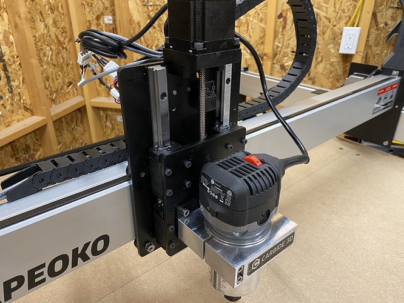

The linear rails and ballscrew design make for a robust solution that will be able to handle aggressive feeds and speeds \(within the limits of what the V-wheels will allow\)

Or for the most demanding jobs you could upgrade to the HD \(Heavy Duty\) Z axis. Here's an example of an early version of the HDZ installed on my machine:



Note that different Z axes have different travel and width, so they require tuning the GRBL parameters accordingly. If using Carbide Motion, this is done through the setup menu. If using other senders, parameters $132 \(max Z travel\) and $130 \(max X travel\) should be tuned manually to match the setup.


## Bed upgrade

There are two main reasons to replace the original MDF bed:

* to match a specific workholding solution \(e.g. T-tracks\)
* to make the Shapeoko more rigid.

While the T-tracks bed upgrade \(that comes as an alternative to the "sea of holes" wasteboard\) typically still uses MDF strips, upgrading to an aluminium bed is a good albeit expensive way to improve machine rigidity as well as have a more "weather-insensitive" machine \(MDF tends to absorb humidity, which _may_ lead to some warping/swelling over time\)

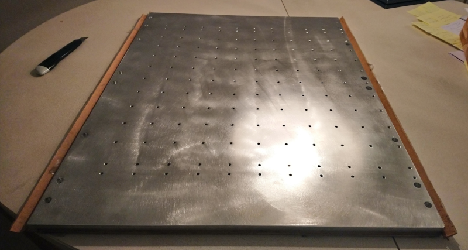

This one is 12mm / ~0.5", the one on Carbide 3D's store is 0.5" thick too.


This is still only a "nice to have" and expensive upgrade: the large majority of Shapeoko users have an MDF bed and are happy with it


## Belts upgrade

This is probably the cheapest upgrade: replacing the original GT2 belts with reinforced ones. The two most popular are **steel-core** belts, and **kevlar** belts.

Here's a section view of steel-core belts showing the embedded steel wires:


Buying several meters of steel-core belts is cheap, will serve as a provision in case the original belts snap, and replacing the belts is very easy \(since it does not involve disassembling anything else that the belt tensioners\) so that upgrade is a no brainer if you feel you can benefit from the increased robustness, and possibly from the ability to push the max speed and acceleration beyond the default settings:

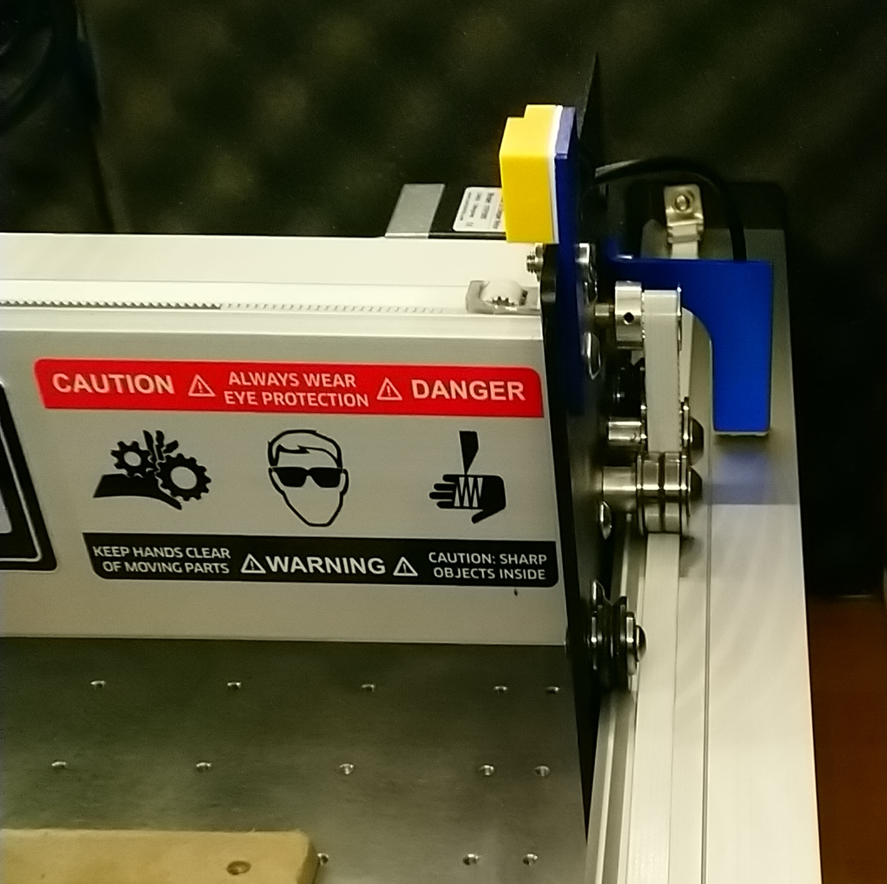

It has been reported that the belt stretch factor for those steel-core belts is about half as much as with regular belts, so they may also bring some benefits for precision work.


The tight bends around the pulleys is more than what steel belts are rated for, but no one in the community has reported any actual issue so far.


## Automatic \(router\) RPM control

Having to manually set RPMs on the router knob at the beginning of each job can get old, and is also error prone. Luckily the Shapeoko controller board happens to have a "PWM" output that GRBL modulates as a function of the RPM values found in the G-code. So it is possible to feed this signal into a dedicated power controller, that will adjust the voltage applied on the router power leads accordingly, resulting in a specific RPM value.

This requires buying such a power control module, the most popular one is the **SuperPID**. You need to know what you are doing since installing it requires wiring mains. 

Beyond the automatic RPM control, the added benefit is that this allows the router to operate at a lower RPM value than the minimal knob setting, e.g. to run at 5000 RPM on a Makita that normally mins out at 10.000RPM. 

## Spindle upgrade

The Shapeoko uses a trim router by default for cost/convenience reasons, but most higher-end CNCs use a spindle instead. Some of the main benefits are:

* a spindle can run at lower RPMs than a router \(some models can run at much _higher_ max RPMs too\), and usually has higher torque. Since a spindle needs a dedicated controller to run anyway, the automatic RPM control described above is a given.
* the runout is smaller.
* it is WAY quieter than a router, especially when using a water-cooled version.
* there is no need to change bushing, so basically no maintenance.
* it usually supports "ER" collets, which come in much more varied sizes than trim router collets.

Here's an overview of the key points to consider for the upgrade:

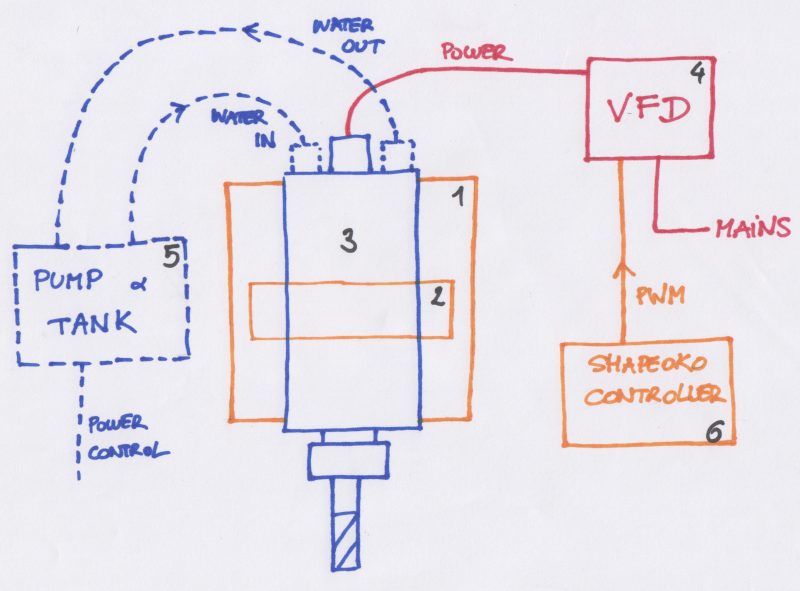

**1\)** The Z axis capability. Spindles can be HEAVY, especially 2.2kW ones. The stock Z axis will not be able to cope with the heavier models, but should be fine for the lighter \(800W\) ones. The HDZ and Z-plus axis, with their ballscrew design, will handle all models.

For reference, here's the relative size of a 2.2kW spindle, next to the Makita trim router:

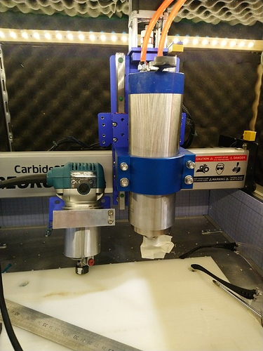

**2\)** The router mount diameter: chances are, the stock router mount diameter will not match the diameter of the selected spindle. Spindle kits often include a mount, but it's usually very bad quality and not easily adaptable to the Shapeoko's Z axis. You are probably better of buying a spindle mount from Carbide3D's store. Here's a view of a 80mm one for reference:

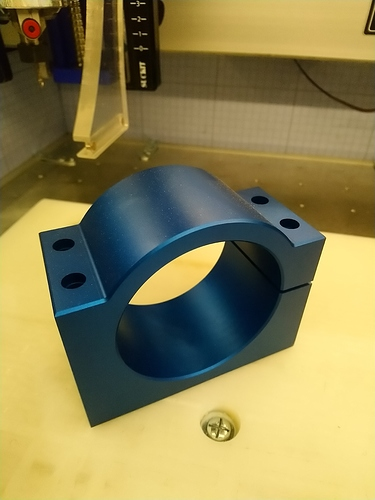

**3\)** Then there is the choice of the spindle itself. They come in two types: **air-cooled** and **water-cooled.** The former is easier to install, but noisier. The latter is extremely quiet, but requires one to install an external water-cooling system.

**4\)** A "Variable Frequency Drive" \(**VFD**\) is required to power the spindle and control its speed. The wiring of the VFD depends on the model \(spoiler alert: chances are you will buy your spindle kit from China, documentation will be sub-par, but the community is here to sort it out\). In the example pic below, the green wire is the PWM signal from the Shapeoko, the black wire is the Ground signal, and the purple wire is just telling to VFD to force the rotation direction:


Beyond that it's just a matter of connecting mains, and the four wires to the spindle \(1,2,3 and Earth, also called U,V,W and Earth\):

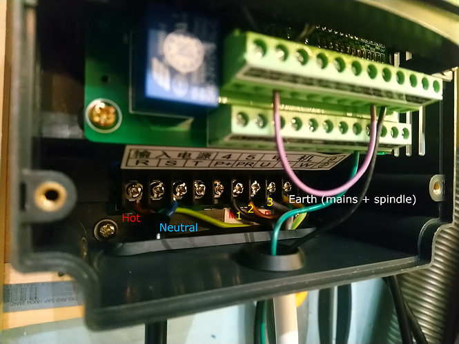

Make sure the spindle's **ground/earth pin** is actually connected inside the spindle to the body:

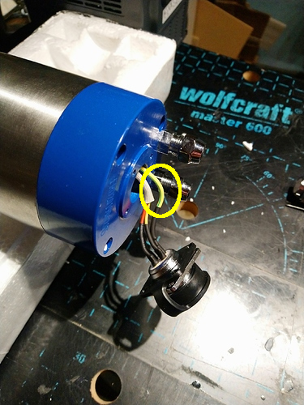

Sometimes it is left unconnected and then you are bound to get static build-up and possibly EMI issues

Finally one must configure the \(many\) parameters on the VFD, they are usually called "PDxxx" parameters, and depend on the VFD type/brand, so you will have to refer to your documentation.


Huanyang VFD owners may find this discussion helpful : [https://community.carbide3d.com/t/vfd-parameters-huanyang-model/15459/7](https://community.carbide3d.com/t/vfd-parameters-huanyang-model/15459/7?u=julien)


**5\)** For water-cooled spindles, one then needs to decide what type of cooling system to use. There are basically two popular approaches:

* one can use a large container as a tank, and install a **submersible pump** in it: 

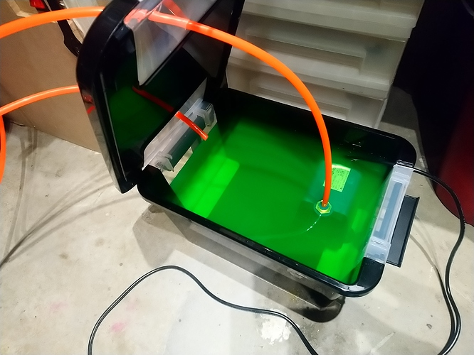


The container should be closed/sealed when operating, or dust/chips could find they way through the cooling system.



With a large enough tank, the volume of coolant alone is enough to keep the temperature low enough.



One should not use plain water as the coolant, the tubes are bound to become covered in fungus after a while. A common trick is to use automotive coolant, or other chemical products, to keep the cooling system clean


* or one can purchase a **closed-loop** cooling system:

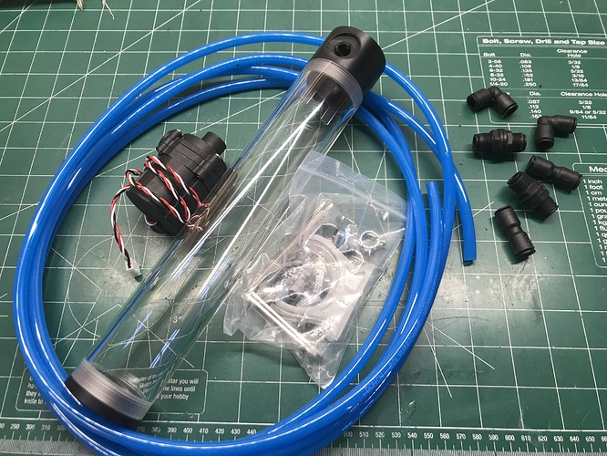

and install it on the machine:

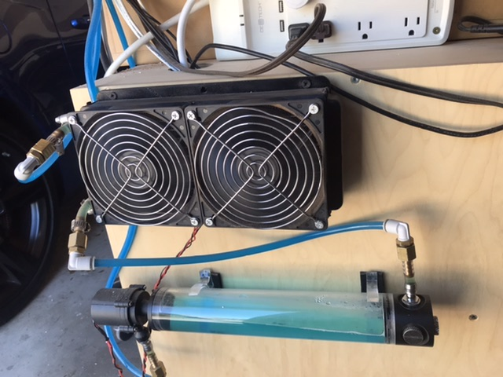


A section of the cooling loop should have fans, to keep the coolant temperature down.


**6\)** While the spindle speed can be set manually at the VFD, it is very convenient to connect the PWM signal from the Shapeoko controller board to the VFD, and configure it such that it will control spindle speed automatically based on that signal. That way, there is no need for any manual action anymore: the Shapeoko controller will adjust the PWM signal based on the RPM value it finds inside the G-code files.


Final tip: to optimize the life and precision of your spindle, it's useful to run a "spindle warmup" routine at the beginning of a session in the shop. The warmup routine consists in initially running the spindle at very low RPM for a little while, then gradually ramp up the speed, to the maximal value, over about 10 minutes. Below is a simple G-code macro to do just that.


```text
M3S2000
G4 P60.0
M3S4000
G4 P60.0
M3S6000
G4 P60.0
M3S8000
G4 P60.0
M3S10000
G4 P60.0
M3S12000
G4 P60.0
M3S14000
G4 P60.0
M3S16000
G4 P60.0
M3S18000
G4 P60.0
M3S20000
G4 P60.0
M3S22000
G4 P60.0
M3S24000
G4 P60.0
M5
```

## Laser upgrade


If you are considering adding a laser to your Shapeoko setup, whatever you do put safety considerations at the very top of your priority list. Eye safety is priceless, so if you are going to do this, you need to have SEVERAL layers of safety measures in place. And the fire hazard is obvious.


It's tempting to leverage the X/Y capability of the Shapeoko, to move a laser module around and engrave/cut the surface of parts. A typical setup will look something like this:


**1\)** The laser module is usually attached somewhere on the router mount, in such a way that it can be installed/removed easily, when switching back and forth between CNC operation and laser operation.

**2\)** One must select a laser module which matches the intended use. Modules mounted on Shapeokos are typically in the range of \[2-10W\] power, which grants the ability for engraving, and cutting thin and soft material \(think plywood\). If your main goal is to do a lot of laser cutting through thick/hard material, you should probably consider a standalone laser cutter instead.

**3\)** The laser beam area should be covered by a **shroud**, filtering the harmful laser light. This is your first line of defence, so think twice before you decide to not have one. If not at the module level, it could be done on your enclosure's front window. The second line of defence is obviously to **use laser goggles at all times when operating the laser.**


One might think that since the laser is always pointing down towards the material, this is inherently safe. But dangerous reflections are a thing, especially when engraving metals.


Here's how my 4.8W laser setup looks like:

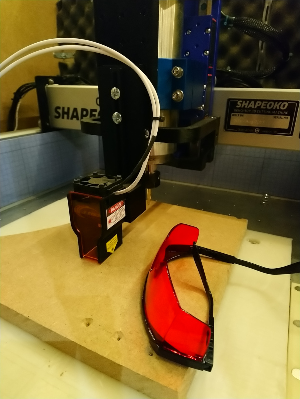

**4\)** The laser is connected to a controller, that will usually:

* provide and modulate its input power based on an input analog signal \(PWM\)
* power the laser fan
* implement a variety of safety features \(switches/interlocks\)

Here's a picture of my controller \(from the J-Tech laser kit\):

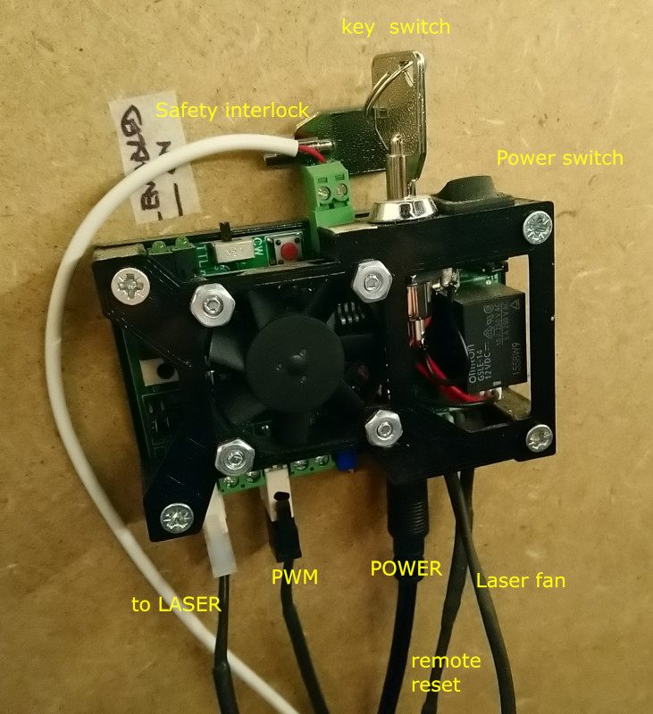

**5\)** The PWM signal driven by the Shapeoko controller will be used to modulate laser using G-code instructions. GRBL generates the PWM signal based on the requested spindle speed value, from 0V for 0 RPM, to 5V for the max RPM value configured in GRBL parameter $30. When using the Shapeoko in laser mode, the software generating the G-code will make use of that capability to control the laser power.

**6\)** While the laser burns the material, it will produce fumes, which is bad for a couple of reasons:

* fumes are toxic, more so on some materials.
* fumes get in the way of the laser, reducing its efficiency and precision

So it's a good idea to add a ventilation system to extract fumes.

A final word on safety. It seems to me that the mininum one should do to use a laser module safely is:

* have the **laser power interlocked** with the presence of whatever physical protection/cover you are using: it must be impossible for power to get to the laser \(voluntarily or by accident\) if the protection is not present.
* wear proper **laser goggles** at all times as soon as the thing is POTENTIALLY turned on \(that includes moments when the power if off, but under the control of the machine i.e. the G-code/controller\). Never, ever trust a single element of software or hardware alone to keep you safe. 
* **stay by the machine** while it is running. Seriously, don't burn down your house for a laser cut gone wrong.

