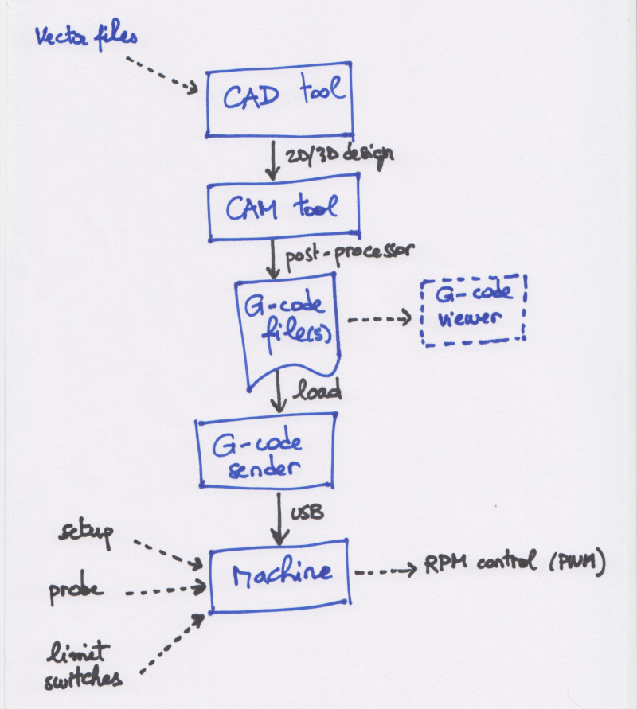

# CNC workflow

First things first, the **workflow** of a typical CNC job: 

Everything starts in a **CAD** \(Computer-Aided Design\) program: this is where you will create the 2D or 3D objects to be machined. CAD software packages are usually able to import 2D and 3D features from a variety of file formats, and the most common/useful ones for CNC are "vector" formats. 


 _**Carbide Create**_, the CAD program provided by Carbide3D for the Shapeoko, can import SVG or DXF vector files \(and the Pro version has additional capabilities\)


Once the object is designed, a **CAM** \(Computer Aided Manufacturing\) module that is usually integrated in the CAD suite, is used to create **toolpaths** to cut the object out of a block of stock material \(more on this later\). Once all required toolpaths are created, the very last step in the CAM program is to generate one or several **G-code** files, containing instructions for the machine to move the cutter along these toolpaths.


G-code format is a standard \(originally ISO 6983-1 back in the 80s\) so one would expect that a G-code file can be run on any CNC. Well almost, but not quite. Different CNCs support different subsets of the G-code instructions, as well as implement their own custom instructions.


Since CAM programs are usually not bound to any specific CNC machine, they make use of a specific **post-processor** to generate the correct G-code for a given machine.


In _**Carbide Create**_, there is a single G-code post-processor that gets executed behind the scenes, and it knows what Shapeoko model you have since there is a dedicated "Machine" parameter in the job setup.


If needed, a G-code viewer can be used to double-check the generated toolpaths, if the CAM tool does not have a toolpath preview feature. CAMotics is a popular \(and free\) option.

Finally the instructions from the generated G-code files must be sent to the machine to produce the required movements of the router to cut through the material. This requires a **G-code sender**, that goes through the G-code file line by line and sends the instructions to the machine, or more precisely to the machine's **controller**, via a communication link \(USB on the Shapeoko\).


 **Carbide Motion** is Carbide3D's G-code sender for the Shapeoko, but alternative senders can also be used, they are covered in the [CAD, CAM, and G-code](cad-cam-tools.md#g-code-senders) section.


The controller executes a piece of software that interprets incoming instructions, and translates them into specific movements of the X, Y, and Z motors. On the Shapeoko, this software is "**GRBL**", \(pronounced "Gerbil"\), an open source motion control software \(see [https://github.com/gnea/grbl](https://github.com/gnea/grbl)\)

It handles the detection of limit switches, and can manage a touch probe to help define and store the coordinates of the reference/starting point for the toolpaths.


The G-code file also contains instructions to control the **rotation speed** \(RPM\) of the router, as defined in the CAM program. On a stock Shapeoko, the RPM needs to be set manually on the router anyway, but the controller still generates an output PWM signal modulated based on the RPM value requested in the G-code.


## Coordinate system

The coordinate system is one of those things that can be a little confusing at first. The axis definitions themselves are straightforward:

* **X** is the left-right axis, with values increasing from left to right.
* **Y** is the front-back axis, with values increasing from front to back.
* **Z** is what you would expect, vertical axis pointing up, so the "altitude" if you will.

The next question is, where is the origin? On a CNC like the Shapeoko, there is no mechanical feedback telling the machine where it is positioned in space at any given time, so the only thing it can do is control X/Y/Z movements **relative** to a given starting point.

The **ZERO** point \(X0,Y0,Z0\) is the point in space against which all movements described in a G-code file will be referenced.

This point is usually referenced somewhere on the stock material \(_e.g._, a corner or the center of the top face\), but it could be set anywhere in the 3D workspace. The G-code for a given job will use this reference, and perform movements **relative** to this local origin.

However, the machine also has a **Home** position, which is where it can go to reset its location: the Home position corresponds to somewhere where the machine will get a physical feedback that it has reached the position, and on the Shapeoko that's above the back right corner, where **homing switches** on the X,Y, and Z axis happen to be triggered.

**Homing** consists in telling the machine to move in the direction of positive X, positive Y and positive Z until it detects that each associated limit switch has triggered, and stop movement on the corresponding axis then. Once all three limits switches have been triggered, the machine is guaranteed to be in a known position \(mechanically\), i.e. Home.

If a G-code file is executed from an arbitrary Zero point, why does it matter where Home is? The trick is that the **coordinates of the Zero point** itself, are defined with respect to the Home position, and happen to be stored in the permanent memory in the controller. So when the machine is in an arbitrary position and is turned off, the next time it will be turned on, Homing allows to go back to this known **absolute** Zero point coordinates.


Due to the way the X/Y/Z axis are oriented, the Zero point in absolute machine coordinates will have negative values. But since everything will happen relative to the zero point anyway, you can just ignore this fact.


The next section gets into some details about how the different parts of a Shapeoko interact to get the job done. 

