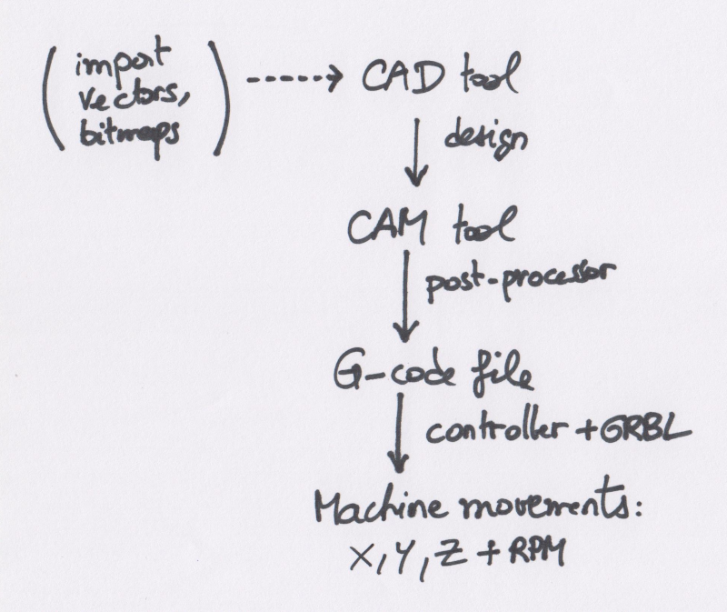
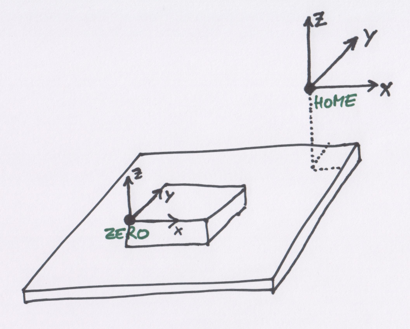

# CNC workflow

First things first, it is important to understand the workflow of a typical CNC job: 

Everything starts in a **CAD** \(Computer-Aided Design\) tool: this is where you will create the 2D or 3D objects to be machined. CAD software packages are usually able to import 2D and 3D features from a variety of file formats, and the most common/useful ones for CNC are "vector" formats. 

_**Carbide Create**_, the CAD program provided by Carbide3D for the Shapeoko, can import SVG or DXF vector files, as well as Bitmaps \(but only to be used as background references for manual tracing\) 

Once the object is designed, the **CAM** \(Computer-Aider Manufacturing\) tool is used to create **toolpaths** to cut the object out of a block of material. More on this later. Once all required toolpaths are created, the very last step in the CAM program is to generate a **G-code** file that will contain instructions for the machine to execute these toolpaths.

G-code **format** is a standard \(originally ISO 6983-1 back in the 80's\) so one would expect that a G-code file can be run on any CNC. Well almost, but not quite. There is a wild range of CNCs, that support various subsets of the G-code instructions, as well as implement their own custom instructions.

Since CAM programs are usually not bound to any specific CNC, they make use of a specific **post-processor** to generate the correct G-code for a selected target machine.

Note: in _**Carbide Create**_, the G-code post-processor is executed behind the scenes, and it knows what model you have since there is a dedicated "Machine" parameter in the job setup.

Finally the instructions from the generated G-code file must be executed by the machine to produce the required movements of the router to cut through the material. This requires a **sender**, that goes through the G-code file line by line, and sends the instructions to the machine, or more precisely to the machine's **controller**, via a communication link \(USB on the Shapeoko\). **Carbide Motion** is Carbide3D's G-code sender.

The controller executes a piece of software that interprets incoming instructions, and translates them into specific movements of the X, Y, and Z axis. On the Shapeoko, this software is "**GRBL**", \(pronounced "Gerbil"\), an open source motion control software \(see [https://github.com/gnea/grbl](https://github.com/gnea/grbl)\)

Note: the G-code also contains instructions to control the **rotation speed** \(RPM\) of the trim router, as defined in the CAM program. On a stock Shapeoko, 

## Coordinate system

The coordinates system is one of those things that can be a little confusing at first. The axis definitions themselves are straightforward:

* **X** is the left-right axis, with values increasing from left to right
* **Y** is the front-back axis, with values increasing from front to back
* **Z** is what you would expect, vertical axis pointing up, so the "altitude" if you will.

The next question is, where is the origin ? On a CNC like the Shapeoko, there is no feedback telling the machine where it is positioned in space, so the only thing it can do is control X/Y/Z movements **relative** to a given starting point, i.e. "_go 1" to the right_"

The **ZERO** point \(X0,Y0,Z0\) is the point in space against which all movements for a job will be referenced.

This point is usually referenced somewhere on the stock material \(e.g. a corner, or the center of the top face\), but it can be set anywhere in the workspace. The G-code for a given job will use this reference, and perform movements **relative** to this local origin. So, to successfully cut a piece, manually setting such a Zero position is enough.

However, the machine also has a **Home** position, which is a specific predefined point in space that the machine can go to when it needs to reset its location: the Home position corresponds to somewhere where the machine does get a feedback that it has reached the position, and on the Shapeoko that's the back right corner, where **limits switches** on the X and Y axis are triggered.

**Homing** consists in telling the machine to move in the direction of positive X and positive Y and positive Z, until it detects that each associated limit switch has triggered, and stop movement on the corresponding axis then. Once all three limits switches have been triggered, the machine is guaranteed to be in a known position \(mechanically\), i.e. Home.

If a G-code file is executed from an arbitrary Zero point, why does it matter where Home is ? The trick is that the **coordinates of the Zero point** itself, are defined with respect to the Home position, and happen to be stored in the permanent memory of the machine. So when the machine is in an arbitrary position and is turned off, the next time it will be turned on, Homing allows to go back to this known **absolute** position, and from there return to the previous Zero position.

  

CAM tool

