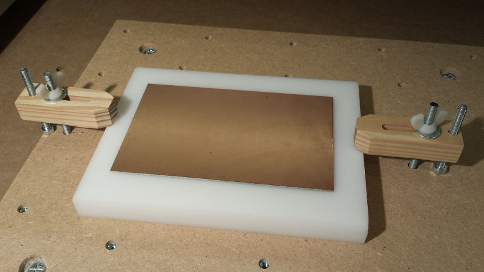
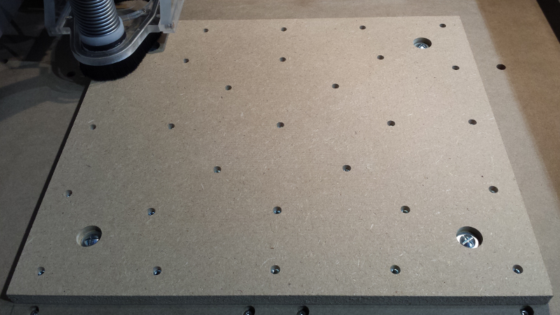
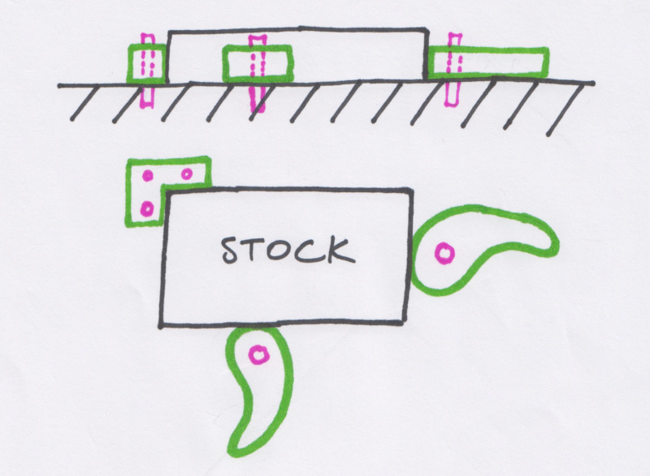
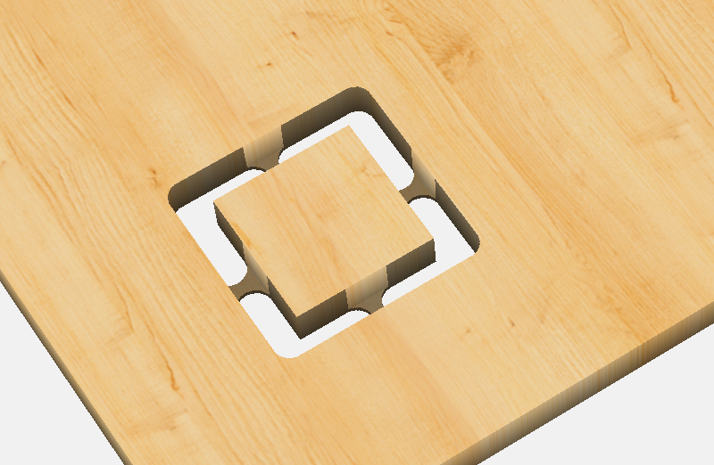
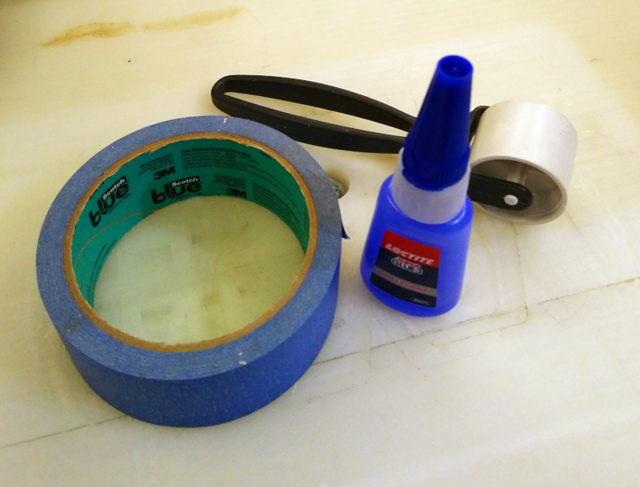

# Workholding

Workholding can be confusing at first because there are many \(many, many\) ways to do it, and everyone seems to have their own tricks. The goals are:

* \#1: obviously, that the workpiece will not come off during the cut, which would both ruin the piece AND be dangerous \(flying objects, machine damage, fire...\) 
* \#2: to provide good rigidity of the machine+stock setup. If the workpiece or workholding bends/shifts slightly under cutting forces, cut quality will be poor, and dimensions will be off. 
* \#3: to maximise clearance/access to the faces of the stock to be machined 
* \#4: that it is easy/convenient/quick enough to install and remove the workpiece.

This section does not intend to cover them all, but to present the most popular ones for the Shapeoko. But first, a small detour to talk about wasteboards.

## Wasteboard

Many projects require to cut all the way through the stock material, e.g. to cut the outer profile of the workpiece. Having a wasteboard placed under the stock material is very common for at least the following reasons:

* Even on a properly calibrated machine, it is not easy to cut _exactly_ down to stock bottom.
* It is often not desirable anyway: the cut quality on the bottom of the piece can be poor if not overcutting \(e.g. small variations in depth/flatness would leave material\)
* Mistakes in the CAM design/G-code, or mechanical issues, might \(will!\) cause the endmill to cut deeper than expected, it would be too bad to damage the machine bed.
* The stock must lay on a surface that is flat and square to the machine's Z axis, and the simplest way to achieve this is to use the machine itself to surface its own base \(see [Squaring, surfacing, tramming](squaring.md)\), so it should be a replaceable part.

It is _possible_ to use the Shapeoko's MDF bed itself as a wasterboard, but who wants to be replacing the bed of their machine? \(considering it would means disassembling it, reassembling with a fresh bed, and then squaring everything again\). It is much more convenient to use a supplementary wasteboard bolted onto the bed.

The \(only?\) downside of using a supplementary wasteboard is that it reduces the maximum Z travel \(i.e. the maximum possible height for a workpiece\)


The exception is using a vice to hold the stock, in which case a wasteboard is irrelevant.


Wasteboard material is very often MDF \(cheap & easy to procure\), HDPE is another option \(much more expensive, but does not wear off / tear out as easily, and is immune to humidity variations\)

The wasteboard needs to be held onto the machine's bed, in such a way that it can easily be removed, the usual way is to bolt it onto the bed. 


Make sure the wasteboard X/Y dimensions are such that an endmill can reach all sides, with some margin: this will be important for surfacing the wasteboard.  The max dimensions vary depending on the machine \(and accessories\) setup, so actually moving the router in the four corner positions, measuring where the endmill ends up being, and making the wasteboard area slightly smaller than that, is an easy way to get this right.

For Z dimension/thickness, make sure to include margin for a few future surfacing operations


## Threaded table, T-tracks, clamps

A very common way to hold the stock onto the wasteboard is to use top clamps, secured to the wasteboard using bolts:

which requires to have threaded holes available across the work area:

There are many different ways to make a "sea of holes" wasteboard, a popular option is to use the Shapeoko itself to drill the holes into either its own bed or a supplementary wasteboard, and then put threaded inserts in the holes.


Another equally popular option to attach clamps is to use T-tracks inserted at regular intervals between "strips" of wasteboard area.


The main drawback that the stock area where the clamps are is not accessible for the tool, and one should carefully design toolpaths such that there is no risk of collision between the tool \(or the dust shoe around it\) and the clamps. The usual mitigations are:

* using a stock larger than strictly necessary for the workpiece, and machine only the center area of the stock. Easy, but not very efficient in terms of how much material is needed/wasted.
* using **low-profile clamps**: this addresses the issue of collision with the dust shoe itself, as the clamps can slide under the bristles of the dust shoe. The risk of collision with the tool itself is still to be managed though. 
* using side clamps/**eccentric clamps** as illustrated below: they push the stock from the side into a corner block, and free up to stock top completely 

## Tabs, Onion skin

Since clamps only hold the stock by its sides, contour/profile cuts leave a middle piece that gets separated from the main stock after the last pass, and this needs to be managed too: at best it can damage the piece \(it may move freely and bounce right into the endmill\), and at worse it can be dangerous if the piece flies away in a random direction.

One solution is to use **tabs** in the design, most CAM tools support this:

The tabs will hold the piece during the last passes of the cut, however they will have to be removed/cleaned-up manually afterwards, which can turn out to be time consuming and may leave clean-up marks on the workpiece.

In some materials \(especially soft plastics like HDPE\), an alternative option is to leave a thin **onion skin** at the bottom of the profile cut, by limiting the cutting depth to something slightly less than the stock thickness. The onion skin should be thick enough to keep the piece from moving, but thin enough to be easily cut manually afterwards with e.g. a X-acto blade. The bottoms edges of the cut still need to be cleaned-up manually, but in soft plastics this can be very easy with a deburring tool.

## Double-sided tape

Since clamps get in the way of the cut, and tabs require clean-up work, the other approach is to use double-sided tape under the stock to secure it onto the wasteboard. 

The main issue with this method is finding the right balance between putting enough to hold the stock firmly, and not putting too much to still be able to remove the piece easily after the cut.

While it can certainly be a good solution for some usecases, the tape & glue method described below has all the same advantages, but provides better rigidity and requires much less force to remove the piece , so read on !


Double-sided tape can be useful in combination with other methods: for example, using clamps to hold the stock but putting a piece of double-sided tape underneath the areas that will be cut free, can be a good way to avoid using tabs


## Tape & glue

Another very popular workholding method is surprisingly simple, and surprisingly efficient. It uses painter's masking tape, and CA glue:

Apply masking tape on the back side of the stock, using several stripes if needed to have a large area covered. I use the roller shown in the picture above to make sure the tape is pushed firmly against the stock and everything is nice and flat \(make sure there are no wrinkles/bubbles\):

Apply masking tape on the top of the wasteboard where the stock will go, to match the tape under the stock. Again, the roller is useful to make things flat and tight.

Now apply a zig-zag of CA glue on the tape under the stock,

Flip it, quickly position it, then push down firmly across the whole surface for a few seconds \(some use glue accelerator, but this is typically not necessary\):

You may want to cut the extra pieces of tape, just to prevent any possible mishap where they would get in the way of the cutter \(think about the case of doing a final contour at full depth around this stock...\)

At this point, the stock should be held tightly: apply lateral force and make sure it does not budge. Push harder if you need to convince yourself that this will hold. If done correctly, the amount of _lateral_ force needed to break the hold is HUGE, way beyond what the machine can produce. Enjoy cutting the piece without any obstruction of the top and sides of the stock ! After getting a taste of this method, you might not want to go back to using clamps.

Once the cut is done, insert a flat tool under the piece to exert an upward force:

It may take a few \(gentle\) tries working on each corner/edge in turn to pry the piece loose, but it usually comes off easily.

The main drawback of this method is that for all cuts that go through the full depth of the stock, during the last passes the tool will cut into the tape and glue sandwich, which is bound to leave gummy residue on the tool. This is very easily removed with a little bit of alcohol/acetone


However, this may turn out to be a real problem for jobs that do multiple profile cuts: if the first profile cut leaves tape & glue residue on the tip of the endmill, it could impact the quality of the subsequent cuts. There is no real solution for this, the only partial mitigation is to cut exactly down to stock bottom to avoid cutting into the tape, but that brings back other issues if the stock bottom is not perfectly flat or the machine not perfectly trammed.


There is at least one case where this method not adequate: cutting thin sheets of soft material \(e.g brass, copper\), because the force required to pry the piece free of the wasteboard would likely bend/damage it. 

## Vise

A vise is typically used when cutting high-precision metal parts, since it provides excellent rigidity. It's also interesting when productivity and/or repeatability over multiple runs of the same job matter: the vise provides a good reference point to align the stock consistently, and installation/removal is very quick. Or more simply, whenever there is a need to hold a piece that cannot sit flat on the wasteboard \(e.g. anything round\)

The max width of the vise jaw is the main limitation, and its the height may be a concern, especially on a machine like the Shapeoko that has a somewhat limited Z travel. A low-profile vise, that can be installed and removed from the machine depending on the job at hand, is a good option to have:

