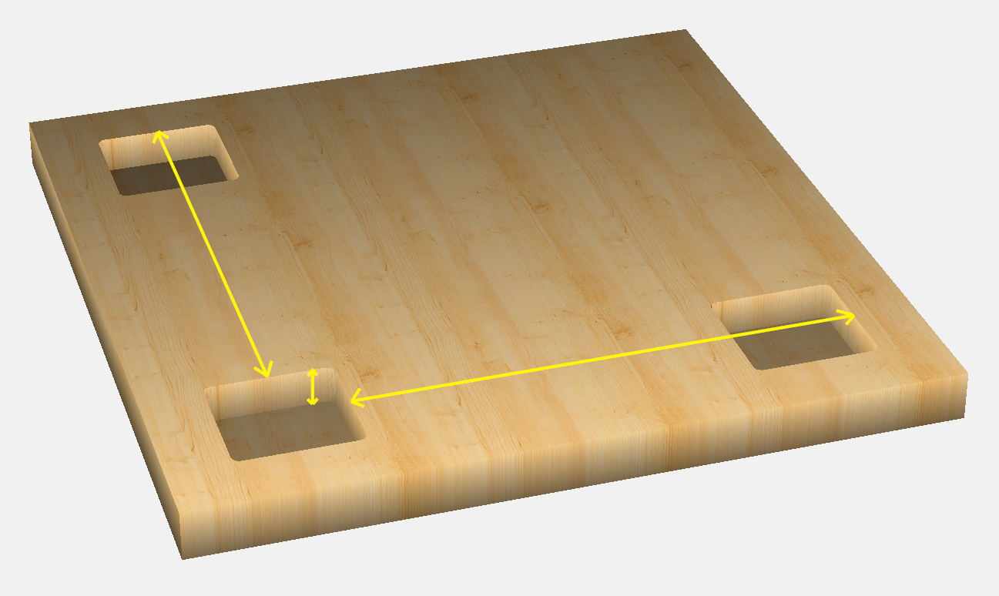
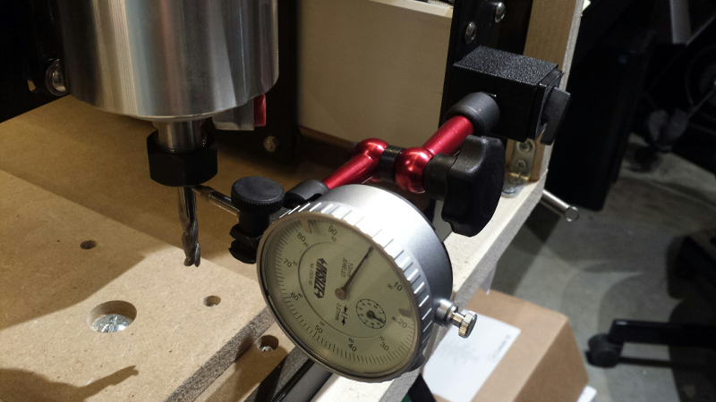
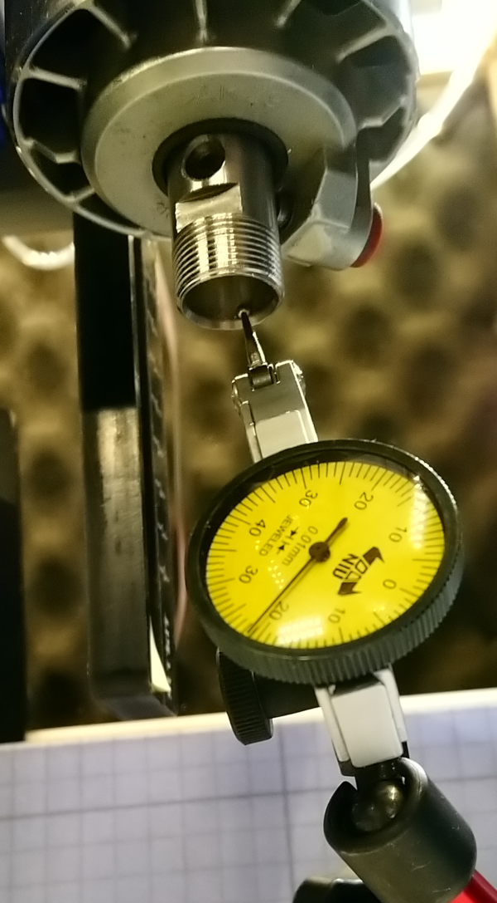
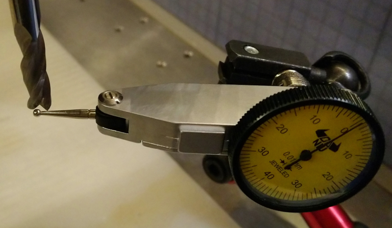
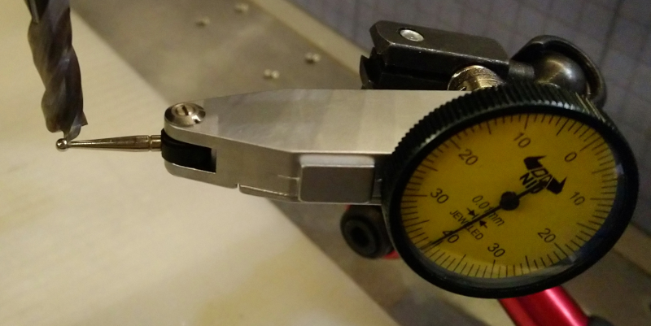
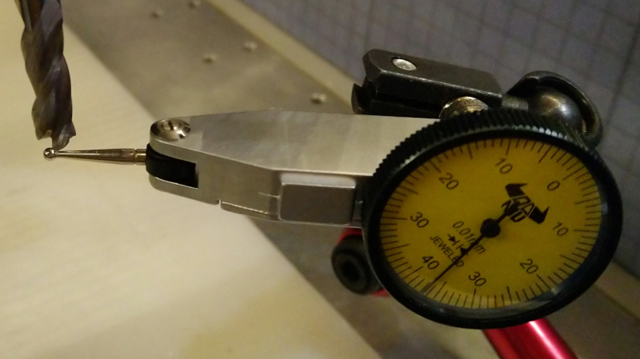
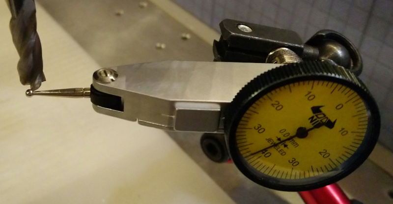
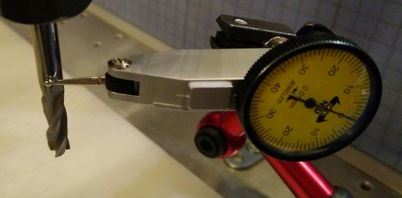
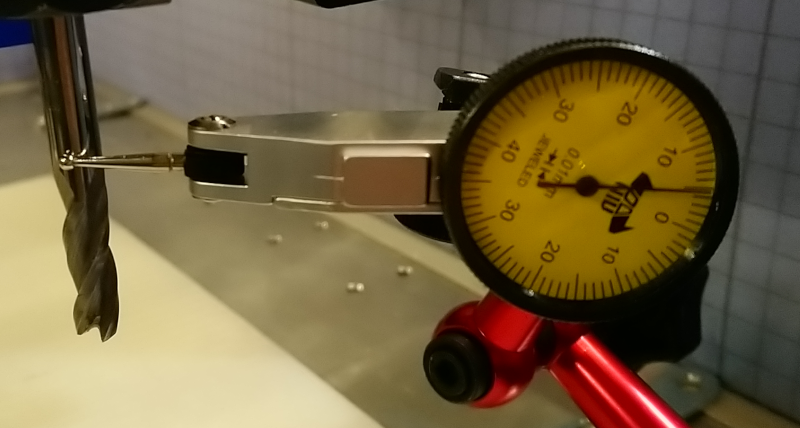

# Dimensional accuracy

For "decorative" projects, some inaccuracy in the dimensions of pieces cut on the Shapeoko do not matter, but many projects require having a finer control on the final dimensions:

* cutting geometrical patterns where a discrepancy between the X and Y dimensions could be visible to the naked eye, e.g. round shapes coming out like ellipses and squares like rectangles. Out of the box, on a properly assembled/squared/tensioned Shapeoko, this X/Y dimensional discrepancy should be small enough to not be noticeable.
* cutting pieces that are intended to fit into each other \(e.g. hole & peg, box & lid, ...\). This is where one typically starts noticing that dimensions are not _quite_ what they were supposed to be, and are inaccurate enough that pieces either do not fit, or require manual rework \(e.g. sanding\) to be assembled.
*  cutting pieces that are supposed to fit, _from a hard material_ \(hard plastics and metals\) This is where the accuracy problem becomes obvious, as there is no elasticity in the material to compensate for small inacurracies.
* and then obviously, projets where the whole point is to cut pieces of specific dimensions within a controlled tolerance \(e.g. mechanical parts\)

Many factors are involved in getting good dimensional accuracy:

* Intrinsic mechanical accuracy of the machine \(that may drift over time, too\)
* knowing the actual dimensions of the tool being used
* rigidity of the workholding solution
* dynamic effects during the cut, mainly tool deflection, depending on the tool, material, toolpaths, feeds & speeds.

If the Shapeoko forum is any indication, many people \(including myself\) have gone through these phases:

1\) starting to care \(then obsess\) about tweaking/calibration/tuning the machine to improve dimensional accuracy

2\) chasing their own tail trying to squeeze these last few % of additional precision

3\) realizing that there are so many factors involved, that a much more efficient approach is to just cut a piece, measure it, adjust the CAD and/or CAM to compensate, rinse and repeat until the result is perfect.

Yet, I still think it is important \(or at least interesting\) to know about sources of inaccuracy to decide what to do \(or not to do\) about each of them. This section will only scratch the surface on this topic, but hopefully provide useful insights on the matter.


The accuracy that is possible to achieve on a Shapeoko with the proper mix of calibration and CAD & CAM iterations, seems to be typically around 0.002" / 0.05mm with some achieving down to 0.0002" / 0.005mm


## X/Y/Z calibration

The Shapeoko belts & pulleys are such that it takes \(very close to\) 40 motor steps to move by 1 mm. But the tensioning of the belts induces some stretch, such that in reality when the stepper motor does 40 steps, the actual resulting movement on the associated axis will be slightly more or slight less than 1mm. 

The GRBL software in the Shapeoko controller stores a "steps per mm" adjustable parameter for each axis, and uses it to convert a G-code command that request a displacement expressed in distance \(inches or mm\), to a number of steps to be generated on the stepper.

These parameters are stored as $100, $101, and $102 for X, Y and Z axis respectively

By measuring by how much a given machine actually moves for a given commanded distance,  one can  adjust these parameters, i.e. calibrate/compensate the belt stretch. 

The basic principle is to: 

* make a note of the current value of $100, $101, and $102 parameters
* design a piece of given dimensions in your CAD tool
* cut the piece on the machine, and measure its actual X and Y and Z dimensions with a caliper
* adjust the $100, $101, and $102 values accordingly:

$$
new\ parameter\ value =  \frac{actual\ dimension}{expected\ dimension}* old\ parameter\ value
$$

* Reset GRBL \(or just power cycle the machine\)
* cut the piece again: it should now be closer to the expected dimensions

In theory, cutting a cube would be ideal to ease the XYZ measurements. In practice, the Z measurement is much easier to do inside a pocket, while for the X and Y dimensions there is a catch: they include at least two sources of errors that are actually not coming from the machine:

* **tool deflection** during the cut: this is influenced by the tool diameter and stickout, the material, the feeds & speeds, the DOC. If tool deflection is significant, the piece will be larger or smaller than expected due to this, not due to belt stretch.
* **tool diameter** uncertainty and **tool runout**: the endmill used to cut the test piece is never _exactly_ the diameter it is supposed to be, and there is probably a little runout too, but the CAM tool generated a toolpath based on the theoretical value of the tool diameter and zero runout, so the piece dimension will be slighty off due to this too. 

These errors should not be included/compensated for in the X/Y calibration, since they will change when a different set of conditions are used \(different endmill, toolpaths,...\)

A simple way to address these contraints is to:

* cut three deep pockets \(two aligned along X, two aligned along Y\)
* measure the board to border distances, and pocket depth:

The border-to-border measurement for X and Y will cancel out the endmill diameter/runout/deflection errors from the measurement, and the pocket depth can also easily be measured with a caliper to adjust $102.

The downside of this method is that measuring border-to-border distance with a ruler will not be extremely accurate, but if the distance between pockets is large enough, it should still grant good results.

Another popular method is to rather measure the gantry movements themselves, instead of measuring the dimensions of the resulting cuts. One can use:

* a **dial indicator**
  * attached to the bed of the machine and oriented along X then Y axis, to measure how much the gantry moves versus what was commanded 
  * attached e.g. to the router and oriented along the Z axis, to measure how much the Z plate moves versus what was commanded 

* a \(long\) **caliper**, oriented along X then Y axis, with the fixed part attached to the bed, then pushing the moving part with the shank of the endmill
  * a **DRO** \(digital readout scale\) can be used to do the same, over a longer distance to minimize the error.


In both cases, the axis of the measurement tool should be aligned carefully to match the axis of the machine, any angle between the two would reduce the accuracy of the measurement.


### Limitations of belt calibration

The pitfall of belt calibration is expecting to get excellent accuracy out of it alone. Unfortunately, belt stretch is not fully linear, and many users found out that the calibration value varies depending on the calibration distance, and where on the work area the measurement was made.

It could even be considered to be counter-productive, because of the finite precision of GRBL computations that will round numbers with lots of decimal places, and the rounding effect may be worse with calibrated values.

As mentioned earlier, another approach to dimensional accuracy is simply to do test cuts, measure the result, adjust the design and toolpaths, and iterate. In this case, leaving the steps per mm at their default value is arguably a good option.

I chose a middle ground: calibrate X/Y/Z to be in the right ballpark on the first try \(which is enough for many projects\), and then do a 2nd round after compensating the error in the design/toolpaths.

## Managing tool deflection

Beyond being bad for tool life \(and quality of the cut in general\), tool deflection is bad for dimensional accuracy. To minimize it, and depending on the situation, one can:

* use a larger \(=stiffer\) endmill
* use an endmill with large shank diameter
* use an endmill with a long shank and short cutting part, if depth of cut allows.
* minimize tool stickout \(when possible\)
* minimize lateral forces on tool, and that usually means taking a lighter cut \(e.g. small DOC and or small radial width of cut / cutter engagement 

This last point is best adressed by the "**roughing + finishing**" toolpath strategy: the roughing toolpath can take aggressive cuts, leaving enough margin \(stock to leave\) that deflection if included in this margin. And then the finishing toolpaths will only have to shave off a thin layer of material, which takes very little force and therefore causes very little deflection.

For smaller endmills, deflection becomes a critical issue that can easily lead to breaking tools, a deflection-aware feeds & speeds calculator is a good way to check before cutting.


HSS endmills are more flexible than carbide endmills, so they will withstand a greater amount of deflection before breaking.


## Managing runout

### Why bother?

Runout was defined in the [Cutters & collets](cutters.md#runout-tir) section. Since the toolpaths in the CAM tool are based on the endmill diameter, and since runout artificially increases the effective cutting diameter, the parts will have a dimensional error of \(at least\) the runout value.

Runout matters a lot for projects using small endmills, i.e. anything smaller than 1/8". The reason is that the endmill will see +/- 1 runout of variation on the chipload. Since runout can be of the same order of magnitude as the target chipload, a small endmill seeing a chipload twice as high as the optimal target value can easily break.

Runout is bad anyway for tool life, chatter, and surface finish.

### **Measuring runout**

The simplest way to measure runout is to do a test cut of a slot, measure the actual width of the resulting slot, then subtract the actual endmill diameter: the difference is the runout value. Unfortunately, it is not straightforward to determine precisely the actual diameter of a given endmill: they are manufactured within given tolerances, and are never quite the diameter they are sold to be. A 1/4" endmill could typically have an actual diameter anywhere between 0.245" and 0.255". Measuring precisely the actual diameter is not easy, as the measurement must be made on the flutes, and without proper tooling that can be difficult especially for endmill with an odd number of flutes.

Another way to measure runout is to use a **test indicator**, capturing the minimum and maximum values read over a 360° revolution of the endmill. Ideally, the runout should be measured at the tip of the endmill, where the cutting action is, but that means measuring on the flutes themselves. Alternatively, the dial indicator can be positioned on the shaft, as close as possible to the flutes, this will give a continuous readout of the runout over a 360° revolution, but could under-estimate the actual runout a bit.

**Runout** is the difference between the maximal and minimal values read, at a given measurement point.

**TIR** \(Total Indicated Runout\) is the range of runout values if we were to measure across the full length of the endmill, so it boils down to the max runout.

Runout measured on the endmill is the result of the combination of the router runout, collet runout, and endmill runout.

Router runout itself can be measured by positioning the test indicator inside the collet taper:

In this case, the measured taper runout was approximately 0.02mm \(0.0008"\). 

But what really matters is total runout at the tip of the endmill. Below is an illustration of measuring runout at the tip of a 3-flute 1/4" square endmill. First, the test indicator is positioned at a point where no flutes touch it, and zero is set there:

then the endmill is rotated manually until the test indicator readout maxes out at the tip of the first flute. In this case it read 0.41mm:

the endmill is then rotated further and the deviation at the tip of the next flute is measured, in this case 0.37mm:

Ditto for the last flute, which read 0.42mm in this setup:

So the max difference is 0.42 -0.37 = **0.05mm runout**

As a comparison, measuring runout on the shaft after setting the indicator zero to the point giving the minimal readout,

gave a max value of about 0.045mm:

Not too far from the 0.05mm measured on the flutes, and easier to measure there.

This example value of 0.05mm \(0.002"\) runout on a Makita router with the stock Makita collet and a 1/4" endmill is not great, but not really a concern in day to day use. It will vary significantly depending on which collet and endmill are used and how they were fastened. Another combination of collet/endmill on this same router granted a runout of only 0.02mm \(~0.0008"\).

### Reducing runout

* There is nothing one can do about the intrinsic runout of a specific router \(short of returning the router to get a new one, that _could_ have a lower runout, but that is random\)
  * **Spindles** usually have lower runout than routers, so upgrading to a spindle can be another  approach \(runout alone may not be a good enough reason to upgrade though\)
* Using **precision collets** is a simple way to help minimizing runout, and is one of the cheapest "upgrades" to the stock Shapeoko setup.
* Using quality endmills helps, but the endmill is probably not the main source of runout anyway.
* Watch out for **debris** stuck between the router taper and the collet, they will tilt things and create runout: always make sure the taper and collet are clean.
* Minimize **tool stickout**: this will minimize the effect of the axial runout.
* Considering that the final runout results from the relative positioning of the router, collet, and endmill, one can try to "**clock**" these three elements, so that the different runout contributions cancel each other to some extent. There is no easy way to determine runout of each element separately, so this can be a trial & error process, but worth trying:  slightly turn the collet inside the router taper, and/or turn the endmill inside the collet, and this _might_ yield a lower overall runout.
* Finally, a method that looks scary but gives surprisingly good results is **tapping** \(gently!\) on the endmill shaft using a screwdriver and a mallet: 
  * first find the orientation of the endmill that gives the maximum readout on a dial indicator placed on the front side.
  * put a small piece of electrical tape or similar on the tip of the screwdriver, to avoid metal to metal contact
  * then...lightly tap the back of the screwdriver with a mallet a couple of times.
  * check runout and repeat if necessary. It takes a few tries to find the right amount of force. In this example, the original runout was around 0.002", and tapping the endmill reduced it to around 0.0006". This adjustment should hold, at least until the end of the current job with this endmill.

### Managing residual runout

Even if it can be minimized to some extent, some runout will always exist. A simple way to deal with it is to make the CAM tool believe that you are using a slightly larger endmill, corresponding to the actual endmill diameter + runout, measure this **effective cutting diameter** on a scrap piece of material, and then use that effective diameter in the CAM tool instead of the theoretical diameter.

This won't do anything about the negative aspects of runout like possible vibrations/chatter/poor surface finish, but at least it should give more accurate dimensions.

